Analysis: A Cells
================

**Cebrian-Silla, Nascimento, Redmond, Mansky et al. 2021**

## Setup

``` r
library(knitr)
library(future)
library(ggplot2) 
library(reticulate) 
library(Seurat)
library(R.utils)
```

    ## Loading required package: R.oo

    ## Loading required package: R.methodsS3

    ## R.methodsS3 v1.8.1 (2020-08-26 16:20:06 UTC) successfully loaded. See ?R.methodsS3 for help.

    ## R.oo v1.24.0 (2020-08-26 16:11:58 UTC) successfully loaded. See ?R.oo for help.

    ## 
    ## Attaching package: 'R.oo'

    ## The following object is masked from 'package:R.methodsS3':
    ## 
    ##     throw

    ## The following objects are masked from 'package:methods':
    ## 
    ##     getClasses, getMethods

    ## The following objects are masked from 'package:base':
    ## 
    ##     attach, detach, load, save

    ## R.utils v2.10.1 (2020-08-26 22:50:31 UTC) successfully loaded. See ?R.utils for help.

    ## 
    ## Attaching package: 'R.utils'

    ## The following object is masked from 'package:utils':
    ## 
    ##     timestamp

    ## The following objects are masked from 'package:base':
    ## 
    ##     cat, commandArgs, getOption, inherits, isOpen, nullfile, parse,
    ##     warnings

``` r
library(dplyr)
```

    ## 
    ## Attaching package: 'dplyr'

    ## The following objects are masked from 'package:stats':
    ## 
    ##     filter, lag

    ## The following objects are masked from 'package:base':
    ## 
    ##     intersect, setdiff, setequal, union

``` r
library(tibble)
library(viridis)
```

    ## Loading required package: viridisLite

``` r
library(patchwork)
library(dendextend)
```

    ## 
    ## ---------------------
    ## Welcome to dendextend version 1.15.1
    ## Type citation('dendextend') for how to cite the package.
    ## 
    ## Type browseVignettes(package = 'dendextend') for the package vignette.
    ## The github page is: https://github.com/talgalili/dendextend/
    ## 
    ## Suggestions and bug-reports can be submitted at: https://github.com/talgalili/dendextend/issues
    ## Or contact: <tal.galili@gmail.com>
    ## 
    ##  To suppress this message use:  suppressPackageStartupMessages(library(dendextend))
    ## ---------------------

    ## 
    ## Attaching package: 'dendextend'

    ## The following object is masked from 'package:stats':
    ## 
    ##     cutree

``` r
library(stats)
library(remotes)
library(readr)
library(biomaRt)
library(enrichplot)
```

    ## 

    ## Registered S3 method overwritten by 'enrichplot':
    ##   method               from
    ##   fortify.enrichResult DOSE

``` r
library(scales)
```

    ## 
    ## Attaching package: 'scales'

    ## The following object is masked from 'package:readr':
    ## 
    ##     col_factor

    ## The following object is masked from 'package:viridis':
    ## 
    ##     viridis_pal

``` r
library(tidyr)
```

    ## 
    ## Attaching package: 'tidyr'

    ## The following object is masked from 'package:R.utils':
    ## 
    ##     extract

``` r
library(scico)
setwd(dirname(rstudioapi::getActiveDocumentContext()$path))
```

## Loading the annotated Seurat Object

``` r
exp <- readRDS("../Files/seurat/GSM5039270_scSeq.rds")
Idents(exp) <- "integrated_snn_res.1.5"
DimPlot(exp, label = T) + coord_fixed() + NoLegend()
```

    ## Warning: Using `as.character()` on a quosure is deprecated as of rlang 0.3.0.
    ## Please use `as_label()` or `as_name()` instead.
    ## This warning is displayed once per session.

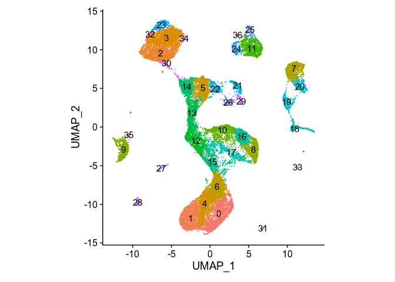<!-- -->

``` r
exp.lin <- subset(exp, idents = c("14", "5", "22", "13", "12", "10", "16", "17", "8", "15", "1", "6", "4", "0"))
DimPlot(exp.lin, label = T) + coord_fixed() + NoLegend()
```

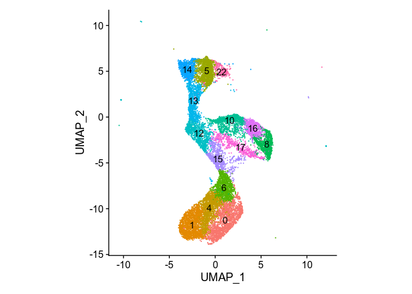<!-- -->

``` r
exp.a <- subset(exp, idents = c("0", "1", "4", "6", "15"))
DimPlot(exp.lin, label = T) + coord_fixed() + NoLegend()
```

<!-- -->

## Subsetting A cells

``` r
a.cells.palette <- c("#671313", "#9B1C1C", "#D93030", "#DF5353", "#EC9898")

a.cells <- WhichCells(exp, idents = c(15,6,1,4,0))
exp@meta.data[a.cells,"acells"] <- exp@meta.data[a.cells,"integrated_snn_res.1.5"]

DimPlot(exp, group.by = "acells", label=T, shuffle = T, cols = a.cells.palette ) + 
  coord_fixed() + 
  xlim(-6, 7) + ylim(-15, 8) + 
  NoAxes() + 
  labs(title = "A Cells")
```

    ## Warning: Removed 8808 rows containing missing values (geom_point).

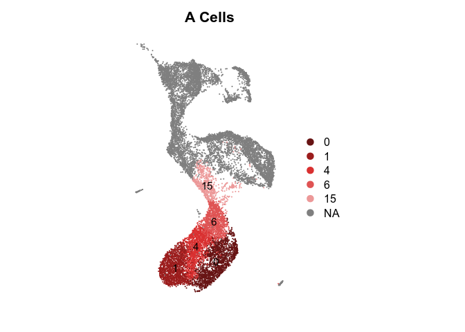<!-- -->

``` r
ggsave
```

    ## function (filename, plot = last_plot(), device = NULL, path = NULL, 
    ##     scale = 1, width = NA, height = NA, units = c("in", "cm", 
    ##         "mm"), dpi = 300, limitsize = TRUE, ...) 
    ## {
    ##     dpi <- parse_dpi(dpi)
    ##     dev <- plot_dev(device, filename, dpi = dpi)
    ##     dim <- plot_dim(c(width, height), scale = scale, units = units, 
    ##         limitsize = limitsize)
    ##     if (!is.null(path)) {
    ##         filename <- file.path(path, filename)
    ##     }
    ##     old_dev <- grDevices::dev.cur()
    ##     dev(filename = filename, width = dim[1], height = dim[2], 
    ##         ...)
    ##     on.exit(utils::capture.output({
    ##         grDevices::dev.off()
    ##         if (old_dev > 1) grDevices::dev.set(old_dev)
    ##     }))
    ##     grid.draw(plot)
    ##     invisible()
    ## }
    ## <bytecode: 0x560a29797678>
    ## <environment: namespace:ggplot2>

``` r
DimPlot(exp, cells = a.cells, label=T, shuffle = T, cols = a.cells.palette ) + 
  xlim(-4.5, 3.5) + ylim(-14, -2) + 
  coord_fixed() + 
  NoAxes() + 
  labs(title = "A Cells Subset")
```

    ## Warning: Removed 22 rows containing missing values (geom_point).

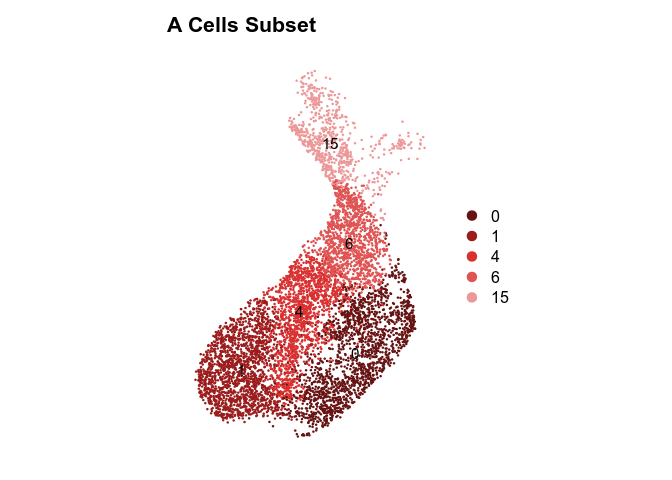<!-- -->

``` r
DimPlot(exp, cells = a.cells, label=F, group.by = "Phase") + 
  xlim(-4.5, 3.5) + ylim(-14, -2) + 
  coord_fixed() + 
  NoAxes() + 
  labs(title = "A Cells - Cell cycle labeling")
```

    ## Warning: Removed 22 rows containing missing values (geom_point).

<!-- -->

## Checking gene expression

### exp.a Markers

#### FindAllMarkers in exp.a

``` r
a.markers <- FindAllMarkers(exp.a, only.pos = T)
```

    ## Calculating cluster 0

    ## Calculating cluster 1

    ## Calculating cluster 4

    ## Calculating cluster 6

    ## Calculating cluster 15

``` r
cutoff <- 0.5 

cluster15.markers <- a.markers %>% filter(cluster==15 & avg_logFC >0 & pct.2 < cutoff) %>% pull(gene)
cluster6.markers <- a.markers %>% filter(cluster==6 & avg_logFC >0 & pct.2 < cutoff) %>% pull(gene)
cluster4.markers <- a.markers %>% filter(cluster==4 & avg_logFC >0 & pct.2 < cutoff) %>% pull(gene)
cluster1.markers <- a.markers %>% filter(cluster==1 & avg_logFC >0 & pct.2 < cutoff) %>% pull(gene)
cluster0.markers <- a.markers %>% filter(cluster==0 & avg_logFC >0 & pct.2 < cutoff) %>% pull(gene)

write.table(cluster15.markers, quote = F, row.names = F, col.names = F, "cluster15.strictmarkers.txt", sep=",")
write.table(cluster6.markers, quote = F, row.names = F, col.names = F, "cluster6.strictmarkers.txt", sep=",")
write.table(cluster4.markers, quote = F, row.names = F, col.names = F, "cluster4.strictmarkers.txt", sep=",")
write.table(cluster1.markers, quote = F, row.names = F, col.names = F, "cluster1.strictmarkers.txt", sep=",")
write.table(cluster0.markers, quote = F, row.names = F, col.names = F, "cluster0.strictmarkers.txt", sep=",")

#Judging by the number of markers, clusters 0 (dorsal), 1 (ventral), and 6 (proliferative) are very unique. Cluster 4 seems like a transitional identity

#String Analysis:
  #Cluster1/Ventral: 
    # 0.2 cutoff: https://version-11-0.string-db.org/cgi/network.pl?networkId=WWV16gHY9tKm #20 genes
    # no cutoff: https://version-11-0.string-db.org/cgi/network.pl?networkId=rTkKFUYrPbYl #121 genes

  #Cluster0/Dorsal: 
    #https://version-11-0.string-db.org/cgi/network.pl?networkId=8WC9g7rgGcxQ #10 genes
    #https://version-11-0.string-db.org/cgi/network.pl?networkId=OHEYxcivrclk #60 genes

  #Cluster6: Early neuroblasts
```

#### Plots

``` r
#cluster 15
p1 <- FeaturePlot(exp.a, features = cluster15.markers[1:9], combine = FALSE, pt.size = 0.6, order = T)
fix.sc <- scale_color_viridis(alpha = 1, option = "A") 
simple <- NoAxes() + NoLegend() 
Plot1 <- lapply(p1, function (x) x + coord_fixed() + xlim(-4.5, 3.5) + ylim(-14, -5) + fix.sc + simple)
```

    ## Scale for 'x' is already present. Adding another scale for 'x', which will
    ## replace the existing scale.

    ## Scale for 'y' is already present. Adding another scale for 'y', which will
    ## replace the existing scale.

    ## Scale for 'colour' is already present. Adding another scale for 'colour',
    ## which will replace the existing scale.

    ## Scale for 'x' is already present. Adding another scale for 'x', which will
    ## replace the existing scale.

    ## Scale for 'y' is already present. Adding another scale for 'y', which will
    ## replace the existing scale.

    ## Scale for 'colour' is already present. Adding another scale for 'colour',
    ## which will replace the existing scale.

    ## Scale for 'x' is already present. Adding another scale for 'x', which will
    ## replace the existing scale.

    ## Scale for 'y' is already present. Adding another scale for 'y', which will
    ## replace the existing scale.

    ## Scale for 'colour' is already present. Adding another scale for 'colour',
    ## which will replace the existing scale.

    ## Scale for 'x' is already present. Adding another scale for 'x', which will
    ## replace the existing scale.

    ## Scale for 'y' is already present. Adding another scale for 'y', which will
    ## replace the existing scale.

    ## Scale for 'colour' is already present. Adding another scale for 'colour',
    ## which will replace the existing scale.

    ## Scale for 'x' is already present. Adding another scale for 'x', which will
    ## replace the existing scale.

    ## Scale for 'y' is already present. Adding another scale for 'y', which will
    ## replace the existing scale.

    ## Scale for 'colour' is already present. Adding another scale for 'colour',
    ## which will replace the existing scale.

    ## Scale for 'x' is already present. Adding another scale for 'x', which will
    ## replace the existing scale.

    ## Scale for 'y' is already present. Adding another scale for 'y', which will
    ## replace the existing scale.

    ## Scale for 'colour' is already present. Adding another scale for 'colour',
    ## which will replace the existing scale.

    ## Scale for 'x' is already present. Adding another scale for 'x', which will
    ## replace the existing scale.

    ## Scale for 'y' is already present. Adding another scale for 'y', which will
    ## replace the existing scale.

    ## Scale for 'colour' is already present. Adding another scale for 'colour',
    ## which will replace the existing scale.

    ## Scale for 'x' is already present. Adding another scale for 'x', which will
    ## replace the existing scale.

    ## Scale for 'y' is already present. Adding another scale for 'y', which will
    ## replace the existing scale.

    ## Scale for 'colour' is already present. Adding another scale for 'colour',
    ## which will replace the existing scale.

    ## Scale for 'x' is already present. Adding another scale for 'x', which will
    ## replace the existing scale.

    ## Scale for 'y' is already present. Adding another scale for 'y', which will
    ## replace the existing scale.

    ## Scale for 'colour' is already present. Adding another scale for 'colour',
    ## which will replace the existing scale.

``` r
wrap_plots(Plot1, ncol = 3) + 
  plot_annotation(
    title = "Top cluster 15 markers",
    subtitle = "Identified using FindAllMarkers() in exp.a",
    caption = "Code available on A.cells.Rmd")
```

    ## Warning: Removed 541 rows containing missing values (geom_point).

    ## Warning: Removed 541 rows containing missing values (geom_point).

    ## Warning: Removed 541 rows containing missing values (geom_point).

    ## Warning: Removed 541 rows containing missing values (geom_point).

    ## Warning: Removed 541 rows containing missing values (geom_point).

    ## Warning: Removed 541 rows containing missing values (geom_point).

    ## Warning: Removed 541 rows containing missing values (geom_point).

    ## Warning: Removed 541 rows containing missing values (geom_point).

    ## Warning: Removed 541 rows containing missing values (geom_point).

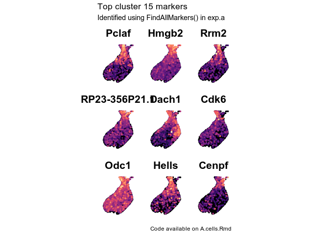<!-- -->

``` r
#cluster 6
p1 <- FeaturePlot(exp.a, features = cluster6.markers[1:9], combine = FALSE, pt.size = 0.6, order = T)
fix.sc <- scale_color_viridis(alpha = 1, option = "A") 
simple <- NoAxes() + NoLegend() 
Plot1 <- lapply(p1, function (x) x + coord_fixed() + xlim(-4.5, 3.5) + ylim(-14, -5) + fix.sc + simple)
```

    ## Scale for 'x' is already present. Adding another scale for 'x', which will
    ## replace the existing scale.

    ## Scale for 'y' is already present. Adding another scale for 'y', which will
    ## replace the existing scale.

    ## Scale for 'colour' is already present. Adding another scale for 'colour',
    ## which will replace the existing scale.

    ## Scale for 'x' is already present. Adding another scale for 'x', which will
    ## replace the existing scale.

    ## Scale for 'y' is already present. Adding another scale for 'y', which will
    ## replace the existing scale.

    ## Scale for 'colour' is already present. Adding another scale for 'colour',
    ## which will replace the existing scale.

    ## Scale for 'x' is already present. Adding another scale for 'x', which will
    ## replace the existing scale.

    ## Scale for 'y' is already present. Adding another scale for 'y', which will
    ## replace the existing scale.

    ## Scale for 'colour' is already present. Adding another scale for 'colour',
    ## which will replace the existing scale.

    ## Scale for 'x' is already present. Adding another scale for 'x', which will
    ## replace the existing scale.

    ## Scale for 'y' is already present. Adding another scale for 'y', which will
    ## replace the existing scale.

    ## Scale for 'colour' is already present. Adding another scale for 'colour',
    ## which will replace the existing scale.

    ## Scale for 'x' is already present. Adding another scale for 'x', which will
    ## replace the existing scale.

    ## Scale for 'y' is already present. Adding another scale for 'y', which will
    ## replace the existing scale.

    ## Scale for 'colour' is already present. Adding another scale for 'colour',
    ## which will replace the existing scale.

    ## Scale for 'x' is already present. Adding another scale for 'x', which will
    ## replace the existing scale.

    ## Scale for 'y' is already present. Adding another scale for 'y', which will
    ## replace the existing scale.

    ## Scale for 'colour' is already present. Adding another scale for 'colour',
    ## which will replace the existing scale.

    ## Scale for 'x' is already present. Adding another scale for 'x', which will
    ## replace the existing scale.

    ## Scale for 'y' is already present. Adding another scale for 'y', which will
    ## replace the existing scale.

    ## Scale for 'colour' is already present. Adding another scale for 'colour',
    ## which will replace the existing scale.

    ## Scale for 'x' is already present. Adding another scale for 'x', which will
    ## replace the existing scale.

    ## Scale for 'y' is already present. Adding another scale for 'y', which will
    ## replace the existing scale.

    ## Scale for 'colour' is already present. Adding another scale for 'colour',
    ## which will replace the existing scale.

    ## Scale for 'x' is already present. Adding another scale for 'x', which will
    ## replace the existing scale.

    ## Scale for 'y' is already present. Adding another scale for 'y', which will
    ## replace the existing scale.

    ## Scale for 'colour' is already present. Adding another scale for 'colour',
    ## which will replace the existing scale.

``` r
wrap_plots(Plot1, ncol = 3) + 
  plot_annotation(
    title = "Top cluster 6 markers",
    subtitle = "Identified using FindAllMarkers() in exp.a",
    caption = "Code available on A.cells.Rmd")
```

    ## Warning: Removed 541 rows containing missing values (geom_point).

    ## Warning: Removed 541 rows containing missing values (geom_point).

    ## Warning: Removed 541 rows containing missing values (geom_point).

    ## Warning: Removed 541 rows containing missing values (geom_point).

    ## Warning: Removed 541 rows containing missing values (geom_point).

    ## Warning: Removed 541 rows containing missing values (geom_point).

    ## Warning: Removed 541 rows containing missing values (geom_point).

    ## Warning: Removed 541 rows containing missing values (geom_point).

    ## Warning: Removed 541 rows containing missing values (geom_point).

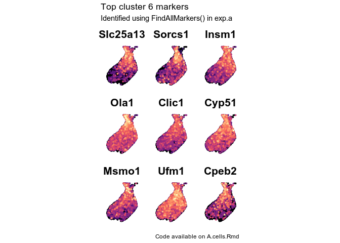<!-- -->

``` r
#cluster 4
p1 <- FeaturePlot(exp.a, features = cluster4.markers[1:9], combine = FALSE, pt.size = 0.6, order = T)
fix.sc <- scale_color_viridis(alpha = 1, option = "A") 
simple <- NoAxes() + NoLegend() 
Plot1 <- lapply(p1, function (x) x + coord_fixed() + xlim(-4.5, 3.5) + ylim(-14, -5) +  fix.sc + simple)
```

    ## Scale for 'x' is already present. Adding another scale for 'x', which will
    ## replace the existing scale.

    ## Scale for 'y' is already present. Adding another scale for 'y', which will
    ## replace the existing scale.

    ## Scale for 'colour' is already present. Adding another scale for 'colour',
    ## which will replace the existing scale.

    ## Scale for 'x' is already present. Adding another scale for 'x', which will
    ## replace the existing scale.

    ## Scale for 'y' is already present. Adding another scale for 'y', which will
    ## replace the existing scale.

    ## Scale for 'colour' is already present. Adding another scale for 'colour',
    ## which will replace the existing scale.

    ## Scale for 'x' is already present. Adding another scale for 'x', which will
    ## replace the existing scale.

    ## Scale for 'y' is already present. Adding another scale for 'y', which will
    ## replace the existing scale.

    ## Scale for 'colour' is already present. Adding another scale for 'colour',
    ## which will replace the existing scale.

    ## Scale for 'x' is already present. Adding another scale for 'x', which will
    ## replace the existing scale.

    ## Scale for 'y' is already present. Adding another scale for 'y', which will
    ## replace the existing scale.

    ## Scale for 'colour' is already present. Adding another scale for 'colour',
    ## which will replace the existing scale.

    ## Scale for 'x' is already present. Adding another scale for 'x', which will
    ## replace the existing scale.

    ## Scale for 'y' is already present. Adding another scale for 'y', which will
    ## replace the existing scale.

    ## Scale for 'colour' is already present. Adding another scale for 'colour',
    ## which will replace the existing scale.

    ## Scale for 'x' is already present. Adding another scale for 'x', which will
    ## replace the existing scale.

    ## Scale for 'y' is already present. Adding another scale for 'y', which will
    ## replace the existing scale.

    ## Scale for 'colour' is already present. Adding another scale for 'colour',
    ## which will replace the existing scale.

    ## Scale for 'x' is already present. Adding another scale for 'x', which will
    ## replace the existing scale.

    ## Scale for 'y' is already present. Adding another scale for 'y', which will
    ## replace the existing scale.

    ## Scale for 'colour' is already present. Adding another scale for 'colour',
    ## which will replace the existing scale.

    ## Scale for 'x' is already present. Adding another scale for 'x', which will
    ## replace the existing scale.

    ## Scale for 'y' is already present. Adding another scale for 'y', which will
    ## replace the existing scale.

    ## Scale for 'colour' is already present. Adding another scale for 'colour',
    ## which will replace the existing scale.

    ## Scale for 'x' is already present. Adding another scale for 'x', which will
    ## replace the existing scale.

    ## Scale for 'y' is already present. Adding another scale for 'y', which will
    ## replace the existing scale.

    ## Scale for 'colour' is already present. Adding another scale for 'colour',
    ## which will replace the existing scale.

``` r
wrap_plots(Plot1, ncol = 3) + 
  plot_annotation(
    title = "Top cluster 4 markers",
    subtitle = "Identified using FindAllMarkers() in exp.a",
    caption = "Code available on A.cells.Rmd")
```

    ## Warning: Removed 541 rows containing missing values (geom_point).

    ## Warning: Removed 541 rows containing missing values (geom_point).

    ## Warning: Removed 541 rows containing missing values (geom_point).

    ## Warning: Removed 541 rows containing missing values (geom_point).

    ## Warning: Removed 541 rows containing missing values (geom_point).

    ## Warning: Removed 541 rows containing missing values (geom_point).

    ## Warning: Removed 541 rows containing missing values (geom_point).

    ## Warning: Removed 541 rows containing missing values (geom_point).

    ## Warning: Removed 541 rows containing missing values (geom_point).

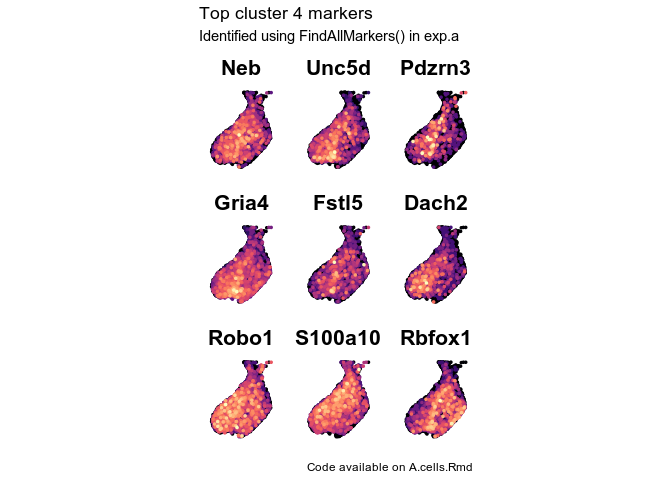<!-- -->

``` r
#cluster 1
p1 <- FeaturePlot(exp.a, features = cluster1.markers[1:9], combine = FALSE, pt.size = 0.6, order = T)
fix.sc <- scale_color_viridis(alpha = 1, option = "A") 
simple <- NoAxes() + NoLegend() 
Plot1 <- lapply(p1, function (x) x + coord_fixed() + xlim(-4.5, 3.5) + ylim(-14, -5) +  fix.sc + simple)
```

    ## Scale for 'x' is already present. Adding another scale for 'x', which will
    ## replace the existing scale.

    ## Scale for 'y' is already present. Adding another scale for 'y', which will
    ## replace the existing scale.

    ## Scale for 'colour' is already present. Adding another scale for 'colour',
    ## which will replace the existing scale.

    ## Scale for 'x' is already present. Adding another scale for 'x', which will
    ## replace the existing scale.

    ## Scale for 'y' is already present. Adding another scale for 'y', which will
    ## replace the existing scale.

    ## Scale for 'colour' is already present. Adding another scale for 'colour',
    ## which will replace the existing scale.

    ## Scale for 'x' is already present. Adding another scale for 'x', which will
    ## replace the existing scale.

    ## Scale for 'y' is already present. Adding another scale for 'y', which will
    ## replace the existing scale.

    ## Scale for 'colour' is already present. Adding another scale for 'colour',
    ## which will replace the existing scale.

    ## Scale for 'x' is already present. Adding another scale for 'x', which will
    ## replace the existing scale.

    ## Scale for 'y' is already present. Adding another scale for 'y', which will
    ## replace the existing scale.

    ## Scale for 'colour' is already present. Adding another scale for 'colour',
    ## which will replace the existing scale.

    ## Scale for 'x' is already present. Adding another scale for 'x', which will
    ## replace the existing scale.

    ## Scale for 'y' is already present. Adding another scale for 'y', which will
    ## replace the existing scale.

    ## Scale for 'colour' is already present. Adding another scale for 'colour',
    ## which will replace the existing scale.

    ## Scale for 'x' is already present. Adding another scale for 'x', which will
    ## replace the existing scale.

    ## Scale for 'y' is already present. Adding another scale for 'y', which will
    ## replace the existing scale.

    ## Scale for 'colour' is already present. Adding another scale for 'colour',
    ## which will replace the existing scale.

    ## Scale for 'x' is already present. Adding another scale for 'x', which will
    ## replace the existing scale.

    ## Scale for 'y' is already present. Adding another scale for 'y', which will
    ## replace the existing scale.

    ## Scale for 'colour' is already present. Adding another scale for 'colour',
    ## which will replace the existing scale.

    ## Scale for 'x' is already present. Adding another scale for 'x', which will
    ## replace the existing scale.

    ## Scale for 'y' is already present. Adding another scale for 'y', which will
    ## replace the existing scale.

    ## Scale for 'colour' is already present. Adding another scale for 'colour',
    ## which will replace the existing scale.

    ## Scale for 'x' is already present. Adding another scale for 'x', which will
    ## replace the existing scale.

    ## Scale for 'y' is already present. Adding another scale for 'y', which will
    ## replace the existing scale.

    ## Scale for 'colour' is already present. Adding another scale for 'colour',
    ## which will replace the existing scale.

``` r
wrap_plots(Plot1, ncol = 3) + 
  plot_annotation(
    title = "Top cluster 1 markers",
    subtitle = "Identified using FindAllMarkers() in exp.a",
    caption = "Code available on A.cells.Rmd")
```

    ## Warning: Removed 541 rows containing missing values (geom_point).

    ## Warning: Removed 541 rows containing missing values (geom_point).

    ## Warning: Removed 541 rows containing missing values (geom_point).

    ## Warning: Removed 541 rows containing missing values (geom_point).

    ## Warning: Removed 541 rows containing missing values (geom_point).

    ## Warning: Removed 541 rows containing missing values (geom_point).

    ## Warning: Removed 541 rows containing missing values (geom_point).

    ## Warning: Removed 541 rows containing missing values (geom_point).

    ## Warning: Removed 541 rows containing missing values (geom_point).

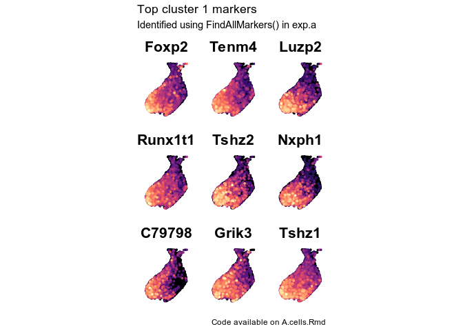<!-- -->

``` r
#cluster 0
p1 <- FeaturePlot(exp.a, features = cluster0.markers[1:9], combine = FALSE, pt.size = 0.6, order = T)
fix.sc <- scale_color_viridis(alpha = 1, option = "A") 
simple <- NoAxes() + NoLegend() 
Plot1 <- lapply(p1, function (x) x + coord_fixed() + xlim(-4.5, 3.5) + ylim(-14, -5) +  fix.sc + simple)
```

    ## Scale for 'x' is already present. Adding another scale for 'x', which will
    ## replace the existing scale.

    ## Scale for 'y' is already present. Adding another scale for 'y', which will
    ## replace the existing scale.

    ## Scale for 'colour' is already present. Adding another scale for 'colour',
    ## which will replace the existing scale.

    ## Scale for 'x' is already present. Adding another scale for 'x', which will
    ## replace the existing scale.

    ## Scale for 'y' is already present. Adding another scale for 'y', which will
    ## replace the existing scale.

    ## Scale for 'colour' is already present. Adding another scale for 'colour',
    ## which will replace the existing scale.

    ## Scale for 'x' is already present. Adding another scale for 'x', which will
    ## replace the existing scale.

    ## Scale for 'y' is already present. Adding another scale for 'y', which will
    ## replace the existing scale.

    ## Scale for 'colour' is already present. Adding another scale for 'colour',
    ## which will replace the existing scale.

    ## Scale for 'x' is already present. Adding another scale for 'x', which will
    ## replace the existing scale.

    ## Scale for 'y' is already present. Adding another scale for 'y', which will
    ## replace the existing scale.

    ## Scale for 'colour' is already present. Adding another scale for 'colour',
    ## which will replace the existing scale.

    ## Scale for 'x' is already present. Adding another scale for 'x', which will
    ## replace the existing scale.

    ## Scale for 'y' is already present. Adding another scale for 'y', which will
    ## replace the existing scale.

    ## Scale for 'colour' is already present. Adding another scale for 'colour',
    ## which will replace the existing scale.

    ## Scale for 'x' is already present. Adding another scale for 'x', which will
    ## replace the existing scale.

    ## Scale for 'y' is already present. Adding another scale for 'y', which will
    ## replace the existing scale.

    ## Scale for 'colour' is already present. Adding another scale for 'colour',
    ## which will replace the existing scale.

    ## Scale for 'x' is already present. Adding another scale for 'x', which will
    ## replace the existing scale.

    ## Scale for 'y' is already present. Adding another scale for 'y', which will
    ## replace the existing scale.

    ## Scale for 'colour' is already present. Adding another scale for 'colour',
    ## which will replace the existing scale.

    ## Scale for 'x' is already present. Adding another scale for 'x', which will
    ## replace the existing scale.

    ## Scale for 'y' is already present. Adding another scale for 'y', which will
    ## replace the existing scale.

    ## Scale for 'colour' is already present. Adding another scale for 'colour',
    ## which will replace the existing scale.

    ## Scale for 'x' is already present. Adding another scale for 'x', which will
    ## replace the existing scale.

    ## Scale for 'y' is already present. Adding another scale for 'y', which will
    ## replace the existing scale.

    ## Scale for 'colour' is already present. Adding another scale for 'colour',
    ## which will replace the existing scale.

``` r
wrap_plots(Plot1, ncol = 3) + 
  plot_annotation(
    title = "Top cluster 0 markers",
    subtitle = "Identified using FindAllMarkers() in exp.a",
    caption = "Code available on A.cells.Rmd")
```

    ## Warning: Removed 541 rows containing missing values (geom_point).

    ## Warning: Removed 541 rows containing missing values (geom_point).

    ## Warning: Removed 541 rows containing missing values (geom_point).

    ## Warning: Removed 541 rows containing missing values (geom_point).

    ## Warning: Removed 541 rows containing missing values (geom_point).

    ## Warning: Removed 541 rows containing missing values (geom_point).

    ## Warning: Removed 541 rows containing missing values (geom_point).

    ## Warning: Removed 541 rows containing missing values (geom_point).

    ## Warning: Removed 541 rows containing missing values (geom_point).

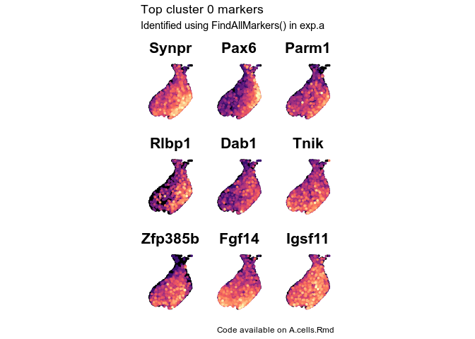<!-- -->

### Cluster 1 vs Cluster 0

``` r
Idents(exp.a) <- "integrated_snn_res.1.5"
vxd.a.markers <- FindMarkers(exp.a, ident.1 = 1, ident.2 = 0)

v.a.markers <- rownames(vxd.a.markers %>% filter(avg_logFC >0 & pct.2 < 0.5))
d.a.markers <- rownames(vxd.a.markers %>% filter(avg_logFC <0 & pct.1 < 0.5))
v.a.markers
```

    ##  [1] "Pbx3"          "Tenm4"         "Foxp2"         "Flrt2"        
    ##  [5] "Runx1t1"       "C79798"        "Gm5607"        "Gm26871"      
    ##  [9] "Prkca"         "Luzp2"         "Grik3"         "Tshz2"        
    ## [13] "Dpp10"         "Vax1"          "Nxph1"         "B020031H02Rik"
    ## [17] "B3gat1"        "St6galnac5"    "Gm45680"       "Bmper"        
    ## [21] "Ptprm"         "Ntng1"         "Zfhx3"         "Zfhx4"        
    ## [25] "Rims1"         "Slc4a4"        "Ptprn2"        "Cers6"        
    ## [29] "Mn1"           "Erc2"          "Slit1"         "Sema5a"       
    ## [33] "Tmem2"         "Rbms1"         "Adgrl3"        "Ccser1"       
    ## [37] "Wnt5a"         "Slc35f1"       "Gm26883"       "Slco5a1"      
    ## [41] "Unc5d"         "Ntm"           "Nrcam"         "Ptprt"        
    ## [45] "Lurap1l"       "Gm20754"       "Ubash3b"       "Syn3"         
    ## [49] "Pde4b"         "Adcy2"         "Lrrtm3"        "Sntb1"        
    ## [53] "Sorcs3"        "Rnf165"        "Fbxl7"         "Kcnh8"        
    ## [57] "March3"        "Nkain3"        "Dach2"         "Cntnap2"      
    ## [61] "Slit2"         "Csmd3"         "Cntnap4"       "Lrrc4c"       
    ## [65] "Hivep3"        "Ptn"           "Mgat5"         "Hcn1"         
    ## [69] "D430041D05Rik" "Plcb4"         "S100a10"       "Thsd7a"       
    ## [73] "Cntn5"         "Tmod3"

``` r
d.a.markers
```

    ##  [1] "Pax6"          "Synpr"         "E130114P18Rik" "Dab1"         
    ##  [5] "Rlbp1"         "Gm29260"       "Parm1"         "Tle1"         
    ##  [9] "St18"          "Sel1l3"        "Slc1a3"        "Nr2f1"        
    ## [13] "Fam65b"        "Insm1"         "Igsf11"        "Trpc4"        
    ## [17] "Gm5087"        "Eml5"          "Dach1"         "Chn1"         
    ## [21] "Tnik"          "Zfp385b"       "Sorcs1"        "Hif1a"        
    ## [25] "Phlpp1"        "Sox5"          "Rbfox1"        "Igfbp5"       
    ## [29] "Pik3r1"        "Mdga2"         "Ube2e2"        "Id4"          
    ## [33] "Dpp6"          "Sema6d"        "Trhde"         "Brinp1"       
    ## [37] "Pola1"         "Brinp3"        "Dcc"           "Zfpm2"        
    ## [41] "Gadd45g"       "Efna5"         "Kcnd3"

#### Plots

``` r
#cluster 1
p1 <- FeaturePlot(exp.a, features = v.a.markers[1:9], combine = FALSE, pt.size = 0.6, order = T)
fix.sc <- scale_color_viridis(alpha = 1, option = "A") 
simple <- NoAxes() + NoLegend() 
Plot1 <- lapply(p1, function (x) x + coord_fixed() + xlim(-4.5, 3.5) + ylim(-14, -5) +  fix.sc + simple)
```

    ## Scale for 'x' is already present. Adding another scale for 'x', which will
    ## replace the existing scale.

    ## Scale for 'y' is already present. Adding another scale for 'y', which will
    ## replace the existing scale.

    ## Scale for 'colour' is already present. Adding another scale for 'colour',
    ## which will replace the existing scale.

    ## Scale for 'x' is already present. Adding another scale for 'x', which will
    ## replace the existing scale.

    ## Scale for 'y' is already present. Adding another scale for 'y', which will
    ## replace the existing scale.

    ## Scale for 'colour' is already present. Adding another scale for 'colour',
    ## which will replace the existing scale.

    ## Scale for 'x' is already present. Adding another scale for 'x', which will
    ## replace the existing scale.

    ## Scale for 'y' is already present. Adding another scale for 'y', which will
    ## replace the existing scale.

    ## Scale for 'colour' is already present. Adding another scale for 'colour',
    ## which will replace the existing scale.

    ## Scale for 'x' is already present. Adding another scale for 'x', which will
    ## replace the existing scale.

    ## Scale for 'y' is already present. Adding another scale for 'y', which will
    ## replace the existing scale.

    ## Scale for 'colour' is already present. Adding another scale for 'colour',
    ## which will replace the existing scale.

    ## Scale for 'x' is already present. Adding another scale for 'x', which will
    ## replace the existing scale.

    ## Scale for 'y' is already present. Adding another scale for 'y', which will
    ## replace the existing scale.

    ## Scale for 'colour' is already present. Adding another scale for 'colour',
    ## which will replace the existing scale.

    ## Scale for 'x' is already present. Adding another scale for 'x', which will
    ## replace the existing scale.

    ## Scale for 'y' is already present. Adding another scale for 'y', which will
    ## replace the existing scale.

    ## Scale for 'colour' is already present. Adding another scale for 'colour',
    ## which will replace the existing scale.

    ## Scale for 'x' is already present. Adding another scale for 'x', which will
    ## replace the existing scale.

    ## Scale for 'y' is already present. Adding another scale for 'y', which will
    ## replace the existing scale.

    ## Scale for 'colour' is already present. Adding another scale for 'colour',
    ## which will replace the existing scale.

    ## Scale for 'x' is already present. Adding another scale for 'x', which will
    ## replace the existing scale.

    ## Scale for 'y' is already present. Adding another scale for 'y', which will
    ## replace the existing scale.

    ## Scale for 'colour' is already present. Adding another scale for 'colour',
    ## which will replace the existing scale.

    ## Scale for 'x' is already present. Adding another scale for 'x', which will
    ## replace the existing scale.

    ## Scale for 'y' is already present. Adding another scale for 'y', which will
    ## replace the existing scale.

    ## Scale for 'colour' is already present. Adding another scale for 'colour',
    ## which will replace the existing scale.

``` r
wrap_plots(Plot1, nrow = 3) + 
  plot_annotation(
    title = "Top cluster 1 markers",
    subtitle = "Identified comparing clusters 1 and 0",
    caption = paste0("Generated on ", format(Sys.time(), "%D"), ". Code available on A.cells.Rmd"))
```

    ## Warning: Removed 541 rows containing missing values (geom_point).

    ## Warning: Removed 541 rows containing missing values (geom_point).

    ## Warning: Removed 541 rows containing missing values (geom_point).

    ## Warning: Removed 541 rows containing missing values (geom_point).

    ## Warning: Removed 541 rows containing missing values (geom_point).

    ## Warning: Removed 541 rows containing missing values (geom_point).

    ## Warning: Removed 541 rows containing missing values (geom_point).

    ## Warning: Removed 541 rows containing missing values (geom_point).

    ## Warning: Removed 541 rows containing missing values (geom_point).

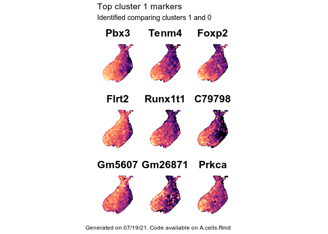<!-- -->

``` r
VlnPlot(exp.a, features = v.a.markers[1:20], stack = T, flip = T, idents = c("1","0")) + NoLegend()
```

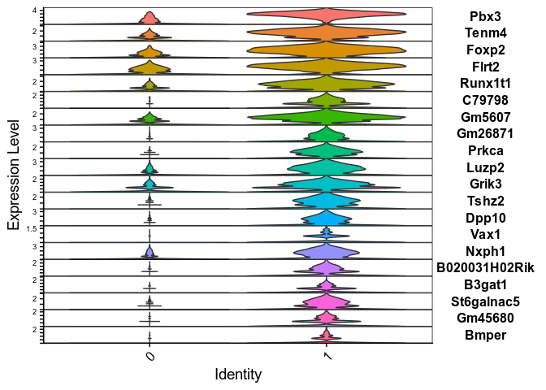<!-- -->

``` r
#cluster 0
p1 <- FeaturePlot(exp.a, features = d.a.markers[1:9], combine = FALSE, pt.size = 0.6, order = T)
fix.sc <- scale_color_viridis(alpha = 1, option = "A") 
simple <- NoAxes() + NoLegend() 
Plot1 <- lapply(p1, function (x) x + coord_fixed() + xlim(-4.5, 3.5) + ylim(-14, -5) +  fix.sc + simple)
```

    ## Scale for 'x' is already present. Adding another scale for 'x', which will
    ## replace the existing scale.

    ## Scale for 'y' is already present. Adding another scale for 'y', which will
    ## replace the existing scale.

    ## Scale for 'colour' is already present. Adding another scale for 'colour',
    ## which will replace the existing scale.

    ## Scale for 'x' is already present. Adding another scale for 'x', which will
    ## replace the existing scale.

    ## Scale for 'y' is already present. Adding another scale for 'y', which will
    ## replace the existing scale.

    ## Scale for 'colour' is already present. Adding another scale for 'colour',
    ## which will replace the existing scale.

    ## Scale for 'x' is already present. Adding another scale for 'x', which will
    ## replace the existing scale.

    ## Scale for 'y' is already present. Adding another scale for 'y', which will
    ## replace the existing scale.

    ## Scale for 'colour' is already present. Adding another scale for 'colour',
    ## which will replace the existing scale.

    ## Scale for 'x' is already present. Adding another scale for 'x', which will
    ## replace the existing scale.

    ## Scale for 'y' is already present. Adding another scale for 'y', which will
    ## replace the existing scale.

    ## Scale for 'colour' is already present. Adding another scale for 'colour',
    ## which will replace the existing scale.

    ## Scale for 'x' is already present. Adding another scale for 'x', which will
    ## replace the existing scale.

    ## Scale for 'y' is already present. Adding another scale for 'y', which will
    ## replace the existing scale.

    ## Scale for 'colour' is already present. Adding another scale for 'colour',
    ## which will replace the existing scale.

    ## Scale for 'x' is already present. Adding another scale for 'x', which will
    ## replace the existing scale.

    ## Scale for 'y' is already present. Adding another scale for 'y', which will
    ## replace the existing scale.

    ## Scale for 'colour' is already present. Adding another scale for 'colour',
    ## which will replace the existing scale.

    ## Scale for 'x' is already present. Adding another scale for 'x', which will
    ## replace the existing scale.

    ## Scale for 'y' is already present. Adding another scale for 'y', which will
    ## replace the existing scale.

    ## Scale for 'colour' is already present. Adding another scale for 'colour',
    ## which will replace the existing scale.

    ## Scale for 'x' is already present. Adding another scale for 'x', which will
    ## replace the existing scale.

    ## Scale for 'y' is already present. Adding another scale for 'y', which will
    ## replace the existing scale.

    ## Scale for 'colour' is already present. Adding another scale for 'colour',
    ## which will replace the existing scale.

    ## Scale for 'x' is already present. Adding another scale for 'x', which will
    ## replace the existing scale.

    ## Scale for 'y' is already present. Adding another scale for 'y', which will
    ## replace the existing scale.

    ## Scale for 'colour' is already present. Adding another scale for 'colour',
    ## which will replace the existing scale.

``` r
wrap_plots(Plot1, nrow = 3) + 
  plot_annotation(
    title = "Top cluster 0 markers",
    subtitle = "Identified comparing clusters 1 and 0",
    caption = paste0("Generated on ", format(Sys.time(), "%D"), ". Code available on A.cells.Rmd"))
```

    ## Warning: Removed 541 rows containing missing values (geom_point).

    ## Warning: Removed 541 rows containing missing values (geom_point).

    ## Warning: Removed 541 rows containing missing values (geom_point).

    ## Warning: Removed 541 rows containing missing values (geom_point).

    ## Warning: Removed 541 rows containing missing values (geom_point).

    ## Warning: Removed 541 rows containing missing values (geom_point).

    ## Warning: Removed 541 rows containing missing values (geom_point).

    ## Warning: Removed 541 rows containing missing values (geom_point).

    ## Warning: Removed 541 rows containing missing values (geom_point).

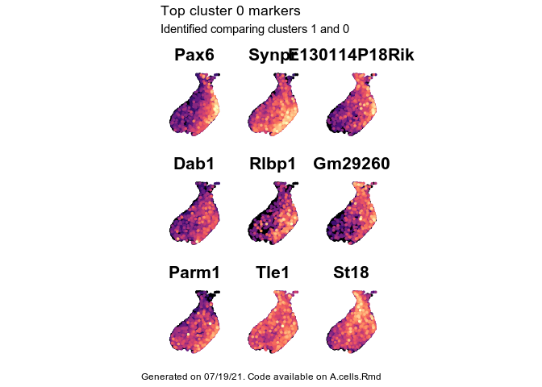<!-- -->

``` r
VlnPlot(exp.a, features = d.a.markers[1:20], stack = T, flip = T, idents = c("1","0")) + NoLegend()
```

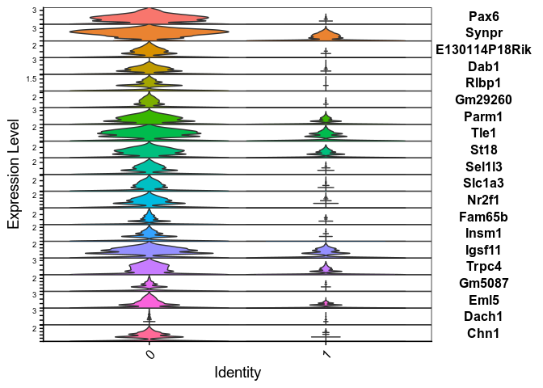<!-- -->

## Assigning A cell identities

``` r
Idents(exp.a) <- "integrated_snn_res.1.5"
v.acells <- WhichCells(exp.a, idents = 1)
d.acells <- WhichCells(exp.a, idents = 0)
nb.acells <- WhichCells(exp.a, idents = c(6, 15))
inter.acells <- WhichCells(exp.a, idents = 4)


exp.a@meta.data[c(v.acells, inter.acells, d.acells),  "cellid"] <- "Young Neurons"
exp.a@meta.data[nb.acells,  "cellid"] <- "Neuroblasts"


Idents(exp.a) <- "cellid"
DimPlot(exp.a, group.by = "cellid", label = T) + coord_fixed() + xlim(-4.5, 3.5) + ylim(-14, -2) + simple
```

    ## Warning: Removed 22 rows containing missing values (geom_point).

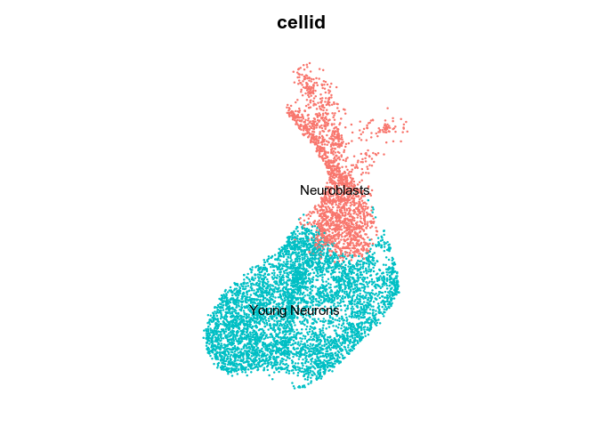<!-- -->

``` r
a.id.markers <- FindAllMarkers(exp.a, only.pos = T)
```

    ## Calculating cluster Neuroblasts

    ## Calculating cluster Young Neurons

``` r
a.id.markers
```

    ##                       p_val avg_logFC pct.1 pct.2     p_val_adj       cluster
    ## Pclaf          0.000000e+00 1.3310623 0.538 0.083  0.000000e+00   Neuroblasts
    ## Hmgb2          0.000000e+00 1.2427943 0.747 0.292  0.000000e+00   Neuroblasts
    ## H2afz          0.000000e+00 1.1825365 0.999 0.988  0.000000e+00   Neuroblasts
    ## Mdk            0.000000e+00 1.1185987 0.896 0.447  0.000000e+00   Neuroblasts
    ## Anp32b         0.000000e+00 0.8989970 0.880 0.499  0.000000e+00   Neuroblasts
    ## Vim            0.000000e+00 0.8818270 0.946 0.686  0.000000e+00   Neuroblasts
    ## Tmsb4x         0.000000e+00 0.8475218 0.999 0.999  0.000000e+00   Neuroblasts
    ## Hat1           0.000000e+00 0.8373098 0.750 0.310  0.000000e+00   Neuroblasts
    ## Hmgn2          0.000000e+00 0.8228881 0.999 0.991  0.000000e+00   Neuroblasts
    ## Slc25a5        0.000000e+00 0.7885329 0.923 0.583  0.000000e+00   Neuroblasts
    ## H2afv          0.000000e+00 0.7841216 0.997 0.961  0.000000e+00   Neuroblasts
    ## RP23-356P21.1  0.000000e+00 0.7624235 0.523 0.097  0.000000e+00   Neuroblasts
    ## Ran            0.000000e+00 0.6989593 0.944 0.706  0.000000e+00   Neuroblasts
    ## RP23-48A24.3   0.000000e+00 0.6940411 0.911 0.578  0.000000e+00   Neuroblasts
    ## Sem1           0.000000e+00 0.6626874 0.997 0.932  0.000000e+00   Neuroblasts
    ## Mcm5           0.000000e+00 0.6202008 0.476 0.081  0.000000e+00   Neuroblasts
    ## Slc25a13       0.000000e+00 0.6089653 0.589 0.142  0.000000e+00   Neuroblasts
    ## Ccnd2          0.000000e+00 0.6008865 0.999 0.994  0.000000e+00   Neuroblasts
    ## Ptma           0.000000e+00 0.5953290 1.000 0.998  0.000000e+00   Neuroblasts
    ## Mcm3           0.000000e+00 0.5828620 0.403 0.043  0.000000e+00   Neuroblasts
    ## Mcm2           0.000000e+00 0.5247938 0.423 0.059  0.000000e+00   Neuroblasts
    ## Rpl41          0.000000e+00 0.5039863 1.000 0.999  0.000000e+00   Neuroblasts
    ## Cenpm          0.000000e+00 0.4282268 0.362 0.026  0.000000e+00   Neuroblasts
    ## Ola1          7.759880e-308 0.6448991 0.831 0.432 2.002282e-303   Neuroblasts
    ## Dut           8.791356e-303 0.8895030 0.779 0.380 2.268434e-298   Neuroblasts
    ## Cdk4          1.137610e-302 0.5231274 0.992 0.906 2.935375e-298   Neuroblasts
    ## Rrm2          2.157833e-302 0.8781171 0.433 0.071 5.567856e-298   Neuroblasts
    ## Eif4a1        5.631236e-299 0.4268157 0.999 0.993 1.453028e-294   Neuroblasts
    ## Ung           2.224588e-291 0.5183245 0.349 0.033 5.740105e-287   Neuroblasts
    ## Mcm6          1.984700e-289 0.7102891 0.523 0.129 5.121122e-285   Neuroblasts
    ## Hmgn1         4.949267e-283 0.4437461 0.999 0.992 1.277059e-278   Neuroblasts
    ## Dach1         4.062730e-280 0.8098995 0.553 0.141 1.048306e-275   Neuroblasts
    ## Ppia          7.235596e-280 0.4541943 0.998 0.994 1.867001e-275   Neuroblasts
    ## Insm1         9.533296e-280 0.6183479 0.758 0.317 2.459876e-275   Neuroblasts
    ## Cks1b         9.863807e-279 0.5962443 0.538 0.145 2.545158e-274   Neuroblasts
    ## Uhrf1         2.127078e-277 0.5788828 0.355 0.041 5.488499e-273   Neuroblasts
    ## Hells         2.350075e-276 0.6934451 0.412 0.070 6.063899e-272   Neuroblasts
    ## Hsp90ab1      8.471975e-274 0.3652804 1.000 0.999 2.186024e-269   Neuroblasts
    ## Gmnn          1.447297e-268 0.4909070 0.396 0.062 3.734461e-264   Neuroblasts
    ## Rpl8          3.358269e-268 0.4184429 0.999 0.994 8.665341e-264   Neuroblasts
    ## Nasp          2.762994e-265 0.8129461 0.863 0.555 7.129353e-261   Neuroblasts
    ## Rpl3-ps1      3.340708e-265 0.3916121 1.000 0.994 8.620028e-261   Neuroblasts
    ## Gm10282       1.470760e-259 0.6112210 0.781 0.398 3.795003e-255   Neuroblasts
    ## Eif5a         4.810734e-259 0.5238472 0.981 0.875 1.241314e-254   Neuroblasts
    ## Sumo2         1.107021e-256 0.4042479 0.999 0.991 2.856447e-252   Neuroblasts
    ## Ranbp1        3.023349e-253 0.6471017 0.944 0.806 7.801148e-249   Neuroblasts
    ## Cycs          5.340675e-253 0.5287929 0.813 0.422 1.378054e-248   Neuroblasts
    ## Ppa1          1.739371e-247 0.5899278 0.791 0.431 4.488099e-243   Neuroblasts
    ## Fabp7         1.592656e-244 0.4966227 0.388 0.068 4.109531e-240   Neuroblasts
    ## Ezr           3.398754e-241 0.5392380 0.900 0.562 8.769804e-237   Neuroblasts
    ## Dhfr          5.650834e-240 0.5458277 0.408 0.083 1.458085e-235   Neuroblasts
    ## Cox5a         3.809868e-239 0.4770329 0.956 0.764 9.830602e-235   Neuroblasts
    ## Gsx2          1.720670e-236 0.3108833 0.258 0.016 4.439844e-232   Neuroblasts
    ## Cdk6          1.963748e-233 0.6565933 0.404 0.085 5.067060e-229   Neuroblasts
    ## Mcm4          6.514877e-232 0.4529125 0.396 0.080 1.681034e-227   Neuroblasts
    ## Dtymk         3.100277e-229 0.5699806 0.751 0.392 7.999644e-225   Neuroblasts
    ## Dek           7.652161e-228 0.7509177 0.819 0.526 1.974487e-223   Neuroblasts
    ## E2f1          5.893423e-227 0.4007285 0.362 0.062 1.520680e-222   Neuroblasts
    ## Mms22l        6.243487e-227 0.5240923 0.486 0.137 1.611007e-222   Neuroblasts
    ## Clic1         5.145470e-226 0.5031525 0.724 0.324 1.327686e-221   Neuroblasts
    ## Tead2         6.660723e-225 0.3909320 0.446 0.108 1.718666e-220   Neuroblasts
    ## Dtl           3.391044e-221 0.4279715 0.286 0.031 8.749911e-217   Neuroblasts
    ## Sox21         2.007933e-220 0.4561535 0.459 0.117 5.181070e-216   Neuroblasts
    ## Rplp1         5.579025e-220 0.3690936 1.000 0.992 1.439556e-215   Neuroblasts
    ## Pbk           1.837917e-216 0.3455687 0.283 0.031 4.742377e-212   Neuroblasts
    ## Hnrnpab       1.025628e-215 0.4163772 0.993 0.955 2.646428e-211   Neuroblasts
    ## Rcc2          1.476774e-215 0.5403580 0.785 0.446 3.810520e-211   Neuroblasts
    ## Gm9790        1.498868e-215 0.3422634 0.448 0.113 3.867530e-211   Neuroblasts
    ## Oaz1          8.493738e-214 0.3506982 0.999 0.990 2.191639e-209   Neuroblasts
    ## Lsm4          2.207002e-211 0.5011991 0.867 0.570 5.694728e-207   Neuroblasts
    ## Clspn         1.201761e-210 0.4827566 0.263 0.026 3.100903e-206   Neuroblasts
    ## Dclk2         1.123814e-209 0.5258301 0.971 0.861 2.899776e-205   Neuroblasts
    ## Chaf1b        7.943926e-209 0.3712447 0.363 0.072 2.049771e-204   Neuroblasts
    ## Odc1          1.000311e-207 0.6456319 0.670 0.316 2.581102e-203   Neuroblasts
    ## Tipin         2.156692e-207 0.4713268 0.555 0.199 5.564913e-203   Neuroblasts
    ## Alyref        1.284235e-204 0.5079089 0.827 0.509 3.313712e-200   Neuroblasts
    ## Snrpb         1.371241e-204 0.4565828 0.947 0.777 3.538213e-200   Neuroblasts
    ## Dbi           2.070104e-204 0.5081398 0.918 0.742 5.341490e-200   Neuroblasts
    ## Idi1          7.698629e-204 0.5040586 0.595 0.233 1.986477e-199   Neuroblasts
    ## Lockd         1.624033e-203 0.5019419 0.509 0.166 4.190492e-199   Neuroblasts
    ## Pttg1         8.516454e-202 0.5485032 0.470 0.140 2.197501e-197   Neuroblasts
    ## Msmo1         3.355153e-201 0.5806232 0.624 0.263 8.657301e-197   Neuroblasts
    ## Gm8186        1.647003e-200 0.3928157 0.992 0.951 4.249763e-196   Neuroblasts
    ## Ube2c         6.363248e-200 0.7179079 0.386 0.091 1.641909e-195   Neuroblasts
    ## Atp5b         1.473627e-199 0.3951146 0.986 0.931 3.802399e-195   Neuroblasts
    ## Mki67         8.287468e-199 0.4256882 0.272 0.033 2.138415e-194   Neuroblasts
    ## Birc5         9.019960e-199 0.4741196 0.289 0.041 2.327420e-194   Neuroblasts
    ## Cyp51         1.516450e-194 0.5156397 0.783 0.445 3.912897e-190   Neuroblasts
    ## Srsf2         7.450745e-193 0.4373562 0.967 0.851 1.922516e-188   Neuroblasts
    ## Nt5dc2        9.394425e-193 0.3890570 0.498 0.164 2.424043e-188   Neuroblasts
    ## Cenpf         3.532043e-192 0.5517545 0.284 0.040 9.113731e-188   Neuroblasts
    ## Rpl14         1.288745e-190 0.3340133 0.998 0.989 3.325348e-186   Neuroblasts
    ## Gm10073       1.331672e-189 0.3490097 0.998 0.985 3.436114e-185   Neuroblasts
    ## Hnrnpu        1.625397e-189 0.4310565 0.973 0.887 4.194011e-185   Neuroblasts
    ## Top2a         2.019981e-187 0.4911949 0.314 0.057 5.212158e-183   Neuroblasts
    ## Cdk2ap1       5.367608e-186 0.4784970 0.855 0.564 1.385004e-181   Neuroblasts
    ## Apitd1        1.500408e-184 0.3274960 0.371 0.086 3.871503e-180   Neuroblasts
    ## Cdca8         4.388509e-184 0.5121959 0.335 0.070 1.132367e-179   Neuroblasts
    ## Rgs20         8.215240e-184 0.6398625 0.495 0.169 2.119778e-179   Neuroblasts
    ## Sec61b        5.784738e-183 0.4232316 0.814 0.483 1.492636e-178   Neuroblasts
    ## Tmpo          8.159723e-182 0.4947307 0.870 0.629 2.105453e-177   Neuroblasts
    ## Rpa2          9.656639e-182 0.4442925 0.388 0.103 2.491703e-177   Neuroblasts
    ## Gins2         1.431858e-181 0.3589978 0.361 0.085 3.694622e-177   Neuroblasts
    ## Rpl19-ps11    2.194210e-181 0.2803948 0.999 0.998 5.661720e-177   Neuroblasts
    ## Pcna          2.978080e-181 0.5424966 0.456 0.154 7.684339e-177   Neuroblasts
    ## Nmral1        5.652463e-181 0.3966108 0.518 0.187 1.458505e-176   Neuroblasts
    ## Hdgf          7.163694e-181 0.5745270 0.920 0.730 1.848448e-176   Neuroblasts
    ## Hmgn5         7.660083e-181 0.3875662 0.435 0.127 1.976531e-176   Neuroblasts
    ## Hint1         6.649517e-178 0.3298778 0.996 0.983 1.715775e-173   Neuroblasts
    ## Gm4204        6.770894e-178 0.5293311 0.791 0.495 1.747094e-173   Neuroblasts
    ## Atad2         9.190775e-177 0.4370096 0.356 0.084 2.371496e-172   Neuroblasts
    ## Tpm4          7.769713e-176 0.4085876 0.646 0.292 2.004819e-171   Neuroblasts
    ## Ube2ql1       2.214247e-175 0.4208437 0.654 0.310 5.713422e-171   Neuroblasts
    ## Chic2         5.813348e-175 0.4116190 0.910 0.657 1.500018e-170   Neuroblasts
    ## H2afy         2.405189e-174 0.3809474 0.974 0.869 6.206110e-170   Neuroblasts
    ## Gm5566        1.006798e-173 0.3411920 0.489 0.169 2.597841e-169   Neuroblasts
    ## Pkig          1.142157e-173 0.4099689 0.738 0.388 2.947107e-169   Neuroblasts
    ## Kcne1l        2.320782e-173 0.2896489 0.262 0.038 5.988313e-169   Neuroblasts
    ## Gm10169       5.317685e-173 0.4716229 0.674 0.340 1.372122e-168   Neuroblasts
    ## Phgdh         1.295642e-172 0.3124329 0.276 0.043 3.343146e-168   Neuroblasts
    ## Ybx1          4.801634e-171 0.3352366 0.998 0.994 1.238966e-166   Neuroblasts
    ## Epha3         8.962764e-171 0.6490168 0.591 0.262 2.312662e-166   Neuroblasts
    ## Mif           1.414849e-170 0.4311564 0.611 0.273 3.650735e-166   Neuroblasts
    ## Ascl1         6.867443e-170 0.2635002 0.205 0.017 1.772006e-165   Neuroblasts
    ## Erh           7.227089e-170 0.4073844 0.946 0.772 1.864806e-165   Neuroblasts
    ## Taldo1        7.977774e-170 0.4183414 0.851 0.548 2.058505e-165   Neuroblasts
    ## Hmgb3         8.711821e-170 0.4009680 0.973 0.904 2.247911e-165   Neuroblasts
    ## Baz1a         5.798475e-169 0.3291116 0.383 0.102 1.496180e-164   Neuroblasts
    ## Gm4332        8.482009e-168 0.2630652 0.999 0.997 2.188613e-163   Neuroblasts
    ## Insig1        1.304246e-166 0.4292111 0.576 0.242 3.365346e-162   Neuroblasts
    ## Prdx2         9.548188e-166 0.2575440 0.999 0.997 2.463719e-161   Neuroblasts
    ## Nap1l1        3.514281e-165 0.4223887 0.690 0.366 9.067900e-161   Neuroblasts
    ## Tuba1b        8.929666e-164 0.4948588 0.934 0.813 2.304122e-159   Neuroblasts
    ## Prdx1         1.102152e-162 0.4401199 0.919 0.751 2.843884e-158   Neuroblasts
    ## Knstrn        4.389481e-162 0.2982370 0.287 0.054 1.132618e-157   Neuroblasts
    ## Dnajc9        3.655308e-161 0.4834967 0.690 0.388 9.431792e-157   Neuroblasts
    ## Prim1         2.198406e-160 0.3914858 0.448 0.154 5.672547e-156   Neuroblasts
    ## Npm1          7.084272e-160 0.4000471 0.991 0.942 1.827955e-155   Neuroblasts
    ## Hmgb1         1.090975e-158 0.4511107 0.851 0.599 2.815043e-154   Neuroblasts
    ## Gm8203        1.792671e-158 0.4049315 0.396 0.121 4.625629e-154   Neuroblasts
    ## Lig1          2.874267e-156 0.4396936 0.419 0.140 7.416472e-152   Neuroblasts
    ## Srsf9         5.645898e-155 0.3768893 0.729 0.405 1.456811e-150   Neuroblasts
    ## Plp2          4.751903e-154 0.2774938 0.356 0.095 1.226133e-149   Neuroblasts
    ## Siva1         1.401369e-153 0.4102502 0.491 0.195 3.615953e-149   Neuroblasts
    ## Rrm1          3.700727e-153 0.3977668 0.472 0.179 9.548986e-149   Neuroblasts
    ## Gm3571        2.018828e-152 0.3572979 0.528 0.219 5.209183e-148   Neuroblasts
    ## Cox8a         4.917298e-152 0.2904130 0.998 0.989 1.268810e-147   Neuroblasts
    ## Csrp1         1.591925e-151 0.3439199 0.472 0.172 4.107644e-147   Neuroblasts
    ## Gm4617        2.902105e-151 0.4623067 0.936 0.778 7.488301e-147   Neuroblasts
    ## Hmgcs1        3.360125e-151 0.5158742 0.784 0.493 8.670130e-147   Neuroblasts
    ## Rpl10a-ps1    5.668439e-151 0.2869159 0.999 0.992 1.462627e-146   Neuroblasts
    ## Hmgcr         7.132423e-151 0.4520334 0.716 0.404 1.840379e-146   Neuroblasts
    ## Anp32e        1.264530e-150 0.4427250 0.722 0.422 3.262866e-146   Neuroblasts
    ## E130114P18Rik 1.612352e-150 0.3623892 0.613 0.268 4.160352e-146   Neuroblasts
    ## Gm10275       2.976760e-150 0.3343621 0.991 0.962 7.680933e-146   Neuroblasts
    ## Chaf1a        4.574125e-150 0.2549937 0.260 0.047 1.180262e-145   Neuroblasts
    ## Gm29260       1.028549e-149 0.5696722 0.506 0.199 2.653966e-145   Neuroblasts
    ## Gm13092       1.778570e-149 0.3853572 0.938 0.750 4.589244e-145   Neuroblasts
    ## Mrfap1        1.842026e-149 0.3472978 0.975 0.893 4.752981e-145   Neuroblasts
    ## Cox6c         1.851664e-149 0.3703634 0.944 0.789 4.777849e-145   Neuroblasts
    ## Atp5e         2.118691e-149 0.4167222 0.976 0.910 5.466857e-145   Neuroblasts
    ## Kitl          5.702152e-149 0.4172606 0.394 0.123 1.471326e-144   Neuroblasts
    ## Rpa1          1.453217e-148 0.2616360 0.271 0.053 3.749737e-144   Neuroblasts
    ## Ctps          1.815545e-148 0.3335217 0.429 0.149 4.684652e-144   Neuroblasts
    ## Zfp367        1.886800e-148 0.3512579 0.242 0.040 4.868511e-144   Neuroblasts
    ## Pkm           2.322247e-148 0.4028244 0.876 0.619 5.992094e-144   Neuroblasts
    ## Uqcrq         2.617921e-148 0.3821205 0.921 0.734 6.755023e-144   Neuroblasts
    ## Wdr89         7.512601e-148 0.2588183 0.999 0.998 1.938476e-143   Neuroblasts
    ## Akirin1       1.098708e-146 0.3668731 0.703 0.374 2.834997e-142   Neuroblasts
    ## Fkbp3         7.683430e-146 0.4406447 0.868 0.644 1.982556e-141   Neuroblasts
    ## Rfc4          9.195737e-146 0.3633045 0.444 0.163 2.372776e-141   Neuroblasts
    ## Higd1a        1.268321e-145 0.2662433 0.366 0.105 3.272648e-141   Neuroblasts
    ## Abracl        1.548312e-144 0.4506240 0.982 0.921 3.995108e-140   Neuroblasts
    ## Myo6          4.353158e-144 0.3027557 0.335 0.088 1.123245e-139   Neuroblasts
    ## Pdia6         7.472134e-144 0.4085660 0.601 0.284 1.928035e-139   Neuroblasts
    ## Rnaseh2c      1.269561e-143 0.3253990 0.485 0.189 3.275848e-139   Neuroblasts
    ## Gpd1          2.086143e-143 0.3279052 0.343 0.095 5.382875e-139   Neuroblasts
    ## Cpeb2         5.245734e-143 0.3036585 0.383 0.118 1.353557e-138   Neuroblasts
    ## Tpx2          2.051285e-142 0.3606811 0.244 0.043 5.292931e-138   Neuroblasts
    ## Myo1b         2.082934e-142 0.3554957 0.547 0.235 5.374595e-138   Neuroblasts
    ## Gm6265        4.422876e-142 0.3559500 0.929 0.707 1.141235e-137   Neuroblasts
    ## Gm10320       8.133023e-141 0.3495830 0.687 0.360 2.098564e-136   Neuroblasts
    ## Dctpp1        1.051886e-140 0.4905888 0.608 0.321 2.714182e-136   Neuroblasts
    ## Smc2          2.344140e-140 0.4290043 0.456 0.181 6.048583e-136   Neuroblasts
    ## Snrpd1        3.080132e-140 0.3635627 0.950 0.821 7.947665e-136   Neuroblasts
    ## Sqle          5.617283e-140 0.3782350 0.639 0.320 1.449427e-135   Neuroblasts
    ## Minos1        2.261275e-139 0.3740723 0.891 0.656 5.834769e-135   Neuroblasts
    ## Lsm2          5.605513e-138 0.3757929 0.651 0.349 1.446391e-133   Neuroblasts
    ## Sae1          1.274174e-137 0.3903375 0.750 0.459 3.287751e-133   Neuroblasts
    ## Pfn1          1.279966e-137 0.3797552 0.911 0.713 3.302696e-133   Neuroblasts
    ## Tyms          2.438315e-137 0.4036457 0.380 0.128 6.291584e-133   Neuroblasts
    ## Rpsa-ps10     3.573643e-136 0.2789552 0.999 0.989 9.221070e-132   Neuroblasts
    ## Hnrnpa2b1     4.965306e-136 0.3217781 0.993 0.968 1.281198e-131   Neuroblasts
    ## Fasn          1.241000e-135 0.2861489 0.421 0.149 3.202153e-131   Neuroblasts
    ## Aim2          1.349305e-135 0.2867519 0.284 0.066 3.481612e-131   Neuroblasts
    ## E2f3          1.798418e-135 0.3090547 0.304 0.077 4.640459e-131   Neuroblasts
    ## Nhp2          2.436941e-135 0.3867303 0.652 0.362 6.288038e-131   Neuroblasts
    ## Lsm5          3.960039e-135 0.3384926 0.545 0.248 1.021809e-130   Neuroblasts
    ## Cenpa         9.975930e-134 0.7175061 0.260 0.058 2.574089e-129   Neuroblasts
    ## Chchd1        4.775893e-133 0.3659311 0.893 0.685 1.232324e-128   Neuroblasts
    ## Ptbp1         7.303781e-133 0.3266164 0.491 0.205 1.884595e-128   Neuroblasts
    ## Cdk1          2.064610e-132 0.2547464 0.209 0.032 5.327313e-128   Neuroblasts
    ## Rps11         2.225163e-132 0.2511857 0.999 0.995 5.741588e-128   Neuroblasts
    ## Senp5         2.542635e-132 0.4092119 0.779 0.499 6.560761e-128   Neuroblasts
    ## Rpa3          6.520618e-132 0.3425080 0.586 0.287 1.682515e-127   Neuroblasts
    ## Mbd3          3.104904e-131 0.3474376 0.894 0.665 8.011583e-127   Neuroblasts
    ## Gm14586       8.153146e-131 0.2601309 0.999 0.990 2.103756e-126   Neuroblasts
    ## Fen1          1.639296e-130 0.3441387 0.335 0.103 4.229876e-126   Neuroblasts
    ## Eef1b2        4.394653e-130 0.3045022 0.982 0.931 1.133952e-125   Neuroblasts
    ## Topbp1        7.695249e-130 0.3746575 0.448 0.181 1.985605e-125   Neuroblasts
    ## Hnrnpf        8.155769e-130 0.3787213 0.928 0.777 2.104433e-125   Neuroblasts
    ## Actl6a        3.608081e-129 0.3434522 0.743 0.452 9.309931e-125   Neuroblasts
    ## Trp53         8.739754e-129 0.3570481 0.650 0.357 2.255119e-124   Neuroblasts
    ## Dlx1as        1.243846e-128 0.4951306 0.871 0.670 3.209496e-124   Neuroblasts
    ## Rpsa          2.270595e-127 0.2649840 0.998 0.991 5.858817e-123   Neuroblasts
    ## Cox6a1        2.903593e-127 0.3155869 0.957 0.813 7.492142e-123   Neuroblasts
    ## Srsf1         4.221734e-127 0.3681648 0.801 0.535 1.089334e-122   Neuroblasts
    ## Tmem14c       2.632818e-126 0.3272769 0.649 0.348 6.793460e-122   Neuroblasts
    ## Sf3b5         6.510595e-126 0.3401549 0.696 0.397 1.679929e-121   Neuroblasts
    ## Serbp1        1.384920e-125 0.3385790 0.984 0.940 3.573509e-121   Neuroblasts
    ## Rangap1       1.551951e-125 0.2871517 0.379 0.130 4.004498e-121   Neuroblasts
    ## Ddx39         2.936094e-125 0.2599061 0.426 0.159 7.576004e-121   Neuroblasts
    ## Hsp90aa1      5.336435e-125 0.3090294 0.989 0.952 1.376960e-120   Neuroblasts
    ## Psmb6         6.166041e-125 0.3236376 0.954 0.800 1.591024e-120   Neuroblasts
    ## Eef1d         2.875474e-124 0.3454747 0.817 0.531 7.419585e-120   Neuroblasts
    ## Psmb3         7.502876e-124 0.3087664 0.608 0.304 1.935967e-119   Neuroblasts
    ## Gm9800        8.671972e-124 0.4217762 0.935 0.773 2.237629e-119   Neuroblasts
    ## Actb          2.868606e-123 0.2646063 1.000 1.000 7.401863e-119   Neuroblasts
    ## Ckb           3.236343e-123 0.5670805 0.936 0.850 8.350735e-119   Neuroblasts
    ## Nes           4.716367e-123 0.2677151 0.349 0.109 1.216964e-118   Neuroblasts
    ## Smdt1         5.540739e-123 0.3181542 0.950 0.813 1.429677e-118   Neuroblasts
    ## Rbm24         7.449815e-123 0.3368212 0.482 0.201 1.922276e-118   Neuroblasts
    ## Set           7.565301e-123 0.3323491 0.990 0.944 1.952075e-118   Neuroblasts
    ## Hmg20b        4.910632e-122 0.2657210 0.389 0.138 1.267090e-117   Neuroblasts
    ## Med10         5.484629e-122 0.3412575 0.808 0.536 1.415199e-117   Neuroblasts
    ## Ndufs6        9.928114e-122 0.3480178 0.769 0.494 2.561751e-117   Neuroblasts
    ## Gm4799        1.655991e-121 0.2975267 0.548 0.260 4.272954e-117   Neuroblasts
    ## Cetn2         3.134896e-120 0.2646745 0.438 0.169 8.088971e-116   Neuroblasts
    ## Ssrp1         3.280263e-120 0.3523236 0.717 0.435 8.464062e-116   Neuroblasts
    ## Gm4950        1.249706e-119 0.2952647 0.565 0.277 3.224616e-115   Neuroblasts
    ## Cisd1         1.323026e-119 0.3493255 0.687 0.403 3.413804e-115   Neuroblasts
    ## Ccdc124       1.761621e-119 0.3211010 0.700 0.411 4.545510e-115   Neuroblasts
    ## Lsm6          3.701398e-119 0.3309381 0.712 0.435 9.550718e-115   Neuroblasts
    ## Atf5          4.546261e-119 0.3205750 0.526 0.247 1.173072e-114   Neuroblasts
    ## Rfc2          8.726312e-119 0.3463781 0.572 0.294 2.251650e-114   Neuroblasts
    ## Eif4a-ps4     1.228060e-118 0.3602573 0.725 0.449 3.168762e-114   Neuroblasts
    ## Peg10         2.126311e-118 0.2950219 0.296 0.083 5.486520e-114   Neuroblasts
    ## Snrpa1        1.027126e-117 0.3276659 0.637 0.352 2.650294e-113   Neuroblasts
    ## Fkbp4         1.062953e-117 0.3548615 0.785 0.524 2.742738e-113   Neuroblasts
    ## Hnrnpk        1.421534e-117 0.2505500 0.999 0.992 3.667985e-113   Neuroblasts
    ## Rfc5          2.333381e-117 0.2686937 0.320 0.099 6.020822e-113   Neuroblasts
    ## Prmt1         4.172047e-117 0.3389647 0.934 0.777 1.076513e-112   Neuroblasts
    ## H2afj         1.490318e-115 0.3544733 0.711 0.428 3.845468e-111   Neuroblasts
    ## Ywhae         4.213768e-115 0.2517788 0.999 0.997 1.087278e-110   Neuroblasts
    ## Rps27l        2.257177e-114 0.3399776 0.838 0.591 5.824193e-110   Neuroblasts
    ## Nfia          3.082824e-114 0.2980623 0.997 0.988 7.954610e-110   Neuroblasts
    ## Pola1         8.265193e-114 0.4267787 0.720 0.451 2.132668e-109   Neuroblasts
    ## Abcf2         1.260772e-113 0.2555179 0.430 0.175 3.253171e-109   Neuroblasts
    ## Cenpe         1.342004e-113 0.2754085 0.179 0.026 3.462772e-109   Neuroblasts
    ## Rbbp7         3.493235e-113 0.3465126 0.647 0.370 9.013593e-109   Neuroblasts
    ## Pdia3         1.461352e-112 0.3354088 0.688 0.398 3.770727e-108   Neuroblasts
    ## Calr          1.506881e-112 0.3959549 0.844 0.640 3.888206e-108   Neuroblasts
    ## Lmnb1         7.061083e-112 0.4012431 0.855 0.688 1.821971e-107   Neuroblasts
    ## Cct2          1.585187e-111 0.2906260 0.965 0.870 4.090257e-107   Neuroblasts
    ## Gm12338       1.619813e-111 0.2901083 0.982 0.910 4.179603e-107   Neuroblasts
    ## Psma7         3.970543e-111 0.3119369 0.938 0.775 1.024519e-106   Neuroblasts
    ## Rnaseh2a      4.205323e-111 0.2554983 0.363 0.130 1.085099e-106   Neuroblasts
    ## Txn1          5.492146e-111 0.3423050 0.887 0.684 1.417138e-106   Neuroblasts
    ## Ak2           8.287115e-111 0.3124196 0.570 0.294 2.138324e-106   Neuroblasts
    ## Rif1          1.051410e-110 0.3548231 0.642 0.360 2.712953e-106   Neuroblasts
    ## Tma7          2.278411e-110 0.3064963 0.959 0.852 5.878985e-106   Neuroblasts
    ## Mrps28        3.663706e-109 0.2808382 0.530 0.255 9.453462e-105   Neuroblasts
    ## Lyar          4.385145e-109 0.2857151 0.440 0.189 1.131499e-104   Neuroblasts
    ## Pgk1          6.984600e-109 0.2924313 0.606 0.319 1.802236e-104   Neuroblasts
    ## Eif2s1        1.210523e-108 0.3184306 0.744 0.483 3.123514e-104   Neuroblasts
    ## Cenph         5.636128e-108 0.2635385 0.289 0.086 1.454290e-103   Neuroblasts
    ## Phf5a         1.086364e-107 0.3149374 0.845 0.609 2.803144e-103   Neuroblasts
    ## Diaph3        1.346917e-107 0.2668697 0.236 0.056 3.475449e-103   Neuroblasts
    ## Pdap1         1.516571e-107 0.3232479 0.916 0.757 3.913207e-103   Neuroblasts
    ## Psmb5         2.011542e-107 0.3012891 0.899 0.684 5.190381e-103   Neuroblasts
    ## Ddx39b        2.041927e-107 0.3351086 0.871 0.668 5.268785e-103   Neuroblasts
    ## 2810025M15Rik 2.652324e-107 0.2954628 0.656 0.376 6.843791e-103   Neuroblasts
    ## Serf2         3.275128e-107 0.3260563 0.826 0.572 8.450814e-103   Neuroblasts
    ## Banf1         3.677599e-107 0.3308371 0.871 0.646 9.489308e-103   Neuroblasts
    ## Srrt          1.043906e-106 0.3091049 0.649 0.375 2.693590e-102   Neuroblasts
    ## St18          1.222030e-106 0.5181733 0.766 0.547 3.153203e-102   Neuroblasts
    ## Fdft1         1.257675e-106 0.3366349 0.725 0.460 3.245179e-102   Neuroblasts
    ## Etf1          1.275975e-106 0.3005750 0.640 0.357 3.292399e-102   Neuroblasts
    ## Gm7730        5.404247e-106 0.2609128 0.346 0.123 1.394458e-101   Neuroblasts
    ## Naa50         7.197580e-106 0.3089204 0.563 0.297 1.857192e-101   Neuroblasts
    ## Mthfd2        9.643198e-106 0.2581209 0.282 0.083 2.488234e-101   Neuroblasts
    ## Hirip3        1.084142e-105 0.2561763 0.351 0.126 2.797412e-101   Neuroblasts
    ## Sp9           1.686666e-105 0.3573459 0.981 0.950 4.352105e-101   Neuroblasts
    ## Cks2          1.840447e-105 0.3453211 0.292 0.090 4.748905e-101   Neuroblasts
    ## Gar1          1.859357e-105 0.2751695 0.490 0.231 4.797698e-101   Neuroblasts
    ## Helt          2.455099e-105 0.2685432 0.115 0.006 6.334891e-101   Neuroblasts
    ## Cnbp          2.511750e-105 0.3158476 0.920 0.753 6.481069e-101   Neuroblasts
    ## Sox5          3.773659e-105 0.4735165 0.877 0.674 9.737172e-101   Neuroblasts
    ## Mrpl36        8.756371e-105 0.2616380 0.491 0.228 2.259406e-100   Neuroblasts
    ## Rpl13a        1.015658e-104 0.3146991 0.886 0.657 2.620704e-100   Neuroblasts
    ## Paics         1.564938e-104 0.3649273 0.738 0.487 4.038010e-100   Neuroblasts
    ## Sec13         3.095175e-104 0.2723846 0.511 0.249 7.986479e-100   Neuroblasts
    ## Snrpf         4.375110e-104 0.2979028 0.666 0.392  1.128910e-99   Neuroblasts
    ## Arl2bp        6.705005e-104 0.3056413 0.695 0.417  1.730093e-99   Neuroblasts
    ## Racgap1       2.010788e-103 0.3201770 0.273 0.081  5.188436e-99   Neuroblasts
    ## Rbmxl1        3.275848e-103 0.3203239 0.743 0.476  8.452670e-99   Neuroblasts
    ## Ttc9b         3.685026e-103 0.3272742 0.844 0.624  9.508474e-99   Neuroblasts
    ## Manf          1.222613e-102 0.3501846 0.859 0.646  3.154707e-98   Neuroblasts
    ## Ube2i         2.554724e-102 0.2745251 0.964 0.870  6.591955e-98   Neuroblasts
    ## Ndufa2        4.012224e-102 0.3036185 0.944 0.809  1.035274e-97   Neuroblasts
    ## Dnajc15       7.735629e-102 0.2544669 0.444 0.193  1.996024e-97   Neuroblasts
    ## Msn           1.222040e-101 0.2936986 0.661 0.386  3.153230e-97   Neuroblasts
    ## Snrpa         1.450789e-101 0.3157868 0.744 0.491  3.743471e-97   Neuroblasts
    ## Dlgap3        2.112130e-101 0.2834977 0.443 0.199  5.449930e-97   Neuroblasts
    ## Oaz1-ps       3.604534e-101 0.3322390 0.714 0.445  9.300778e-97   Neuroblasts
    ## Elavl1        9.572979e-101 0.3078106 0.836 0.614  2.470116e-96   Neuroblasts
    ## Notch1        5.827443e-100 0.2701534 0.474 0.217  1.503655e-95   Neuroblasts
    ## Lsm8          7.723721e-100 0.3006037 0.846 0.622  1.992952e-95   Neuroblasts
    ## Mrto4         9.853194e-100 0.2737266 0.608 0.339  2.542420e-95   Neuroblasts
    ## Prdx4          1.238604e-99 0.2738272 0.504 0.241  3.195970e-95   Neuroblasts
    ## Snrnp40        1.478295e-99 0.3074643 0.761 0.510  3.814445e-95   Neuroblasts
    ## Hipk2          1.527117e-99 0.3932938 0.901 0.746  3.940420e-95   Neuroblasts
    ## Gm17208        6.383607e-99 0.2645819 0.490 0.237  1.647162e-94   Neuroblasts
    ## Mdh2           7.897020e-99 0.3056524 0.901 0.694  2.037668e-94   Neuroblasts
    ## Pgam1          1.217274e-98 0.2930943 0.784 0.529  3.140932e-94   Neuroblasts
    ## Mcm7           2.012120e-98 0.3882183 0.749 0.525  5.191873e-94   Neuroblasts
    ## Slc25a3        2.406238e-98 0.2615584 0.973 0.899  6.208817e-94   Neuroblasts
    ## Metap1d        2.672355e-98 0.3085494 0.656 0.387  6.895476e-94   Neuroblasts
    ## Cebpg          5.341317e-98 0.2738145 0.595 0.321  1.378220e-93   Neuroblasts
    ## Tfdp1          8.365511e-98 0.2949779 0.521 0.269  2.158553e-93   Neuroblasts
    ## Srsf6          2.277652e-97 0.3194628 0.901 0.730  5.877026e-93   Neuroblasts
    ## Stip1          2.776603e-97 0.2957687 0.709 0.442  7.164469e-93   Neuroblasts
    ## Pole3          4.722958e-97 0.2777588 0.580 0.313  1.218665e-92   Neuroblasts
    ## Gm14706        5.166605e-97 0.2539893 0.485 0.235  1.333139e-92   Neuroblasts
    ## Smim11         5.705524e-97 0.2648120 0.514 0.255  1.472196e-92   Neuroblasts
    ## Gng5           6.375358e-97 0.3190951 0.806 0.587  1.645034e-92   Neuroblasts
    ## Pole4          1.331114e-96 0.2819311 0.534 0.277  3.434674e-92   Neuroblasts
    ## Eif3d          1.865798e-96 0.2933493 0.713 0.461  4.814319e-92   Neuroblasts
    ## Pard3          2.451981e-96 0.2889325 0.559 0.289  6.326846e-92   Neuroblasts
    ## Snu13          5.303335e-96 0.2902266 0.928 0.761  1.368419e-91   Neuroblasts
    ## Gm9531         7.771566e-96 0.2989101 0.656 0.403  2.005297e-91   Neuroblasts
    ## Pfdn4          8.195272e-96 0.2748855 0.799 0.547  2.114626e-91   Neuroblasts
    ## Gm9840         8.449852e-96 0.2872929 0.899 0.703  2.180315e-91   Neuroblasts
    ## Cdca7          1.224563e-95 0.3263076 0.945 0.849  3.159739e-91   Neuroblasts
    ## Hsph1          2.994139e-94 0.2967888 0.534 0.277  7.725778e-90   Neuroblasts
    ## Pabpc1         2.997982e-94 0.3103062 0.851 0.623  7.735694e-90   Neuroblasts
    ## Nudcd2         3.058652e-94 0.2667508 0.442 0.205  7.892239e-90   Neuroblasts
    ## Hnrnpa3        3.255443e-94 0.3028603 0.881 0.678  8.400019e-90   Neuroblasts
    ## mt-Nd5         4.621971e-94 0.2745446 0.982 0.931  1.192607e-89   Neuroblasts
    ## Ndufa4         9.222444e-94 0.2595294 0.987 0.939  2.379667e-89   Neuroblasts
    ## Maz            2.378325e-93 0.2806680 0.704 0.439  6.136793e-89   Neuroblasts
    ## Slbp           2.718994e-93 0.4334742 0.540 0.306  7.015819e-89   Neuroblasts
    ## Eif3a          3.771397e-93 0.3067886 0.906 0.722  9.731335e-89   Neuroblasts
    ## Larp7          1.226697e-92 0.2542652 0.493 0.242  3.165246e-88   Neuroblasts
    ## Psmc5          2.681751e-92 0.2687461 0.620 0.362  6.919723e-88   Neuroblasts
    ## Bzw1           3.629152e-92 0.3012750 0.892 0.715  9.364302e-88   Neuroblasts
    ## Ciapin1        3.851217e-92 0.2625723 0.551 0.299  9.937296e-88   Neuroblasts
    ## H2afy2         1.221734e-91 0.2912667 0.888 0.718  3.152440e-87   Neuroblasts
    ## RP24-547N4.5   1.789652e-91 0.2895267 0.817 0.588  4.617838e-87   Neuroblasts
    ## Eif3b          2.067845e-91 0.2509291 0.522 0.272  5.335661e-87   Neuroblasts
    ## Nlrc4          2.376583e-91 0.2519301 0.980 0.922  6.132296e-87   Neuroblasts
    ## Hnrnpl         2.505684e-91 0.2897495 0.679 0.422  6.465416e-87   Neuroblasts
    ## Prdx6          6.123613e-91 0.3600202 0.764 0.556  1.580076e-86   Neuroblasts
    ## Prim2          6.743890e-91 0.3444469 0.438 0.215  1.740126e-86   Neuroblasts
    ## Psma4          1.170424e-90 0.2731145 0.892 0.693  3.020045e-86   Neuroblasts
    ## Gm5812         1.182758e-90 0.2634440 0.605 0.350  3.051870e-86   Neuroblasts
    ## Rad51b         1.200645e-90 0.2646993 0.186 0.040  3.098025e-86   Neuroblasts
    ## Slc25a12       2.127777e-90 0.3205634 0.657 0.406  5.490304e-86   Neuroblasts
    ## Flna           2.777747e-90 0.2614287 0.530 0.281  7.167420e-86   Neuroblasts
    ## Sel1l3         5.008984e-90 0.3939681 0.565 0.322  1.292468e-85   Neuroblasts
    ## Ddx21          1.041571e-89 0.2786982 0.509 0.263  2.687566e-85   Neuroblasts
    ## Mrpl11         3.861951e-89 0.2682396 0.705 0.451  9.964991e-85   Neuroblasts
    ## Hspa4          5.308664e-89 0.2937095 0.792 0.559  1.369795e-84   Neuroblasts
    ## Msi2           6.748189e-89 0.2877269 0.987 0.955  1.741235e-84   Neuroblasts
    ## Cisd2          6.894228e-89 0.2640604 0.612 0.356  1.778918e-84   Neuroblasts
    ## Rpl22l1        1.008469e-88 0.2915011 0.784 0.528  2.602153e-84   Neuroblasts
    ## Nop10          1.644180e-88 0.3071485 0.586 0.342  4.242478e-84   Neuroblasts
    ## Eif4g1         3.291467e-88 0.2786091 0.656 0.397  8.492971e-84   Neuroblasts
    ## Itpa           3.746333e-88 0.2600272 0.698 0.445  9.666664e-84   Neuroblasts
    ## Psmc2          5.701307e-88 0.2734387 0.709 0.468  1.471108e-83   Neuroblasts
    ## Lsm3           5.749019e-88 0.2972052 0.765 0.537  1.483419e-83   Neuroblasts
    ## Uqcrb          1.029643e-87 0.2707583 0.912 0.723  2.656788e-83   Neuroblasts
    ## Nudt21         1.815650e-87 0.2700652 0.879 0.679  4.684923e-83   Neuroblasts
    ## Ssb            4.329159e-87 0.2656490 0.941 0.827  1.117053e-82   Neuroblasts
    ## Mrpl12         5.559391e-87 0.2646926 0.740 0.494  1.434490e-82   Neuroblasts
    ## Dnmt1          1.038203e-86 0.2926953 0.432 0.212  2.678876e-82   Neuroblasts
    ## Ufm1           1.194261e-86 0.2688055 0.704 0.454  3.081551e-82   Neuroblasts
    ## Gm43126        1.671366e-86 0.2812716 0.547 0.306  4.312624e-82   Neuroblasts
    ## Mrpl18         2.360872e-86 0.3044494 0.825 0.631  6.091758e-82   Neuroblasts
    ## Psmd1          3.739966e-86 0.2654071 0.625 0.372  9.650234e-82   Neuroblasts
    ## Gm13889        5.673720e-86 0.3667360 0.790 0.581  1.463990e-81   Neuroblasts
    ## Lima1          9.071929e-86 0.3701730 0.592 0.361  2.340830e-81   Neuroblasts
    ## Gm10039        1.131580e-85 0.2877353 0.898 0.720  2.919815e-81   Neuroblasts
    ## Nucks1         1.131874e-85 0.3470009 0.797 0.578  2.920575e-81   Neuroblasts
    ## Dpy30          3.242902e-85 0.2831918 0.729 0.487  8.367660e-81   Neuroblasts
    ## Psmg4          4.658767e-85 0.2663191 0.615 0.367  1.202102e-80   Neuroblasts
    ## Pa2g4          8.423177e-85 0.2723356 0.609 0.364  2.173432e-80   Neuroblasts
    ## Srsf7          8.889144e-85 0.2778482 0.965 0.901  2.293666e-80   Neuroblasts
    ## Ptges3         1.005332e-84 0.2983699 0.852 0.665  2.594058e-80   Neuroblasts
    ## Hnrnpm         1.761678e-84 0.2755553 0.912 0.754  4.545657e-80   Neuroblasts
    ## Psmd2          2.279260e-84 0.2639571 0.668 0.424  5.881176e-80   Neuroblasts
    ## Sorcs1         3.271066e-84 0.8004297 0.412 0.208  8.440331e-80   Neuroblasts
    ## Gm12481        4.052770e-84 0.2593781 0.606 0.350  1.045736e-79   Neuroblasts
    ## Snrpd2         4.727702e-84 0.2864599 0.866 0.678  1.219889e-79   Neuroblasts
    ## Psmd13         5.427126e-84 0.2716335 0.789 0.559  1.400361e-79   Neuroblasts
    ## Tcf3           5.491773e-84 0.2743294 0.713 0.474  1.417042e-79   Neuroblasts
    ## Gm12892        5.942339e-84 0.3437496 0.552 0.315  1.533302e-79   Neuroblasts
    ## Mrpl20         3.163683e-83 0.2573845 0.897 0.699  8.163253e-79   Neuroblasts
    ## Snrpg          4.264236e-83 0.3516860 0.887 0.727  1.100301e-78   Neuroblasts
    ## Dnaja2         4.293586e-83 0.2626948 0.883 0.680  1.107874e-78   Neuroblasts
    ## Gm12350        1.131057e-82 0.2992910 0.834 0.617  2.918466e-78   Neuroblasts
    ## Smc4           1.226438e-82 0.3366958 0.549 0.314  3.164577e-78   Neuroblasts
    ## Gm10076        1.351399e-82 0.3779076 0.908 0.749  3.487016e-78   Neuroblasts
    ## Ppp1ca         3.087924e-82 0.2666169 0.891 0.714  7.967770e-78   Neuroblasts
    ## Psmc4          8.780084e-82 0.2606317 0.705 0.453  2.265525e-77   Neuroblasts
    ## Coro1c         1.048625e-81 0.2750098 0.685 0.451  2.705768e-77   Neuroblasts
    ## Hspa5          2.006271e-81 0.3544447 0.844 0.686  5.176780e-77   Neuroblasts
    ## Mdh1           3.804736e-81 0.2823122 0.842 0.620  9.817360e-77   Neuroblasts
    ## Anp32a         9.977528e-81 0.2731953 0.932 0.809  2.574502e-76   Neuroblasts
    ## Snrpd3         1.685031e-80 0.2768159 0.857 0.656  4.347886e-76   Neuroblasts
    ## Ak6            2.548228e-80 0.2555512 0.657 0.412  6.575193e-76   Neuroblasts
    ## Bax            2.569869e-80 0.2566475 0.820 0.584  6.631034e-76   Neuroblasts
    ## C1qbp          2.883182e-80 0.2820235 0.794 0.579  7.439475e-76   Neuroblasts
    ## Tkt            4.392632e-80 0.2563337 0.690 0.438  1.133431e-75   Neuroblasts
    ## Tsen34         4.538815e-80 0.2766017 0.697 0.461  1.171150e-75   Neuroblasts
    ## Ptprz1         5.390860e-80 0.3714383 0.861 0.702  1.391004e-75   Neuroblasts
    ## Hspd1          5.770978e-80 0.2910379 0.809 0.608  1.489085e-75   Neuroblasts
    ## Rbbp4          5.922146e-80 0.2783667 0.914 0.762  1.528091e-75   Neuroblasts
    ## Plaa           1.257290e-79 0.2524834 0.570 0.330  3.244185e-75   Neuroblasts
    ## Pomp           1.219188e-78 0.2572852 0.913 0.757  3.145870e-74   Neuroblasts
    ## Txnl4a         1.265046e-78 0.2698679 0.787 0.563  3.264198e-74   Neuroblasts
    ## Scd2           2.305125e-78 0.2829966 0.827 0.621  5.947913e-74   Neuroblasts
    ## Ppp1r2         3.548100e-78 0.2584412 0.733 0.492  9.155161e-74   Neuroblasts
    ## Cyc1           3.753518e-78 0.2510256 0.755 0.514  9.685204e-74   Neuroblasts
    ## Magoh          8.093912e-78 0.2583116 0.701 0.470  2.088472e-73   Neuroblasts
    ## Psmb2          2.221149e-77 0.2747288 0.904 0.735  5.731230e-73   Neuroblasts
    ## Mrps14         6.540135e-77 0.2571368 0.847 0.637  1.687551e-72   Neuroblasts
    ## Gm10221        2.199553e-76 0.2543799 0.765 0.532  5.675508e-72   Neuroblasts
    ## Tbcb           3.663289e-76 0.2534972 0.730 0.493  9.452384e-72   Neuroblasts
    ## Calm3          4.265925e-76 0.2814707 0.884 0.706  1.100737e-71   Neuroblasts
    ## Cux1           5.312519e-76 0.2845231 0.673 0.437  1.370789e-71   Neuroblasts
    ## Zfpm2          5.427096e-76 0.3088318 0.436 0.213  1.400354e-71   Neuroblasts
    ## Gm10232        5.785795e-76 0.2541372 0.759 0.527  1.492909e-71   Neuroblasts
    ## Pou3f2         1.105736e-75 0.3243704 0.802 0.603  2.853131e-71   Neuroblasts
    ## 1810037I17Rik  1.783589e-75 0.2631298 0.688 0.441  4.602195e-71   Neuroblasts
    ## Stub1          2.255393e-75 0.2529909 0.728 0.492  5.819590e-71   Neuroblasts
    ## Tomm7          7.690425e-75 0.3322509 0.879 0.733  1.984360e-70   Neuroblasts
    ## Sall3          8.315672e-75 0.2768373 0.384 0.183  2.145693e-70   Neuroblasts
    ## Pip5k1b        1.262249e-74 0.3192544 0.785 0.545  3.256980e-70   Neuroblasts
    ## Ppib           1.298390e-74 0.2521906 0.913 0.749  3.350235e-70   Neuroblasts
    ## Swi5           1.353688e-74 0.2604700 0.926 0.796  3.492920e-70   Neuroblasts
    ## Rps6-ps4       2.116732e-74 0.2741451 0.944 0.817  5.461804e-70   Neuroblasts
    ## Supt16         2.185026e-74 0.2804987 0.776 0.574  5.638022e-70   Neuroblasts
    ## Nol7           2.353280e-74 0.2642430 0.823 0.600  6.072168e-70   Neuroblasts
    ## Atp5g1         1.524398e-73 0.2611796 0.765 0.549  3.933405e-69   Neuroblasts
    ## RP23-184H3.5   3.073804e-73 0.3077259 0.757 0.553  7.931337e-69   Neuroblasts
    ## Dazap1         3.258860e-73 0.2515199 0.804 0.581  8.408836e-69   Neuroblasts
    ## Cox7a2         8.196338e-73 0.2650168 0.978 0.929  2.114901e-68   Neuroblasts
    ## Gm6563         8.397161e-73 0.2590887 0.810 0.602  2.166719e-68   Neuroblasts
    ## Gadd45g        9.841623e-73 0.4226268 0.461 0.243  2.539434e-68   Neuroblasts
    ## Sox9           1.278655e-72 0.2874809 0.483 0.259  3.299313e-68   Neuroblasts
    ## Eif1ax         2.834162e-72 0.2555725 0.831 0.626  7.312987e-68   Neuroblasts
    ## Asf1a          4.433718e-72 0.2589355 0.676 0.451  1.144032e-67   Neuroblasts
    ## Rfc3           4.768691e-72 0.3549981 0.676 0.499  1.230465e-67   Neuroblasts
    ## Ndufc2         1.215174e-70 0.2598274 0.924 0.810  3.135514e-66   Neuroblasts
    ## Anapc13        6.362588e-70 0.2557985 0.681 0.455  1.641739e-65   Neuroblasts
    ## Apex1          8.123899e-68 0.2700674 0.826 0.655  2.096210e-63   Neuroblasts
    ## Arl6ip6        3.948947e-67 0.2721766 0.595 0.393  1.018947e-62   Neuroblasts
    ## Tubb4b         5.588340e-66 0.3615210 0.745 0.581  1.441959e-61   Neuroblasts
    ## Hmgn3          8.147978e-66 0.2657010 0.539 0.325  2.102423e-61   Neuroblasts
    ## Atp5k          1.329957e-65 0.2542075 0.635 0.413  3.431688e-61   Neuroblasts
    ## Hsp90b1        1.652343e-65 0.3588674 0.746 0.571  4.263540e-61   Neuroblasts
    ## Cenpp          2.056585e-65 0.2983717 0.394 0.204  5.306606e-61   Neuroblasts
    ## Gm10131        2.896185e-65 0.2592357 0.442 0.244  7.473027e-61   Neuroblasts
    ## Hes5           9.062690e-64 0.4151677 0.191 0.060  2.338446e-59   Neuroblasts
    ## Arid5b         1.071646e-63 0.2828908 0.350 0.165  2.765169e-59   Neuroblasts
    ## Atad5          2.791215e-63 0.2543467 0.360 0.181  7.202172e-59   Neuroblasts
    ## Bola2          1.214400e-61 0.2560525 0.659 0.451  3.133517e-57   Neuroblasts
    ## Gab2           1.943062e-60 0.2950177 0.556 0.340  5.013682e-56   Neuroblasts
    ## Pid1           4.096294e-60 0.3710053 0.428 0.236  1.056967e-55   Neuroblasts
    ## Cdc20          4.379288e-60 0.2886492 0.140 0.034  1.129988e-55   Neuroblasts
    ## Nell2          7.710849e-59 0.3476638 0.743 0.573  1.989630e-54   Neuroblasts
    ## Cox7c          2.768429e-58 0.2870991 0.961 0.898  7.143376e-54   Neuroblasts
    ## H2afx          4.074549e-58 0.2547902 0.404 0.220  1.051356e-53   Neuroblasts
    ## Pnn            4.537920e-58 0.2500660 0.800 0.630  1.170919e-53   Neuroblasts
    ## Als2cr12       6.750550e-58 0.2959909 0.665 0.482  1.741845e-53   Neuroblasts
    ## Rpl14-ps1      1.891683e-52 0.2649074 0.827 0.657  4.881109e-48   Neuroblasts
    ## Lin7a          3.579408e-50 0.2629867 0.361 0.194  9.235945e-46   Neuroblasts
    ## Prox1          5.418774e-50 0.3009361 0.840 0.694  1.398206e-45   Neuroblasts
    ## Sntb1          7.906339e-50 0.2654837 0.259 0.115  2.040073e-45   Neuroblasts
    ## Ncoa1          1.596006e-37 0.2509419 0.883 0.772  4.118175e-33   Neuroblasts
    ## Hes6           1.142722e-36 0.2514599 0.607 0.458  2.948566e-32   Neuroblasts
    ## Erdr1          6.663791e-32 0.2582553 0.763 0.626  1.719458e-27   Neuroblasts
    ## Adarb2         0.000000e+00 2.1305596 0.932 0.484  0.000000e+00 Young Neurons
    ## Erbb4          0.000000e+00 1.9307111 0.857 0.378  0.000000e+00 Young Neurons
    ## Lrrc7          0.000000e+00 1.7340858 0.958 0.416  0.000000e+00 Young Neurons
    ## Meg3           0.000000e+00 1.6757946 0.810 0.339  0.000000e+00 Young Neurons
    ## Plxna4         0.000000e+00 1.5734609 0.780 0.196  0.000000e+00 Young Neurons
    ## Grip1          0.000000e+00 1.3234997 0.825 0.307  0.000000e+00 Young Neurons
    ## Cadm2          0.000000e+00 1.2856604 0.920 0.536  0.000000e+00 Young Neurons
    ## Nav3           0.000000e+00 1.1847212 0.999 0.724  0.000000e+00 Young Neurons
    ## Sorbs2         0.000000e+00 1.1790098 0.827 0.379  0.000000e+00 Young Neurons
    ## Cacna1c        0.000000e+00 1.0401642 0.916 0.544  0.000000e+00 Young Neurons
    ## Pde4dip        0.000000e+00 1.0302622 0.905 0.502  0.000000e+00 Young Neurons
    ## Robo2          0.000000e+00 0.9883963 0.940 0.680  0.000000e+00 Young Neurons
    ## Pcdh9          0.000000e+00 0.9779974 0.998 0.959  0.000000e+00 Young Neurons
    ## Zfp704         0.000000e+00 0.9290180 0.984 0.813  0.000000e+00 Young Neurons
    ## Magi2          0.000000e+00 0.8973949 0.992 0.917  0.000000e+00 Young Neurons
    ## Myt1l          0.000000e+00 0.8830097 0.899 0.423  0.000000e+00 Young Neurons
    ## Meis2          0.000000e+00 0.8033206 0.999 0.991  0.000000e+00 Young Neurons
    ## Zswim6         0.000000e+00 0.7874939 0.957 0.767  0.000000e+00 Young Neurons
    ## Celf4          0.000000e+00 0.7737717 0.985 0.808  0.000000e+00 Young Neurons
    ## Enox1          0.000000e+00 0.7298404 0.989 0.846  0.000000e+00 Young Neurons
    ## Pbx1           0.000000e+00 0.7223716 1.000 0.991  0.000000e+00 Young Neurons
    ## Sox4           0.000000e+00 0.7188241 1.000 0.993  0.000000e+00 Young Neurons
    ## Khdrbs3        0.000000e+00 0.7056522 0.970 0.813  0.000000e+00 Young Neurons
    ## Tubb2b         0.000000e+00 0.6400466 0.999 0.996  0.000000e+00 Young Neurons
    ## Stmn2          0.000000e+00 0.6383947 0.999 0.857  0.000000e+00 Young Neurons
    ## Auts2          0.000000e+00 0.6285226 1.000 0.997  0.000000e+00 Young Neurons
    ## Ctnna2         0.000000e+00 0.6071881 1.000 0.991  0.000000e+00 Young Neurons
    ## Malat1         0.000000e+00 0.5860925 1.000 1.000  0.000000e+00 Young Neurons
    ## Nfib           0.000000e+00 0.5567025 1.000 0.999  0.000000e+00 Young Neurons
    ## Rtn1           0.000000e+00 0.5414089 1.000 0.995  0.000000e+00 Young Neurons
    ## Map1b          0.000000e+00 0.5336245 0.999 0.950  0.000000e+00 Young Neurons
    ## Btg1          4.132864e-307 0.6079040 0.997 0.938 1.066403e-302 Young Neurons
    ## Il1rapl1      8.626908e-306 1.1072153 0.820 0.438 2.226001e-301 Young Neurons
    ## Shtn1         3.420268e-298 0.8901097 0.848 0.473 8.825317e-294 Young Neurons
    ## Ppfia2        2.241708e-279 0.8377468 0.781 0.382 5.784279e-275 Young Neurons
    ## Nedd4l        1.261574e-275 0.6161872 0.940 0.787 3.255241e-271 Young Neurons
    ## Tenm4         4.934638e-250 0.9745148 0.569 0.137 1.273285e-245 Young Neurons
    ## Srgap2        4.966192e-250 0.6427751 0.907 0.711 1.281426e-245 Young Neurons
    ## Elmo1         8.033516e-250 0.7272368 0.642 0.204 2.072888e-245 Young Neurons
    ## Nrxn3         4.652367e-248 0.4508509 1.000 1.000 1.200450e-243 Young Neurons
    ## Gm26735       1.765000e-240 0.6332859 0.898 0.695 4.554231e-236 Young Neurons
    ## Pak7          2.692209e-240 0.6871499 0.807 0.449 6.946708e-236 Young Neurons
    ## Tmem178b      4.887688e-235 0.7281227 0.754 0.389 1.261170e-230 Young Neurons
    ## Kirrel3       4.422009e-231 1.1762924 0.550 0.139 1.141011e-226 Young Neurons
    ## Sdk2          2.139149e-218 0.7087815 0.784 0.467 5.519645e-214 Young Neurons
    ## Wls           3.289294e-214 0.7385733 0.647 0.254 8.487365e-210 Young Neurons
    ## Cdk14         4.659445e-214 0.6053749 0.938 0.839 1.202276e-209 Young Neurons
    ## Ncam1         7.346963e-212 0.4287226 1.000 0.958 1.895737e-207 Young Neurons
    ## Dlgap1        4.054131e-208 0.7205875 0.900 0.690 1.046087e-203 Young Neurons
    ## Tenm2         5.734101e-208 0.9142848 0.790 0.500 1.479570e-203 Young Neurons
    ## Gad2          1.242122e-206 0.5403125 0.960 0.757 3.205048e-202 Young Neurons
    ## Asap1         6.927139e-202 0.5384410 0.918 0.791 1.787410e-197 Young Neurons
    ## Ank2          1.352769e-200 0.5349396 0.966 0.907 3.490549e-196 Young Neurons
    ## Ctnnd2        6.971909e-192 0.5361979 0.956 0.857 1.798962e-187 Young Neurons
    ## Nrep          7.081379e-189 0.4920333 0.907 0.739 1.827208e-184 Young Neurons
    ## Fgf14         3.151987e-188 1.1169867 0.601 0.265 8.133071e-184 Young Neurons
    ## Dclk1         1.753328e-187 0.4591907 0.962 0.884 4.524113e-183 Young Neurons
    ## Spon1         3.519247e-187 0.7046193 0.764 0.457 9.080714e-183 Young Neurons
    ## Mtss1         3.140499e-186 0.5954049 0.719 0.417 8.103429e-182 Young Neurons
    ## Tubb2a        7.177093e-186 0.4966386 0.937 0.740 1.851905e-181 Young Neurons
    ## Maml3         1.083611e-185 0.5530036 0.925 0.786 2.796042e-181 Young Neurons
    ## St6galnac3    1.901376e-184 0.6270568 0.719 0.409 4.906120e-180 Young Neurons
    ## Xkr4          2.188652e-184 0.8439322 0.667 0.339 5.647380e-180 Young Neurons
    ## March1        1.850843e-183 0.7686091 0.781 0.486 4.775730e-179 Young Neurons
    ## Foxp2         1.960335e-180 1.0653753 0.587 0.243 5.058253e-176 Young Neurons
    ## Runx1t1       1.836533e-176 0.7474289 0.502 0.148 4.738807e-172 Young Neurons
    ## Fam155a       1.068813e-173 0.7700086 0.707 0.391 2.757857e-169 Young Neurons
    ## Gria2         5.099240e-173 0.7364979 0.758 0.511 1.315757e-168 Young Neurons
    ## Cadps         1.533746e-172 0.5053178 0.940 0.813 3.957524e-168 Young Neurons
    ## Anks1b        2.524389e-170 0.4935673 0.991 0.888 6.513681e-166 Young Neurons
    ## Ncam2         4.197202e-169 1.2973353 0.462 0.121 1.083004e-164 Young Neurons
    ## Serf1         1.884886e-165 0.4479878 0.912 0.793 4.863570e-161 Young Neurons
    ## Ly6h          2.328777e-165 0.5351692 0.697 0.367 6.008943e-161 Young Neurons
    ## Tshz1         4.021830e-165 0.7407540 0.624 0.333 1.037753e-160 Young Neurons
    ## Gria4         5.311296e-164 0.9155067 0.587 0.257 1.370474e-159 Young Neurons
    ## Ppp1r12b      2.189239e-160 0.5598434 0.761 0.505 5.648893e-156 Young Neurons
    ## Ank3          2.199042e-158 0.7375018 0.531 0.202 5.674188e-154 Young Neurons
    ## Tanc2         1.345569e-157 0.5930901 0.737 0.495 3.471972e-153 Young Neurons
    ## Tnrc6b        3.647850e-156 0.4751461 0.829 0.626 9.412546e-152 Young Neurons
    ## Nxph1         6.163636e-156 1.0504431 0.370 0.058 1.590403e-151 Young Neurons
    ## Pde4d         2.001905e-155 0.5015006 0.926 0.803 5.165516e-151 Young Neurons
    ## Luzp2         1.083792e-152 0.9571179 0.394 0.083 2.796508e-148 Young Neurons
    ## Bach2         1.089346e-152 0.5356823 0.811 0.618 2.810839e-148 Young Neurons
    ## Aff3          1.224214e-152 0.5836965 0.827 0.651 3.158840e-148 Young Neurons
    ## Pbx3          9.023929e-152 1.2324411 0.703 0.505 2.328444e-147 Young Neurons
    ## Nmnat2        3.503825e-151 0.5090699 0.621 0.297 9.040920e-147 Young Neurons
    ## Dmd           3.516943e-148 0.5512084 0.826 0.629 9.074768e-144 Young Neurons
    ## Basp1         7.138003e-148 0.2892319 0.999 0.966 1.841819e-143 Young Neurons
    ## Gng3          5.134404e-147 0.5213252 0.753 0.484 1.324830e-142 Young Neurons
    ## Gnao1         5.388309e-146 0.4016994 0.915 0.807 1.390345e-141 Young Neurons
    ## Sntg1         6.092714e-145 0.7177538 0.668 0.414 1.572103e-140 Young Neurons
    ## Hdac9         1.102953e-144 0.6041083 0.812 0.646 2.845950e-140 Young Neurons
    ## Rian          1.624913e-144 0.5011736 0.421 0.107 4.192763e-140 Young Neurons
    ## Sgip1         1.941436e-144 0.4810959 0.781 0.541 5.009488e-140 Young Neurons
    ## Gad1          1.188004e-142 0.4389530 0.879 0.628 3.065408e-138 Young Neurons
    ## Tshz2         2.294119e-142 0.6796460 0.361 0.064 5.919515e-138 Young Neurons
    ## Slain1        5.560816e-141 0.4558485 0.828 0.609 1.434857e-136 Young Neurons
    ## Pdcd4         1.165000e-139 0.4941008 0.683 0.419 3.006050e-135 Young Neurons
    ## Slc8a1        7.900262e-139 0.5606261 0.832 0.632 2.038505e-134 Young Neurons
    ## Grik3         1.513731e-138 0.5157906 0.482 0.174 3.905880e-134 Young Neurons
    ## Sptbn1        2.846196e-137 0.4866129 0.604 0.304 7.344040e-133 Young Neurons
    ## Frmd4b        1.630159e-136 0.5371596 0.827 0.684 4.206300e-132 Young Neurons
    ## Dcx           1.658711e-136 0.3482195 0.987 0.935 4.279972e-132 Young Neurons
    ## 2610307P16Rik 8.523147e-132 0.4125001 0.971 0.911 2.199228e-127 Young Neurons
    ## Nlgn1         7.827079e-130 0.8834192 0.627 0.357 2.019621e-125 Young Neurons
    ## Cacnb4        1.861463e-126 0.4632387 0.404 0.113 4.803134e-122 Young Neurons
    ## Rims1         3.706460e-125 0.6999049 0.497 0.215 9.563779e-121 Young Neurons
    ## Plxna2        5.155643e-125 0.4822825 0.794 0.630 1.330310e-120 Young Neurons
    ## Hecw1         1.694302e-123 0.5207057 0.515 0.214 4.371808e-119 Young Neurons
    ## Dpp10         2.077095e-123 0.7542632 0.359 0.084 5.359529e-119 Young Neurons
    ## Peli2         6.724070e-123 0.4701085 0.516 0.225 1.735012e-118 Young Neurons
    ## Gm4258        1.168080e-121 0.3721291 0.986 0.940 3.013997e-117 Young Neurons
    ## Mapk10        1.448417e-120 0.5327901 0.759 0.550 3.737349e-116 Young Neurons
    ## Fam110b       1.048272e-119 0.4232150 0.829 0.679 2.704855e-115 Young Neurons
    ## Asxl3         3.286782e-118 0.4406099 0.615 0.343 8.480883e-114 Young Neurons
    ## Ttc3          3.328676e-118 0.2864355 0.996 0.988 8.588984e-114 Young Neurons
    ## Akap6         3.629995e-118 0.3733707 0.953 0.889 9.366475e-114 Young Neurons
    ## Edil3         3.121687e-116 0.5024002 0.779 0.559 8.054888e-112 Young Neurons
    ## Cdc42ep3      1.225065e-115 0.3668859 0.384 0.108 3.161034e-111 Young Neurons
    ## Ccdc88a       4.820581e-115 0.3002267 0.998 0.987 1.243855e-110 Young Neurons
    ## Plcl1         4.369770e-113 0.3872088 0.980 0.855 1.127532e-108 Young Neurons
    ## Scn3a         2.689729e-111 0.4193241 0.374 0.105 6.940309e-107 Young Neurons
    ## Tubb4a        5.416543e-111 0.4052868 0.610 0.336 1.397630e-106 Young Neurons
    ## Nnat          1.336483e-110 0.3042990 0.999 0.985 3.448527e-106 Young Neurons
    ## 6330403K07Rik 4.408736e-110 0.3226112 0.970 0.875 1.137586e-105 Young Neurons
    ## 2610203C20Rik 3.015381e-109 0.4085863 0.849 0.722 7.780588e-105 Young Neurons
    ## B230334C09Rik 3.428324e-109 0.2897009 0.259 0.026 8.846103e-105 Young Neurons
    ## Kalrn         3.710306e-109 0.3979598 0.892 0.827 9.573703e-105 Young Neurons
    ## Rbfox2        8.258774e-109 0.3425504 0.883 0.805 2.131011e-104 Young Neurons
    ## Slc4a4        2.771413e-107 0.5628585 0.377 0.118 7.151076e-103 Young Neurons
    ## Hist3h2ba     3.033407e-107 0.4608430 0.691 0.451 7.827100e-103 Young Neurons
    ## Vcan          5.771673e-107 0.5161898 0.686 0.456 1.489265e-102 Young Neurons
    ## Cdh2          8.920055e-107 0.3579510 0.962 0.933 2.301642e-102 Young Neurons
    ## Erc2          4.577918e-106 0.5003958 0.420 0.157 1.181240e-101 Young Neurons
    ## Eif4a2        6.826436e-106 0.3687979 0.840 0.692 1.761425e-101 Young Neurons
    ## Csmd3         1.003634e-105 0.6696814 0.506 0.239 2.589677e-101 Young Neurons
    ## Cdk5r1        2.425555e-104 0.3724892 0.818 0.666 6.258659e-100 Young Neurons
    ## St8sia4       5.266538e-103 0.4270487 0.472 0.208  1.358925e-98 Young Neurons
    ## Kat6b         1.561157e-102 0.3351852 0.924 0.829  4.028254e-98 Young Neurons
    ## Sox2ot        2.204361e-102 0.3554973 0.998 0.994  5.687912e-98 Young Neurons
    ## Cmss1         8.661165e-102 0.2930361 0.998 0.994  2.234840e-97 Young Neurons
    ## Plcb4         1.344234e-101 0.4993518 0.489 0.246  3.468526e-97 Young Neurons
    ## Stmn4         2.035378e-101 0.4865051 0.781 0.587  5.251886e-97 Young Neurons
    ## Sln           3.768163e-101 0.4175927 0.251 0.029  9.722990e-97 Young Neurons
    ## Sp8           2.975766e-100 0.4518629 0.757 0.549  7.678368e-96 Young Neurons
    ## Ankrd12        3.586978e-98 0.4055486 0.737 0.566  9.255479e-94 Young Neurons
    ## Trafd1         1.162837e-97 0.3653522 0.540 0.284  3.000469e-93 Young Neurons
    ## Mpped2         2.586315e-97 0.5520643 0.917 0.910  6.673470e-93 Young Neurons
    ## Fez1           1.168290e-96 0.2933536 0.932 0.884  3.014538e-92 Young Neurons
    ## 4930402H24Rik  4.206255e-96 0.3575446 0.869 0.764  1.085340e-91 Young Neurons
    ## Zfp385b        1.112768e-95 0.5295604 0.382 0.131  2.871274e-91 Young Neurons
    ## Gabrb3         2.376165e-95 0.4519153 0.797 0.654  6.131219e-91 Young Neurons
    ## Kcnj3          2.159665e-94 0.4526572 0.302 0.072  5.572583e-90 Young Neurons
    ## Igf1r          1.843206e-93 0.3343553 0.917 0.863  4.756024e-89 Young Neurons
    ## Snrpn          1.122047e-92 0.4859603 0.647 0.421  2.895217e-88 Young Neurons
    ## Zfp608         7.707178e-92 0.3825114 0.848 0.657  1.988683e-87 Young Neurons
    ## Parm1          2.563935e-90 0.5384465 0.419 0.173  6.615720e-86 Young Neurons
    ## Grin2b         3.110680e-90 0.5670626 0.528 0.307  8.026488e-86 Young Neurons
    ## Dnm3           3.689900e-90 0.4124428 0.369 0.130  9.521049e-86 Young Neurons
    ## Zeb1           3.020117e-89 0.4037007 0.940 0.899  7.792808e-85 Young Neurons
    ## Mycbp2         2.749318e-88 0.3312610 0.851 0.776  7.094066e-84 Young Neurons
    ## Scaper         8.970472e-88 0.4015463 0.684 0.496  2.314651e-83 Young Neurons
    ## Fam78b         4.480035e-87 0.3411358 0.526 0.273  1.155984e-82 Young Neurons
    ## Synpr          3.479469e-86 0.7337999 0.608 0.393  8.978074e-82 Young Neurons
    ## Lsamp          4.790667e-86 0.4393866 0.890 0.739  1.236136e-81 Young Neurons
    ## Snhg14         3.062285e-85 0.4099939 0.530 0.309  7.901615e-81 Young Neurons
    ## Brinp2         2.281978e-84 0.3956554 0.690 0.467  5.888188e-80 Young Neurons
    ## Snap91         6.631144e-84 0.3247324 0.420 0.183  1.711034e-79 Young Neurons
    ## Tcaf1          1.523713e-83 0.3126936 0.905 0.861  3.931636e-79 Young Neurons
    ## Pnrc1          5.210611e-83 0.3020113 0.881 0.795  1.344494e-78 Young Neurons
    ## Tiam2          8.109409e-83 0.2589468 0.997 0.955  2.092471e-78 Young Neurons
    ## Thra           9.624875e-82 0.3725573 0.741 0.614  2.483507e-77 Young Neurons
    ## Dpysl5         1.103976e-80 0.3346649 0.782 0.644  2.848589e-76 Young Neurons
    ## Spag9          2.278084e-79 0.2886717 0.930 0.891  5.878141e-75 Young Neurons
    ## Nsg2           3.188291e-79 0.2868604 0.896 0.833  8.226747e-75 Young Neurons
    ## Mllt3          5.190368e-79 0.3943174 0.644 0.452  1.339271e-74 Young Neurons
    ## Macrod2        4.588790e-78 0.5431330 0.686 0.534  1.184046e-73 Young Neurons
    ## Kcnh8          4.218363e-77 0.3887292 0.500 0.271  1.088464e-72 Young Neurons
    ## St6galnac5     4.123302e-75 0.4659028 0.376 0.156  1.063936e-70 Young Neurons
    ## Slc24a3        2.247165e-74 0.4166026 0.627 0.423  5.798359e-70 Young Neurons
    ## Nhsl1          6.834899e-74 0.3218217 0.486 0.267  1.763609e-69 Young Neurons
    ## Syn3           9.764500e-73 0.4069901 0.304 0.104  2.519534e-68 Young Neurons
    ## Pls3           3.048050e-71 0.2798076 0.222 0.044  7.864884e-67 Young Neurons
    ## Kmt2e          3.979675e-71 0.2683623 0.908 0.868  1.026876e-66 Young Neurons
    ## Ccdc50         5.203305e-69 0.3337653 0.801 0.737  1.342609e-64 Young Neurons
    ## Tmtc2          8.259386e-69 0.4391562 0.785 0.662  2.131169e-64 Young Neurons
    ## Sobp           9.518258e-69 0.3622785 0.742 0.607  2.455996e-64 Young Neurons
    ## St6gal1        1.325608e-66 0.3291762 0.731 0.593  3.420466e-62 Young Neurons
    ## Wnt5a          4.346359e-66 0.2580147 0.265 0.078  1.121491e-61 Young Neurons
    ## Gnaq           1.647549e-65 0.2632484 0.889 0.846  4.251170e-61 Young Neurons
    ## Atcay          1.739719e-65 0.2848521 0.563 0.355  4.488996e-61 Young Neurons
    ## Rora           6.022201e-65 0.4755014 0.565 0.383  1.553909e-60 Young Neurons
    ## Rai2           1.146406e-63 0.2733295 0.371 0.167  2.958071e-59 Young Neurons
    ## Exoc6b         1.372406e-63 0.3018176 0.766 0.655  3.541218e-59 Young Neurons
    ## C530008M17Rik  1.319442e-62 0.3144461 0.856 0.802  3.404557e-58 Young Neurons
    ## Rsrp1          1.913207e-62 0.2646936 0.856 0.781  4.936647e-58 Young Neurons
    ## Mvb12b         4.616335e-62 0.3025100 0.717 0.586  1.191153e-57 Young Neurons
    ## Fyn            1.133696e-61 0.2640135 0.848 0.777  2.925275e-57 Young Neurons
    ## Fgf13          4.361039e-61 0.4914370 0.704 0.589  1.125279e-56 Young Neurons
    ## Csrnp3         5.357730e-61 0.2929770 0.253 0.081  1.382455e-56 Young Neurons
    ## C79798         4.196073e-60 0.3206053 0.290 0.111  1.082713e-55 Young Neurons
    ## Tnik           5.601554e-60 0.3851028 0.418 0.232  1.445369e-55 Young Neurons
    ## Fgfr2          5.667128e-60 0.3427406 0.669 0.554  1.462289e-55 Young Neurons
    ## B020031H02Rik  3.183907e-59 0.3153573 0.344 0.149  8.215435e-55 Young Neurons
    ## Robo1          3.762798e-59 0.4217983 0.500 0.310  9.709148e-55 Young Neurons
    ## Gm26871        6.629810e-59 0.4961619 0.303 0.121  1.710690e-54 Young Neurons
    ## Tmcc1          1.668656e-58 0.2575197 0.929 0.900  4.305632e-54 Young Neurons
    ## Dleu2          4.046587e-58 0.3257704 0.819 0.742  1.044141e-53 Young Neurons
    ## Cacng4         5.476239e-58 0.2878860 0.492 0.300  1.413034e-53 Young Neurons
    ## Nrcam          1.322068e-57 0.3584418 0.457 0.273  3.411331e-53 Young Neurons
    ## Ptchd4         6.799432e-57 0.3225717 0.152 0.017  1.754457e-52 Young Neurons
    ## Kcnd3          9.404030e-57 0.3782494 0.198 0.047  2.426522e-52 Young Neurons
    ## Ubash3b        1.044404e-56 0.2641319 0.215 0.059  2.694877e-52 Young Neurons
    ## Ptprm          1.192100e-56 0.4016205 0.244 0.083  3.075977e-52 Young Neurons
    ## G630016G05Rik  1.295596e-56 0.2721381 0.461 0.266  3.343028e-52 Young Neurons
    ## Slc6a1         1.798444e-56 0.3019687 0.490 0.314  4.640525e-52 Young Neurons
    ## Pkia           4.012379e-56 0.3020714 0.828 0.773  1.035314e-51 Young Neurons
    ## Unc13b         5.317377e-55 0.3011223 0.433 0.247  1.372043e-50 Young Neurons
    ## Ulk2           6.939474e-55 0.3051139 0.613 0.459  1.790592e-50 Young Neurons
    ## Mbtd1          2.225797e-52 0.2538722 0.833 0.779  5.743225e-48 Young Neurons
    ## Rnf150         4.687647e-52 0.2979349 0.353 0.176  1.209554e-47 Young Neurons
    ## Osbpl9         5.484290e-52 0.2837910 0.707 0.610  1.415111e-47 Young Neurons
    ## Farp1          7.261856e-52 0.3013047 0.603 0.456  1.873777e-47 Young Neurons
    ## Nkain3         1.270947e-51 0.3684082 0.238 0.083  3.279425e-47 Young Neurons
    ## Tspan5         1.287472e-51 0.2945190 0.770 0.677  3.322065e-47 Young Neurons
    ## Gm42439        1.742836e-51 0.2581995 0.532 0.354  4.497040e-47 Young Neurons
    ## Gpr137c        6.523431e-51 0.3939289 0.520 0.365  1.683241e-46 Young Neurons
    ## St8sia2        4.329254e-50 0.2802475 0.585 0.432  1.117077e-45 Young Neurons
    ## Srgap3         4.499323e-50 0.2595318 0.764 0.687  1.160960e-45 Young Neurons
    ## Gm45680        2.541505e-49 0.2557623 0.306 0.137  6.557844e-45 Young Neurons
    ## Syn1           5.055045e-49 0.2910996 0.425 0.249  1.304353e-44 Young Neurons
    ## Crebrf         7.655394e-49 0.2654979 0.549 0.383  1.975321e-44 Young Neurons
    ## Unc5d          2.059917e-48 0.5367274 0.353 0.187  5.315203e-44 Young Neurons
    ## Kcnd2          1.701268e-47 0.4783389 0.336 0.176  4.389781e-43 Young Neurons
    ## 2410006H16Rik  4.828986e-46 0.3122895 0.661 0.535  1.246023e-41 Young Neurons
    ## Mtus1          5.397980e-46 0.2594559 0.429 0.267  1.392841e-41 Young Neurons
    ## Adgrb3         1.934906e-45 0.5048629 0.625 0.520  4.992639e-41 Young Neurons
    ## Slit1          4.386821e-44 0.2615626 0.350 0.188  1.131931e-39 Young Neurons
    ## Unc79          8.434483e-44 0.2660146 0.716 0.619  2.176350e-39 Young Neurons
    ## 5730522E02Rik  1.063604e-43 0.4115645 0.608 0.480  2.744419e-39 Young Neurons
    ## March3         3.598834e-43 0.3292065 0.562 0.409  9.286071e-39 Young Neurons
    ## Dlg2.1         3.653875e-43 0.3359718 0.311 0.160  9.428095e-39 Young Neurons
    ## Rbms1          7.762773e-43 0.2523494 0.183 0.056  2.003028e-38 Young Neurons
    ## Ptprt          9.686749e-43 0.3318726 0.173 0.051  2.499472e-38 Young Neurons
    ## Lrrn1          1.046568e-42 0.2926088 0.562 0.427  2.700459e-38 Young Neurons
    ## Stau2          1.653685e-42 0.2900601 0.706 0.632  4.267002e-38 Young Neurons
    ## Tmem47         1.731680e-42 0.3103505 0.512 0.373  4.468255e-38 Young Neurons
    ## Rab30          2.175618e-42 0.2569153 0.423 0.264  5.613747e-38 Young Neurons
    ## Cacna2d1       2.451082e-42 0.3421413 0.492 0.342  6.324528e-38 Young Neurons
    ## Kcnn2          3.884123e-42 0.3264314 0.716 0.627  1.002220e-37 Young Neurons
    ## Syt1           4.103043e-42 0.3717833 0.327 0.173  1.058708e-37 Young Neurons
    ## Cnksr2         4.419935e-42 0.2676520 0.272 0.125  1.140476e-37 Young Neurons
    ## Ntng1          4.546105e-42 0.3313173 0.123 0.018  1.173032e-37 Young Neurons
    ## Kcnk10         4.743947e-42 0.2618753 0.558 0.403  1.224081e-37 Young Neurons
    ## Fam172a        7.423466e-42 0.2510631 0.812 0.764  1.915477e-37 Young Neurons
    ## Mapt           1.259090e-41 0.2587938 0.788 0.735  3.248830e-37 Young Neurons
    ## Cacna2d3       3.342919e-41 0.3074447 0.420 0.268  8.625734e-37 Young Neurons
    ## Cntnap2        1.704436e-40 0.4450421 0.280 0.142  4.397957e-36 Young Neurons
    ## Dach2          6.234499e-40 0.3421151 0.269 0.130  1.608688e-35 Young Neurons
    ## 1810026B05Rik  7.799120e-40 0.2879402 0.789 0.749  2.012407e-35 Young Neurons
    ## Kcnc2          1.034725e-39 0.2893368 0.165 0.048  2.669901e-35 Young Neurons
    ## Negr1          1.153456e-39 0.2873959 0.827 0.765  2.976263e-35 Young Neurons
    ## Dock4          1.305616e-39 0.3000045 0.704 0.626  3.368880e-35 Young Neurons
    ## Fmnl2          3.559524e-36 0.2812896 0.691 0.602  9.184640e-32 Young Neurons
    ## Hivep3         4.546822e-36 0.2714455 0.401 0.264  1.173217e-31 Young Neurons
    ## Ppp3ca         5.677684e-35 0.2558132 0.775 0.740  1.465013e-30 Young Neurons
    ## Cttnbp2        6.456380e-35 0.2575951 0.736 0.635  1.665940e-30 Young Neurons
    ## Rbfox1         6.796290e-35 0.3825933 0.359 0.216  1.753647e-30 Young Neurons
    ## Nrg1           1.474250e-33 0.4128213 0.668 0.554  3.804008e-29 Young Neurons
    ## Gm44593        5.976055e-33 0.2651282 0.429 0.284  1.542002e-28 Young Neurons
    ## Sema6d         1.706197e-32 0.3145127 0.473 0.346  4.402500e-28 Young Neurons
    ## D430041D05Rik  7.268531e-32 0.2728763 0.456 0.328  1.875499e-27 Young Neurons
    ## Gucy1a2        7.553697e-26 0.2538654 0.535 0.436  1.949080e-21 Young Neurons
    ## Nrxn1          1.204807e-25 0.3401179 0.897 0.911  3.108764e-21 Young Neurons
    ## Brinp1         3.541757e-25 0.3017715 0.377 0.258  9.138796e-21 Young Neurons
    ## Zfp804a        1.450498e-23 0.2836959 0.149 0.063  3.742721e-19 Young Neurons
    ## Kcnh7          4.540092e-22 0.2663161 0.697 0.649  1.171480e-17 Young Neurons
    ## Fbxl7          5.223128e-22 0.2919459 0.306 0.201  1.347724e-17 Young Neurons
    ## Adgrl3         6.141243e-21 0.2813192 0.333 0.238  1.584625e-16 Young Neurons
    ## Ptprd          6.206877e-21 0.3249633 0.522 0.443  1.601560e-16 Young Neurons
    ## Pde1c          9.109388e-21 0.2526044 0.416 0.316  2.350495e-16 Young Neurons
    ## Lrrtm4         3.537227e-14 0.3077871 0.393 0.311  9.127106e-10 Young Neurons
    ## Ccser1         3.481784e-13 0.4316181 0.495 0.459  8.984047e-09 Young Neurons
    ## Unc5c          1.762701e-12 0.2689583 0.151 0.090  4.548297e-08 Young Neurons
    ## Cntn5          4.804770e-09 0.2816694 0.174 0.121  1.239775e-04 Young Neurons
    ## Pax6           3.878409e-07 0.3232806 0.358 0.324  1.000746e-02 Young Neurons
    ## Dcc            2.921123e-05 0.2895869 0.469 0.436  7.537374e-01 Young Neurons
    ##                        gene
    ## Pclaf                 Pclaf
    ## Hmgb2                 Hmgb2
    ## H2afz                 H2afz
    ## Mdk                     Mdk
    ## Anp32b               Anp32b
    ## Vim                     Vim
    ## Tmsb4x               Tmsb4x
    ## Hat1                   Hat1
    ## Hmgn2                 Hmgn2
    ## Slc25a5             Slc25a5
    ## H2afv                 H2afv
    ## RP23-356P21.1 RP23-356P21.1
    ## Ran                     Ran
    ## RP23-48A24.3   RP23-48A24.3
    ## Sem1                   Sem1
    ## Mcm5                   Mcm5
    ## Slc25a13           Slc25a13
    ## Ccnd2                 Ccnd2
    ## Ptma                   Ptma
    ## Mcm3                   Mcm3
    ## Mcm2                   Mcm2
    ## Rpl41                 Rpl41
    ## Cenpm                 Cenpm
    ## Ola1                   Ola1
    ## Dut                     Dut
    ## Cdk4                   Cdk4
    ## Rrm2                   Rrm2
    ## Eif4a1               Eif4a1
    ## Ung                     Ung
    ## Mcm6                   Mcm6
    ## Hmgn1                 Hmgn1
    ## Dach1                 Dach1
    ## Ppia                   Ppia
    ## Insm1                 Insm1
    ## Cks1b                 Cks1b
    ## Uhrf1                 Uhrf1
    ## Hells                 Hells
    ## Hsp90ab1           Hsp90ab1
    ## Gmnn                   Gmnn
    ## Rpl8                   Rpl8
    ## Nasp                   Nasp
    ## Rpl3-ps1           Rpl3-ps1
    ## Gm10282             Gm10282
    ## Eif5a                 Eif5a
    ## Sumo2                 Sumo2
    ## Ranbp1               Ranbp1
    ## Cycs                   Cycs
    ## Ppa1                   Ppa1
    ## Fabp7                 Fabp7
    ## Ezr                     Ezr
    ## Dhfr                   Dhfr
    ## Cox5a                 Cox5a
    ## Gsx2                   Gsx2
    ## Cdk6                   Cdk6
    ## Mcm4                   Mcm4
    ## Dtymk                 Dtymk
    ## Dek                     Dek
    ## E2f1                   E2f1
    ## Mms22l               Mms22l
    ## Clic1                 Clic1
    ## Tead2                 Tead2
    ## Dtl                     Dtl
    ## Sox21                 Sox21
    ## Rplp1                 Rplp1
    ## Pbk                     Pbk
    ## Hnrnpab             Hnrnpab
    ## Rcc2                   Rcc2
    ## Gm9790               Gm9790
    ## Oaz1                   Oaz1
    ## Lsm4                   Lsm4
    ## Clspn                 Clspn
    ## Dclk2                 Dclk2
    ## Chaf1b               Chaf1b
    ## Odc1                   Odc1
    ## Tipin                 Tipin
    ## Alyref               Alyref
    ## Snrpb                 Snrpb
    ## Dbi                     Dbi
    ## Idi1                   Idi1
    ## Lockd                 Lockd
    ## Pttg1                 Pttg1
    ## Msmo1                 Msmo1
    ## Gm8186               Gm8186
    ## Ube2c                 Ube2c
    ## Atp5b                 Atp5b
    ## Mki67                 Mki67
    ## Birc5                 Birc5
    ## Cyp51                 Cyp51
    ## Srsf2                 Srsf2
    ## Nt5dc2               Nt5dc2
    ## Cenpf                 Cenpf
    ## Rpl14                 Rpl14
    ## Gm10073             Gm10073
    ## Hnrnpu               Hnrnpu
    ## Top2a                 Top2a
    ## Cdk2ap1             Cdk2ap1
    ## Apitd1               Apitd1
    ## Cdca8                 Cdca8
    ## Rgs20                 Rgs20
    ## Sec61b               Sec61b
    ## Tmpo                   Tmpo
    ## Rpa2                   Rpa2
    ## Gins2                 Gins2
    ## Rpl19-ps11       Rpl19-ps11
    ## Pcna                   Pcna
    ## Nmral1               Nmral1
    ## Hdgf                   Hdgf
    ## Hmgn5                 Hmgn5
    ## Hint1                 Hint1
    ## Gm4204               Gm4204
    ## Atad2                 Atad2
    ## Tpm4                   Tpm4
    ## Ube2ql1             Ube2ql1
    ## Chic2                 Chic2
    ## H2afy                 H2afy
    ## Gm5566               Gm5566
    ## Pkig                   Pkig
    ## Kcne1l               Kcne1l
    ## Gm10169             Gm10169
    ## Phgdh                 Phgdh
    ## Ybx1                   Ybx1
    ## Epha3                 Epha3
    ## Mif                     Mif
    ## Ascl1                 Ascl1
    ## Erh                     Erh
    ## Taldo1               Taldo1
    ## Hmgb3                 Hmgb3
    ## Baz1a                 Baz1a
    ## Gm4332               Gm4332
    ## Insig1               Insig1
    ## Prdx2                 Prdx2
    ## Nap1l1               Nap1l1
    ## Tuba1b               Tuba1b
    ## Prdx1                 Prdx1
    ## Knstrn               Knstrn
    ## Dnajc9               Dnajc9
    ## Prim1                 Prim1
    ## Npm1                   Npm1
    ## Hmgb1                 Hmgb1
    ## Gm8203               Gm8203
    ## Lig1                   Lig1
    ## Srsf9                 Srsf9
    ## Plp2                   Plp2
    ## Siva1                 Siva1
    ## Rrm1                   Rrm1
    ## Gm3571               Gm3571
    ## Cox8a                 Cox8a
    ## Csrp1                 Csrp1
    ## Gm4617               Gm4617
    ## Hmgcs1               Hmgcs1
    ## Rpl10a-ps1       Rpl10a-ps1
    ## Hmgcr                 Hmgcr
    ## Anp32e               Anp32e
    ## E130114P18Rik E130114P18Rik
    ## Gm10275             Gm10275
    ## Chaf1a               Chaf1a
    ## Gm29260             Gm29260
    ## Gm13092             Gm13092
    ## Mrfap1               Mrfap1
    ## Cox6c                 Cox6c
    ## Atp5e                 Atp5e
    ## Kitl                   Kitl
    ## Rpa1                   Rpa1
    ## Ctps                   Ctps
    ## Zfp367               Zfp367
    ## Pkm                     Pkm
    ## Uqcrq                 Uqcrq
    ## Wdr89                 Wdr89
    ## Akirin1             Akirin1
    ## Fkbp3                 Fkbp3
    ## Rfc4                   Rfc4
    ## Higd1a               Higd1a
    ## Abracl               Abracl
    ## Myo6                   Myo6
    ## Pdia6                 Pdia6
    ## Rnaseh2c           Rnaseh2c
    ## Gpd1                   Gpd1
    ## Cpeb2                 Cpeb2
    ## Tpx2                   Tpx2
    ## Myo1b                 Myo1b
    ## Gm6265               Gm6265
    ## Gm10320             Gm10320
    ## Dctpp1               Dctpp1
    ## Smc2                   Smc2
    ## Snrpd1               Snrpd1
    ## Sqle                   Sqle
    ## Minos1               Minos1
    ## Lsm2                   Lsm2
    ## Sae1                   Sae1
    ## Pfn1                   Pfn1
    ## Tyms                   Tyms
    ## Rpsa-ps10         Rpsa-ps10
    ## Hnrnpa2b1         Hnrnpa2b1
    ## Fasn                   Fasn
    ## Aim2                   Aim2
    ## E2f3                   E2f3
    ## Nhp2                   Nhp2
    ## Lsm5                   Lsm5
    ## Cenpa                 Cenpa
    ## Chchd1               Chchd1
    ## Ptbp1                 Ptbp1
    ## Cdk1                   Cdk1
    ## Rps11                 Rps11
    ## Senp5                 Senp5
    ## Rpa3                   Rpa3
    ## Mbd3                   Mbd3
    ## Gm14586             Gm14586
    ## Fen1                   Fen1
    ## Eef1b2               Eef1b2
    ## Topbp1               Topbp1
    ## Hnrnpf               Hnrnpf
    ## Actl6a               Actl6a
    ## Trp53                 Trp53
    ## Dlx1as               Dlx1as
    ## Rpsa                   Rpsa
    ## Cox6a1               Cox6a1
    ## Srsf1                 Srsf1
    ## Tmem14c             Tmem14c
    ## Sf3b5                 Sf3b5
    ## Serbp1               Serbp1
    ## Rangap1             Rangap1
    ## Ddx39                 Ddx39
    ## Hsp90aa1           Hsp90aa1
    ## Psmb6                 Psmb6
    ## Eef1d                 Eef1d
    ## Psmb3                 Psmb3
    ## Gm9800               Gm9800
    ## Actb                   Actb
    ## Ckb                     Ckb
    ## Nes                     Nes
    ## Smdt1                 Smdt1
    ## Rbm24                 Rbm24
    ## Set                     Set
    ## Hmg20b               Hmg20b
    ## Med10                 Med10
    ## Ndufs6               Ndufs6
    ## Gm4799               Gm4799
    ## Cetn2                 Cetn2
    ## Ssrp1                 Ssrp1
    ## Gm4950               Gm4950
    ## Cisd1                 Cisd1
    ## Ccdc124             Ccdc124
    ## Lsm6                   Lsm6
    ## Atf5                   Atf5
    ## Rfc2                   Rfc2
    ## Eif4a-ps4         Eif4a-ps4
    ## Peg10                 Peg10
    ## Snrpa1               Snrpa1
    ## Fkbp4                 Fkbp4
    ## Hnrnpk               Hnrnpk
    ## Rfc5                   Rfc5
    ## Prmt1                 Prmt1
    ## H2afj                 H2afj
    ## Ywhae                 Ywhae
    ## Rps27l               Rps27l
    ## Nfia                   Nfia
    ## Pola1                 Pola1
    ## Abcf2                 Abcf2
    ## Cenpe                 Cenpe
    ## Rbbp7                 Rbbp7
    ## Pdia3                 Pdia3
    ## Calr                   Calr
    ## Lmnb1                 Lmnb1
    ## Cct2                   Cct2
    ## Gm12338             Gm12338
    ## Psma7                 Psma7
    ## Rnaseh2a           Rnaseh2a
    ## Txn1                   Txn1
    ## Ak2                     Ak2
    ## Rif1                   Rif1
    ## Tma7                   Tma7
    ## Mrps28               Mrps28
    ## Lyar                   Lyar
    ## Pgk1                   Pgk1
    ## Eif2s1               Eif2s1
    ## Cenph                 Cenph
    ## Phf5a                 Phf5a
    ## Diaph3               Diaph3
    ## Pdap1                 Pdap1
    ## Psmb5                 Psmb5
    ## Ddx39b               Ddx39b
    ## 2810025M15Rik 2810025M15Rik
    ## Serf2                 Serf2
    ## Banf1                 Banf1
    ## Srrt                   Srrt
    ## St18                   St18
    ## Fdft1                 Fdft1
    ## Etf1                   Etf1
    ## Gm7730               Gm7730
    ## Naa50                 Naa50
    ## Mthfd2               Mthfd2
    ## Hirip3               Hirip3
    ## Sp9                     Sp9
    ## Cks2                   Cks2
    ## Gar1                   Gar1
    ## Helt                   Helt
    ## Cnbp                   Cnbp
    ## Sox5                   Sox5
    ## Mrpl36               Mrpl36
    ## Rpl13a               Rpl13a
    ## Paics                 Paics
    ## Sec13                 Sec13
    ## Snrpf                 Snrpf
    ## Arl2bp               Arl2bp
    ## Racgap1             Racgap1
    ## Rbmxl1               Rbmxl1
    ## Ttc9b                 Ttc9b
    ## Manf                   Manf
    ## Ube2i                 Ube2i
    ## Ndufa2               Ndufa2
    ## Dnajc15             Dnajc15
    ## Msn                     Msn
    ## Snrpa                 Snrpa
    ## Dlgap3               Dlgap3
    ## Oaz1-ps             Oaz1-ps
    ## Elavl1               Elavl1
    ## Notch1               Notch1
    ## Lsm8                   Lsm8
    ## Mrto4                 Mrto4
    ## Prdx4                 Prdx4
    ## Snrnp40             Snrnp40
    ## Hipk2                 Hipk2
    ## Gm17208             Gm17208
    ## Mdh2                   Mdh2
    ## Pgam1                 Pgam1
    ## Mcm7                   Mcm7
    ## Slc25a3             Slc25a3
    ## Metap1d             Metap1d
    ## Cebpg                 Cebpg
    ## Tfdp1                 Tfdp1
    ## Srsf6                 Srsf6
    ## Stip1                 Stip1
    ## Pole3                 Pole3
    ## Gm14706             Gm14706
    ## Smim11               Smim11
    ## Gng5                   Gng5
    ## Pole4                 Pole4
    ## Eif3d                 Eif3d
    ## Pard3                 Pard3
    ## Snu13                 Snu13
    ## Gm9531               Gm9531
    ## Pfdn4                 Pfdn4
    ## Gm9840               Gm9840
    ## Cdca7                 Cdca7
    ## Hsph1                 Hsph1
    ## Pabpc1               Pabpc1
    ## Nudcd2               Nudcd2
    ## Hnrnpa3             Hnrnpa3
    ## mt-Nd5               mt-Nd5
    ## Ndufa4               Ndufa4
    ## Maz                     Maz
    ## Slbp                   Slbp
    ## Eif3a                 Eif3a
    ## Larp7                 Larp7
    ## Psmc5                 Psmc5
    ## Bzw1                   Bzw1
    ## Ciapin1             Ciapin1
    ## H2afy2               H2afy2
    ## RP24-547N4.5   RP24-547N4.5
    ## Eif3b                 Eif3b
    ## Nlrc4                 Nlrc4
    ## Hnrnpl               Hnrnpl
    ## Prdx6                 Prdx6
    ## Prim2                 Prim2
    ## Psma4                 Psma4
    ## Gm5812               Gm5812
    ## Rad51b               Rad51b
    ## Slc25a12           Slc25a12
    ## Flna                   Flna
    ## Sel1l3               Sel1l3
    ## Ddx21                 Ddx21
    ## Mrpl11               Mrpl11
    ## Hspa4                 Hspa4
    ## Msi2                   Msi2
    ## Cisd2                 Cisd2
    ## Rpl22l1             Rpl22l1
    ## Nop10                 Nop10
    ## Eif4g1               Eif4g1
    ## Itpa                   Itpa
    ## Psmc2                 Psmc2
    ## Lsm3                   Lsm3
    ## Uqcrb                 Uqcrb
    ## Nudt21               Nudt21
    ## Ssb                     Ssb
    ## Mrpl12               Mrpl12
    ## Dnmt1                 Dnmt1
    ## Ufm1                   Ufm1
    ## Gm43126             Gm43126
    ## Mrpl18               Mrpl18
    ## Psmd1                 Psmd1
    ## Gm13889             Gm13889
    ## Lima1                 Lima1
    ## Gm10039             Gm10039
    ## Nucks1               Nucks1
    ## Dpy30                 Dpy30
    ## Psmg4                 Psmg4
    ## Pa2g4                 Pa2g4
    ## Srsf7                 Srsf7
    ## Ptges3               Ptges3
    ## Hnrnpm               Hnrnpm
    ## Psmd2                 Psmd2
    ## Sorcs1               Sorcs1
    ## Gm12481             Gm12481
    ## Snrpd2               Snrpd2
    ## Psmd13               Psmd13
    ## Tcf3                   Tcf3
    ## Gm12892             Gm12892
    ## Mrpl20               Mrpl20
    ## Snrpg                 Snrpg
    ## Dnaja2               Dnaja2
    ## Gm12350             Gm12350
    ## Smc4                   Smc4
    ## Gm10076             Gm10076
    ## Ppp1ca               Ppp1ca
    ## Psmc4                 Psmc4
    ## Coro1c               Coro1c
    ## Hspa5                 Hspa5
    ## Mdh1                   Mdh1
    ## Anp32a               Anp32a
    ## Snrpd3               Snrpd3
    ## Ak6                     Ak6
    ## Bax                     Bax
    ## C1qbp                 C1qbp
    ## Tkt                     Tkt
    ## Tsen34               Tsen34
    ## Ptprz1               Ptprz1
    ## Hspd1                 Hspd1
    ## Rbbp4                 Rbbp4
    ## Plaa                   Plaa
    ## Pomp                   Pomp
    ## Txnl4a               Txnl4a
    ## Scd2                   Scd2
    ## Ppp1r2               Ppp1r2
    ## Cyc1                   Cyc1
    ## Magoh                 Magoh
    ## Psmb2                 Psmb2
    ## Mrps14               Mrps14
    ## Gm10221             Gm10221
    ## Tbcb                   Tbcb
    ## Calm3                 Calm3
    ## Cux1                   Cux1
    ## Zfpm2                 Zfpm2
    ## Gm10232             Gm10232
    ## Pou3f2               Pou3f2
    ## 1810037I17Rik 1810037I17Rik
    ## Stub1                 Stub1
    ## Tomm7                 Tomm7
    ## Sall3                 Sall3
    ## Pip5k1b             Pip5k1b
    ## Ppib                   Ppib
    ## Swi5                   Swi5
    ## Rps6-ps4           Rps6-ps4
    ## Supt16               Supt16
    ## Nol7                   Nol7
    ## Atp5g1               Atp5g1
    ## RP23-184H3.5   RP23-184H3.5
    ## Dazap1               Dazap1
    ## Cox7a2               Cox7a2
    ## Gm6563               Gm6563
    ## Gadd45g             Gadd45g
    ## Sox9                   Sox9
    ## Eif1ax               Eif1ax
    ## Asf1a                 Asf1a
    ## Rfc3                   Rfc3
    ## Ndufc2               Ndufc2
    ## Anapc13             Anapc13
    ## Apex1                 Apex1
    ## Arl6ip6             Arl6ip6
    ## Tubb4b               Tubb4b
    ## Hmgn3                 Hmgn3
    ## Atp5k                 Atp5k
    ## Hsp90b1             Hsp90b1
    ## Cenpp                 Cenpp
    ## Gm10131             Gm10131
    ## Hes5                   Hes5
    ## Arid5b               Arid5b
    ## Atad5                 Atad5
    ## Bola2                 Bola2
    ## Gab2                   Gab2
    ## Pid1                   Pid1
    ## Cdc20                 Cdc20
    ## Nell2                 Nell2
    ## Cox7c                 Cox7c
    ## H2afx                 H2afx
    ## Pnn                     Pnn
    ## Als2cr12           Als2cr12
    ## Rpl14-ps1         Rpl14-ps1
    ## Lin7a                 Lin7a
    ## Prox1                 Prox1
    ## Sntb1                 Sntb1
    ## Ncoa1                 Ncoa1
    ## Hes6                   Hes6
    ## Erdr1                 Erdr1
    ## Adarb2               Adarb2
    ## Erbb4                 Erbb4
    ## Lrrc7                 Lrrc7
    ## Meg3                   Meg3
    ## Plxna4               Plxna4
    ## Grip1                 Grip1
    ## Cadm2                 Cadm2
    ## Nav3                   Nav3
    ## Sorbs2               Sorbs2
    ## Cacna1c             Cacna1c
    ## Pde4dip             Pde4dip
    ## Robo2                 Robo2
    ## Pcdh9                 Pcdh9
    ## Zfp704               Zfp704
    ## Magi2                 Magi2
    ## Myt1l                 Myt1l
    ## Meis2                 Meis2
    ## Zswim6               Zswim6
    ## Celf4                 Celf4
    ## Enox1                 Enox1
    ## Pbx1                   Pbx1
    ## Sox4                   Sox4
    ## Khdrbs3             Khdrbs3
    ## Tubb2b               Tubb2b
    ## Stmn2                 Stmn2
    ## Auts2                 Auts2
    ## Ctnna2               Ctnna2
    ## Malat1               Malat1
    ## Nfib                   Nfib
    ## Rtn1                   Rtn1
    ## Map1b                 Map1b
    ## Btg1                   Btg1
    ## Il1rapl1           Il1rapl1
    ## Shtn1                 Shtn1
    ## Ppfia2               Ppfia2
    ## Nedd4l               Nedd4l
    ## Tenm4                 Tenm4
    ## Srgap2               Srgap2
    ## Elmo1                 Elmo1
    ## Nrxn3                 Nrxn3
    ## Gm26735             Gm26735
    ## Pak7                   Pak7
    ## Tmem178b           Tmem178b
    ## Kirrel3             Kirrel3
    ## Sdk2                   Sdk2
    ## Wls                     Wls
    ## Cdk14                 Cdk14
    ## Ncam1                 Ncam1
    ## Dlgap1               Dlgap1
    ## Tenm2                 Tenm2
    ## Gad2                   Gad2
    ## Asap1                 Asap1
    ## Ank2                   Ank2
    ## Ctnnd2               Ctnnd2
    ## Nrep                   Nrep
    ## Fgf14                 Fgf14
    ## Dclk1                 Dclk1
    ## Spon1                 Spon1
    ## Mtss1                 Mtss1
    ## Tubb2a               Tubb2a
    ## Maml3                 Maml3
    ## St6galnac3       St6galnac3
    ## Xkr4                   Xkr4
    ## March1               March1
    ## Foxp2                 Foxp2
    ## Runx1t1             Runx1t1
    ## Fam155a             Fam155a
    ## Gria2                 Gria2
    ## Cadps                 Cadps
    ## Anks1b               Anks1b
    ## Ncam2                 Ncam2
    ## Serf1                 Serf1
    ## Ly6h                   Ly6h
    ## Tshz1                 Tshz1
    ## Gria4                 Gria4
    ## Ppp1r12b           Ppp1r12b
    ## Ank3                   Ank3
    ## Tanc2                 Tanc2
    ## Tnrc6b               Tnrc6b
    ## Nxph1                 Nxph1
    ## Pde4d                 Pde4d
    ## Luzp2                 Luzp2
    ## Bach2                 Bach2
    ## Aff3                   Aff3
    ## Pbx3                   Pbx3
    ## Nmnat2               Nmnat2
    ## Dmd                     Dmd
    ## Basp1                 Basp1
    ## Gng3                   Gng3
    ## Gnao1                 Gnao1
    ## Sntg1                 Sntg1
    ## Hdac9                 Hdac9
    ## Rian                   Rian
    ## Sgip1                 Sgip1
    ## Gad1                   Gad1
    ## Tshz2                 Tshz2
    ## Slain1               Slain1
    ## Pdcd4                 Pdcd4
    ## Slc8a1               Slc8a1
    ## Grik3                 Grik3
    ## Sptbn1               Sptbn1
    ## Frmd4b               Frmd4b
    ## Dcx                     Dcx
    ## 2610307P16Rik 2610307P16Rik
    ## Nlgn1                 Nlgn1
    ## Cacnb4               Cacnb4
    ## Rims1                 Rims1
    ## Plxna2               Plxna2
    ## Hecw1                 Hecw1
    ## Dpp10                 Dpp10
    ## Peli2                 Peli2
    ## Gm4258               Gm4258
    ## Mapk10               Mapk10
    ## Fam110b             Fam110b
    ## Asxl3                 Asxl3
    ## Ttc3                   Ttc3
    ## Akap6                 Akap6
    ## Edil3                 Edil3
    ## Cdc42ep3           Cdc42ep3
    ## Ccdc88a             Ccdc88a
    ## Plcl1                 Plcl1
    ## Scn3a                 Scn3a
    ## Tubb4a               Tubb4a
    ## Nnat                   Nnat
    ## 6330403K07Rik 6330403K07Rik
    ## 2610203C20Rik 2610203C20Rik
    ## B230334C09Rik B230334C09Rik
    ## Kalrn                 Kalrn
    ## Rbfox2               Rbfox2
    ## Slc4a4               Slc4a4
    ## Hist3h2ba         Hist3h2ba
    ## Vcan                   Vcan
    ## Cdh2                   Cdh2
    ## Erc2                   Erc2
    ## Eif4a2               Eif4a2
    ## Csmd3                 Csmd3
    ## Cdk5r1               Cdk5r1
    ## St8sia4             St8sia4
    ## Kat6b                 Kat6b
    ## Sox2ot               Sox2ot
    ## Cmss1                 Cmss1
    ## Plcb4                 Plcb4
    ## Stmn4                 Stmn4
    ## Sln                     Sln
    ## Sp8                     Sp8
    ## Ankrd12             Ankrd12
    ## Trafd1               Trafd1
    ## Mpped2               Mpped2
    ## Fez1                   Fez1
    ## 4930402H24Rik 4930402H24Rik
    ## Zfp385b             Zfp385b
    ## Gabrb3               Gabrb3
    ## Kcnj3                 Kcnj3
    ## Igf1r                 Igf1r
    ## Snrpn                 Snrpn
    ## Zfp608               Zfp608
    ## Parm1                 Parm1
    ## Grin2b               Grin2b
    ## Dnm3                   Dnm3
    ## Zeb1                   Zeb1
    ## Mycbp2               Mycbp2
    ## Scaper               Scaper
    ## Fam78b               Fam78b
    ## Synpr                 Synpr
    ## Lsamp                 Lsamp
    ## Snhg14               Snhg14
    ## Brinp2               Brinp2
    ## Snap91               Snap91
    ## Tcaf1                 Tcaf1
    ## Pnrc1                 Pnrc1
    ## Tiam2                 Tiam2
    ## Thra                   Thra
    ## Dpysl5               Dpysl5
    ## Spag9                 Spag9
    ## Nsg2                   Nsg2
    ## Mllt3                 Mllt3
    ## Macrod2             Macrod2
    ## Kcnh8                 Kcnh8
    ## St6galnac5       St6galnac5
    ## Slc24a3             Slc24a3
    ## Nhsl1                 Nhsl1
    ## Syn3                   Syn3
    ## Pls3                   Pls3
    ## Kmt2e                 Kmt2e
    ## Ccdc50               Ccdc50
    ## Tmtc2                 Tmtc2
    ## Sobp                   Sobp
    ## St6gal1             St6gal1
    ## Wnt5a                 Wnt5a
    ## Gnaq                   Gnaq
    ## Atcay                 Atcay
    ## Rora                   Rora
    ## Rai2                   Rai2
    ## Exoc6b               Exoc6b
    ## C530008M17Rik C530008M17Rik
    ## Rsrp1                 Rsrp1
    ## Mvb12b               Mvb12b
    ## Fyn                     Fyn
    ## Fgf13                 Fgf13
    ## Csrnp3               Csrnp3
    ## C79798               C79798
    ## Tnik                   Tnik
    ## Fgfr2                 Fgfr2
    ## B020031H02Rik B020031H02Rik
    ## Robo1                 Robo1
    ## Gm26871             Gm26871
    ## Tmcc1                 Tmcc1
    ## Dleu2                 Dleu2
    ## Cacng4               Cacng4
    ## Nrcam                 Nrcam
    ## Ptchd4               Ptchd4
    ## Kcnd3                 Kcnd3
    ## Ubash3b             Ubash3b
    ## Ptprm                 Ptprm
    ## G630016G05Rik G630016G05Rik
    ## Slc6a1               Slc6a1
    ## Pkia                   Pkia
    ## Unc13b               Unc13b
    ## Ulk2                   Ulk2
    ## Mbtd1                 Mbtd1
    ## Rnf150               Rnf150
    ## Osbpl9               Osbpl9
    ## Farp1                 Farp1
    ## Nkain3               Nkain3
    ## Tspan5               Tspan5
    ## Gm42439             Gm42439
    ## Gpr137c             Gpr137c
    ## St8sia2             St8sia2
    ## Srgap3               Srgap3
    ## Gm45680             Gm45680
    ## Syn1                   Syn1
    ## Crebrf               Crebrf
    ## Unc5d                 Unc5d
    ## Kcnd2                 Kcnd2
    ## 2410006H16Rik 2410006H16Rik
    ## Mtus1                 Mtus1
    ## Adgrb3               Adgrb3
    ## Slit1                 Slit1
    ## Unc79                 Unc79
    ## 5730522E02Rik 5730522E02Rik
    ## March3               March3
    ## Dlg2.1               Dlg2.1
    ## Rbms1                 Rbms1
    ## Ptprt                 Ptprt
    ## Lrrn1                 Lrrn1
    ## Stau2                 Stau2
    ## Tmem47               Tmem47
    ## Rab30                 Rab30
    ## Cacna2d1           Cacna2d1
    ## Kcnn2                 Kcnn2
    ## Syt1                   Syt1
    ## Cnksr2               Cnksr2
    ## Ntng1                 Ntng1
    ## Kcnk10               Kcnk10
    ## Fam172a             Fam172a
    ## Mapt                   Mapt
    ## Cacna2d3           Cacna2d3
    ## Cntnap2             Cntnap2
    ## Dach2                 Dach2
    ## 1810026B05Rik 1810026B05Rik
    ## Kcnc2                 Kcnc2
    ## Negr1                 Negr1
    ## Dock4                 Dock4
    ## Fmnl2                 Fmnl2
    ## Hivep3               Hivep3
    ## Ppp3ca               Ppp3ca
    ## Cttnbp2             Cttnbp2
    ## Rbfox1               Rbfox1
    ## Nrg1                   Nrg1
    ## Gm44593             Gm44593
    ## Sema6d               Sema6d
    ## D430041D05Rik D430041D05Rik
    ## Gucy1a2             Gucy1a2
    ## Nrxn1                 Nrxn1
    ## Brinp1               Brinp1
    ## Zfp804a             Zfp804a
    ## Kcnh7                 Kcnh7
    ## Fbxl7                 Fbxl7
    ## Adgrl3               Adgrl3
    ## Ptprd                 Ptprd
    ## Pde1c                 Pde1c
    ## Lrrtm4               Lrrtm4
    ## Ccser1               Ccser1
    ## Unc5c                 Unc5c
    ## Cntn5                 Cntn5
    ## Pax6                   Pax6
    ## Dcc                     Dcc

## Heatmap + Dendrogram

``` r
Idents(exp.a) <- "integrated_snn_res.1.5"
exp.a.heatmap <- SCTransform(exp.a, new.assay.name = "SCT2", variable.features.n = 20681, vars.to.regress = "percent.mt")
```

    ## Calculating cell attributes from input UMI matrix: log_umi

    ## Variance stabilizing transformation of count matrix of size 21231 by 6924

    ## Model formula is y ~ log_umi

    ## Get Negative Binomial regression parameters per gene

    ## Using 2000 genes, 6924 cells

    ##   |                                                                              |                                                                      |   0%

    ## Warning in theta.ml(y = y, mu = fit$fitted): iteration limit reached

    ## Warning in theta.ml(y = y, mu = fit$fitted): iteration limit reached

    ## Warning in theta.ml(y = y, mu = fit$fitted): iteration limit reached

    ## Warning in theta.ml(y = y, mu = fit$fitted): iteration limit reached

    ## Warning in theta.ml(y = y, mu = fit$fitted): iteration limit reached

    ## Warning in theta.ml(y = y, mu = fit$fitted): iteration limit reached

    ## Warning in theta.ml(y = y, mu = fit$fitted): iteration limit reached

    ## Warning in theta.ml(y = y, mu = fit$fitted): iteration limit reached

    ## Warning in theta.ml(y = y, mu = fit$fitted): iteration limit reached

    ## Warning in theta.ml(y = y, mu = fit$fitted): iteration limit reached

    ## Warning in theta.ml(y = y, mu = fit$fitted): iteration limit reached

    ## Warning in theta.ml(y = y, mu = fit$fitted): iteration limit reached

    ## Warning in theta.ml(y = y, mu = fit$fitted): iteration limit reached

    ## Warning in theta.ml(y = y, mu = fit$fitted): iteration limit reached

    ## Warning in theta.ml(y = y, mu = fit$fitted): iteration limit reached

    ## Warning in theta.ml(y = y, mu = fit$fitted): iteration limit reached

    ## Warning in theta.ml(y = y, mu = fit$fitted): iteration limit reached

    ## Warning in theta.ml(y = y, mu = fit$fitted): iteration limit reached

    ## Warning in theta.ml(y = y, mu = fit$fitted): iteration limit reached

    ## Warning in theta.ml(y = y, mu = fit$fitted): iteration limit reached

    ## Warning in theta.ml(y = y, mu = fit$fitted): iteration limit reached

    ## Warning in theta.ml(y = y, mu = fit$fitted): iteration limit reached

    ## Warning in theta.ml(y = y, mu = fit$fitted): iteration limit reached

    ## Warning in theta.ml(y = y, mu = fit$fitted): iteration limit reached

    ## Warning in theta.ml(y = y, mu = fit$fitted): iteration limit reached

    ## Warning in theta.ml(y = y, mu = fit$fitted): iteration limit reached

    ## Warning in theta.ml(y = y, mu = fit$fitted): iteration limit reached

    ## Warning in theta.ml(y = y, mu = fit$fitted): iteration limit reached

    ## Warning in theta.ml(y = y, mu = fit$fitted): iteration limit reached

    ## Warning in theta.ml(y = y, mu = fit$fitted): iteration limit reached

    ## Warning in theta.ml(y = y, mu = fit$fitted): iteration limit reached

    ## Warning in theta.ml(y = y, mu = fit$fitted): iteration limit reached

    ## Warning in theta.ml(y = y, mu = fit$fitted): iteration limit reached

    ## Warning in theta.ml(y = y, mu = fit$fitted): iteration limit reached

    ## Warning in theta.ml(y = y, mu = fit$fitted): iteration limit reached

    ## Warning in theta.ml(y = y, mu = fit$fitted): iteration limit reached

    ## Warning in theta.ml(y = y, mu = fit$fitted): iteration limit reached

    ## Warning in theta.ml(y = y, mu = fit$fitted): iteration limit reached

    ## Warning in theta.ml(y = y, mu = fit$fitted): iteration limit reached

    ## Warning in theta.ml(y = y, mu = fit$fitted): iteration limit reached

    ## Warning in theta.ml(y = y, mu = fit$fitted): iteration limit reached

    ## Warning in theta.ml(y = y, mu = fit$fitted): iteration limit reached

    ## Warning in theta.ml(y = y, mu = fit$fitted): iteration limit reached

    ## Warning in theta.ml(y = y, mu = fit$fitted): iteration limit reached

    ## Warning in theta.ml(y = y, mu = fit$fitted): iteration limit reached

    ## Warning in theta.ml(y = y, mu = fit$fitted): iteration limit reached

    ## Warning in theta.ml(y = y, mu = fit$fitted): iteration limit reached

    ## Warning in theta.ml(y = y, mu = fit$fitted): iteration limit reached

    ## Warning in theta.ml(y = y, mu = fit$fitted): iteration limit reached

    ## Warning in theta.ml(y = y, mu = fit$fitted): iteration limit reached

    ## Warning in theta.ml(y = y, mu = fit$fitted): iteration limit reached

    ## Warning in theta.ml(y = y, mu = fit$fitted): iteration limit reached

    ## Warning in theta.ml(y = y, mu = fit$fitted): iteration limit reached

    ## Warning in theta.ml(y = y, mu = fit$fitted): iteration limit reached

    ## Warning in theta.ml(y = y, mu = fit$fitted): iteration limit reached

    ## Warning in theta.ml(y = y, mu = fit$fitted): iteration limit reached

    ## Warning in theta.ml(y = y, mu = fit$fitted): iteration limit reached

    ## Warning in theta.ml(y = y, mu = fit$fitted): iteration limit reached

    ## Warning in theta.ml(y = y, mu = fit$fitted): iteration limit reached

    ## Warning in theta.ml(y = y, mu = fit$fitted): iteration limit reached

    ## Warning in theta.ml(y = y, mu = fit$fitted): iteration limit reached

    ## Warning in theta.ml(y = y, mu = fit$fitted): iteration limit reached

    ## Warning in theta.ml(y = y, mu = fit$fitted): iteration limit reached

    ## Warning in theta.ml(y = y, mu = fit$fitted): iteration limit reached

    ## Warning in theta.ml(y = y, mu = fit$fitted): iteration limit reached

    ## Warning in theta.ml(y = y, mu = fit$fitted): iteration limit reached

    ## Warning in theta.ml(y = y, mu = fit$fitted): iteration limit reached

    ## Warning in theta.ml(y = y, mu = fit$fitted): iteration limit reached

    ## Warning in theta.ml(y = y, mu = fit$fitted): iteration limit reached

    ## Warning in theta.ml(y = y, mu = fit$fitted): iteration limit reached

    ## Warning in theta.ml(y = y, mu = fit$fitted): iteration limit reached

    ## Warning in theta.ml(y = y, mu = fit$fitted): iteration limit reached

    ## Warning in theta.ml(y = y, mu = fit$fitted): iteration limit reached

    ## Warning in theta.ml(y = y, mu = fit$fitted): iteration limit reached

    ## Warning in theta.ml(y = y, mu = fit$fitted): iteration limit reached

    ## Warning in theta.ml(y = y, mu = fit$fitted): iteration limit reached

    ## Warning in theta.ml(y = y, mu = fit$fitted): iteration limit reached

    ## Warning in theta.ml(y = y, mu = fit$fitted): iteration limit reached

    ## Warning in theta.ml(y = y, mu = fit$fitted): iteration limit reached

    ## Warning in theta.ml(y = y, mu = fit$fitted): iteration limit reached

    ## Warning in theta.ml(y = y, mu = fit$fitted): iteration limit reached

    ## Warning in theta.ml(y = y, mu = fit$fitted): iteration limit reached

    ## Warning in theta.ml(y = y, mu = fit$fitted): iteration limit reached

    ## Warning in theta.ml(y = y, mu = fit$fitted): iteration limit reached

    ## Warning in theta.ml(y = y, mu = fit$fitted): iteration limit reached

    ## Warning in theta.ml(y = y, mu = fit$fitted): iteration limit reached

    ## Warning in theta.ml(y = y, mu = fit$fitted): iteration limit reached

    ## Warning in theta.ml(y = y, mu = fit$fitted): iteration limit reached

    ## Warning in theta.ml(y = y, mu = fit$fitted): iteration limit reached

    ## Warning in theta.ml(y = y, mu = fit$fitted): iteration limit reached

    ## Warning in theta.ml(y = y, mu = fit$fitted): iteration limit reached

    ## Warning in theta.ml(y = y, mu = fit$fitted): iteration limit reached

    ## Warning in theta.ml(y = y, mu = fit$fitted): iteration limit reached

    ## Warning in theta.ml(y = y, mu = fit$fitted): iteration limit reached

    ## Warning in theta.ml(y = y, mu = fit$fitted): iteration limit reached

    ## Warning in theta.ml(y = y, mu = fit$fitted): iteration limit reached

    ## Warning in theta.ml(y = y, mu = fit$fitted): iteration limit reached

    ## Warning in theta.ml(y = y, mu = fit$fitted): iteration limit reached

    ## Warning in theta.ml(y = y, mu = fit$fitted): iteration limit reached

    ## Warning in theta.ml(y = y, mu = fit$fitted): iteration limit reached

    ## Warning in theta.ml(y = y, mu = fit$fitted): iteration limit reached

    ## Warning in theta.ml(y = y, mu = fit$fitted): iteration limit reached

    ## Warning in theta.ml(y = y, mu = fit$fitted): iteration limit reached

    ## Warning in theta.ml(y = y, mu = fit$fitted): iteration limit reached

    ## Warning in theta.ml(y = y, mu = fit$fitted): iteration limit reached

    ## Warning in theta.ml(y = y, mu = fit$fitted): iteration limit reached

    ## Warning in theta.ml(y = y, mu = fit$fitted): iteration limit reached

    ## Warning in theta.ml(y = y, mu = fit$fitted): iteration limit reached

    ## Warning in theta.ml(y = y, mu = fit$fitted): iteration limit reached

    ## Warning in theta.ml(y = y, mu = fit$fitted): iteration limit reached

    ## Warning in theta.ml(y = y, mu = fit$fitted): iteration limit reached

    ## Warning in theta.ml(y = y, mu = fit$fitted): iteration limit reached

    ## Warning in theta.ml(y = y, mu = fit$fitted): iteration limit reached

    ## Warning in theta.ml(y = y, mu = fit$fitted): iteration limit reached

    ## Warning in theta.ml(y = y, mu = fit$fitted): iteration limit reached

    ## Warning in theta.ml(y = y, mu = fit$fitted): iteration limit reached

    ## Warning in theta.ml(y = y, mu = fit$fitted): iteration limit reached

    ## Warning in theta.ml(y = y, mu = fit$fitted): iteration limit reached

    ## Warning in theta.ml(y = y, mu = fit$fitted): iteration limit reached

    ## Warning in theta.ml(y = y, mu = fit$fitted): iteration limit reached

    ## Warning in theta.ml(y = y, mu = fit$fitted): iteration limit reached

    ## Warning in theta.ml(y = y, mu = fit$fitted): iteration limit reached

    ## Warning in theta.ml(y = y, mu = fit$fitted): iteration limit reached

    ## Warning in theta.ml(y = y, mu = fit$fitted): iteration limit reached

    ## Warning in theta.ml(y = y, mu = fit$fitted): iteration limit reached

    ## Warning in theta.ml(y = y, mu = fit$fitted): iteration limit reached

    ## Warning in theta.ml(y = y, mu = fit$fitted): iteration limit reached

    ## Warning in theta.ml(y = y, mu = fit$fitted): iteration limit reached

    ## Warning in theta.ml(y = y, mu = fit$fitted): iteration limit reached

    ## Warning in theta.ml(y = y, mu = fit$fitted): iteration limit reached

    ## Warning in theta.ml(y = y, mu = fit$fitted): iteration limit reached

    ## Warning in theta.ml(y = y, mu = fit$fitted): iteration limit reached

    ## Warning in theta.ml(y = y, mu = fit$fitted): iteration limit reached

    ## Warning in theta.ml(y = y, mu = fit$fitted): iteration limit reached

    ## Warning in theta.ml(y = y, mu = fit$fitted): iteration limit reached

    ## Warning in theta.ml(y = y, mu = fit$fitted): iteration limit reached

    ## Warning in theta.ml(y = y, mu = fit$fitted): iteration limit reached

    ## Warning in theta.ml(y = y, mu = fit$fitted): iteration limit reached

    ## Warning in theta.ml(y = y, mu = fit$fitted): iteration limit reached

    ## Warning in theta.ml(y = y, mu = fit$fitted): iteration limit reached

    ## Warning in theta.ml(y = y, mu = fit$fitted): iteration limit reached

    ## Warning in theta.ml(y = y, mu = fit$fitted): iteration limit reached

    ## Warning in theta.ml(y = y, mu = fit$fitted): iteration limit reached

    ## Warning in theta.ml(y = y, mu = fit$fitted): iteration limit reached

    ## Warning in theta.ml(y = y, mu = fit$fitted): iteration limit reached

    ## Warning in theta.ml(y = y, mu = fit$fitted): iteration limit reached

    ## Warning in theta.ml(y = y, mu = fit$fitted): iteration limit reached

    ## Warning in theta.ml(y = y, mu = fit$fitted): iteration limit reached

    ## Warning in theta.ml(y = y, mu = fit$fitted): iteration limit reached

    ## Warning in theta.ml(y = y, mu = fit$fitted): iteration limit reached

    ## Warning in theta.ml(y = y, mu = fit$fitted): iteration limit reached

    ## Warning in theta.ml(y = y, mu = fit$fitted): iteration limit reached

    ## Warning in theta.ml(y = y, mu = fit$fitted): iteration limit reached

    ## Warning in theta.ml(y = y, mu = fit$fitted): iteration limit reached

    ## Warning in theta.ml(y = y, mu = fit$fitted): iteration limit reached

    ## Warning in theta.ml(y = y, mu = fit$fitted): iteration limit reached

    ## Warning in theta.ml(y = y, mu = fit$fitted): iteration limit reached

    ## Warning in theta.ml(y = y, mu = fit$fitted): iteration limit reached

    ## Warning in theta.ml(y = y, mu = fit$fitted): iteration limit reached

    ## Warning in theta.ml(y = y, mu = fit$fitted): iteration limit reached

    ## Warning in theta.ml(y = y, mu = fit$fitted): iteration limit reached

    ## Warning in theta.ml(y = y, mu = fit$fitted): iteration limit reached

    ## Warning in theta.ml(y = y, mu = fit$fitted): iteration limit reached

    ## Warning in theta.ml(y = y, mu = fit$fitted): iteration limit reached

    ## Warning in theta.ml(y = y, mu = fit$fitted): iteration limit reached

    ## Warning in theta.ml(y = y, mu = fit$fitted): iteration limit reached

    ## Warning in theta.ml(y = y, mu = fit$fitted): iteration limit reached

    ## Warning in theta.ml(y = y, mu = fit$fitted): iteration limit reached

    ## Warning in theta.ml(y = y, mu = fit$fitted): iteration limit reached

    ## Warning in theta.ml(y = y, mu = fit$fitted): iteration limit reached

    ## Warning in theta.ml(y = y, mu = fit$fitted): iteration limit reached

    ## Warning in theta.ml(y = y, mu = fit$fitted): iteration limit reached

    ## Warning in theta.ml(y = y, mu = fit$fitted): iteration limit reached

    ## Warning in theta.ml(y = y, mu = fit$fitted): iteration limit reached

    ## Warning in theta.ml(y = y, mu = fit$fitted): iteration limit reached

    ## Warning in theta.ml(y = y, mu = fit$fitted): iteration limit reached

    ## Warning in theta.ml(y = y, mu = fit$fitted): iteration limit reached

    ## Warning in theta.ml(y = y, mu = fit$fitted): iteration limit reached

    ## Warning in theta.ml(y = y, mu = fit$fitted): iteration limit reached

    ## Warning in theta.ml(y = y, mu = fit$fitted): iteration limit reached

    ## Warning in theta.ml(y = y, mu = fit$fitted): iteration limit reached

    ## Warning in theta.ml(y = y, mu = fit$fitted): iteration limit reached

    ## Warning in theta.ml(y = y, mu = fit$fitted): iteration limit reached

    ## Warning in theta.ml(y = y, mu = fit$fitted): iteration limit reached

    ## Warning in theta.ml(y = y, mu = fit$fitted): iteration limit reached

    ## Warning in theta.ml(y = y, mu = fit$fitted): iteration limit reached

    ## Warning in theta.ml(y = y, mu = fit$fitted): iteration limit reached

    ## Warning in theta.ml(y = y, mu = fit$fitted): iteration limit reached

    ## Warning in theta.ml(y = y, mu = fit$fitted): iteration limit reached

    ## Warning in theta.ml(y = y, mu = fit$fitted): iteration limit reached

    ## Warning in theta.ml(y = y, mu = fit$fitted): iteration limit reached

    ## Warning in theta.ml(y = y, mu = fit$fitted): iteration limit reached

    ## Warning in theta.ml(y = y, mu = fit$fitted): iteration limit reached

    ## Warning in theta.ml(y = y, mu = fit$fitted): iteration limit reached

    ## Warning in theta.ml(y = y, mu = fit$fitted): iteration limit reached

    ## Warning in theta.ml(y = y, mu = fit$fitted): iteration limit reached

    ## Warning in theta.ml(y = y, mu = fit$fitted): iteration limit reached

    ## Warning in theta.ml(y = y, mu = fit$fitted): iteration limit reached

    ## Warning in theta.ml(y = y, mu = fit$fitted): iteration limit reached

    ## Warning in theta.ml(y = y, mu = fit$fitted): iteration limit reached

    ## Warning in theta.ml(y = y, mu = fit$fitted): iteration limit reached

    ## Warning in theta.ml(y = y, mu = fit$fitted): iteration limit reached

    ## Warning in theta.ml(y = y, mu = fit$fitted): iteration limit reached

    ## Warning in theta.ml(y = y, mu = fit$fitted): iteration limit reached

    ## Warning in theta.ml(y = y, mu = fit$fitted): iteration limit reached

    ## Warning in theta.ml(y = y, mu = fit$fitted): iteration limit reached

    ## Warning in theta.ml(y = y, mu = fit$fitted): iteration limit reached

    ## Warning in theta.ml(y = y, mu = fit$fitted): iteration limit reached

    ## Warning in theta.ml(y = y, mu = fit$fitted): iteration limit reached

    ## Warning in theta.ml(y = y, mu = fit$fitted): iteration limit reached

    ## Warning in theta.ml(y = y, mu = fit$fitted): iteration limit reached

    ## Warning in theta.ml(y = y, mu = fit$fitted): iteration limit reached

    ## Warning in theta.ml(y = y, mu = fit$fitted): iteration limit reached

    ## Warning in theta.ml(y = y, mu = fit$fitted): iteration limit reached

    ## Warning in theta.ml(y = y, mu = fit$fitted): iteration limit reached

    ## Warning in theta.ml(y = y, mu = fit$fitted): iteration limit reached

    ## Warning in theta.ml(y = y, mu = fit$fitted): iteration limit reached

    ## Warning in theta.ml(y = y, mu = fit$fitted): iteration limit reached

    ## Warning in theta.ml(y = y, mu = fit$fitted): iteration limit reached

    ## Warning in theta.ml(y = y, mu = fit$fitted): iteration limit reached

    ## Warning in theta.ml(y = y, mu = fit$fitted): iteration limit reached

    ## Warning in theta.ml(y = y, mu = fit$fitted): iteration limit reached

    ## Warning in theta.ml(y = y, mu = fit$fitted): iteration limit reached

    ## Warning in theta.ml(y = y, mu = fit$fitted): iteration limit reached

    ## Warning in theta.ml(y = y, mu = fit$fitted): iteration limit reached

    ## Warning in theta.ml(y = y, mu = fit$fitted): iteration limit reached

    ## Warning in theta.ml(y = y, mu = fit$fitted): iteration limit reached

    ## Warning in theta.ml(y = y, mu = fit$fitted): iteration limit reached

    ## Warning in theta.ml(y = y, mu = fit$fitted): iteration limit reached

    ## Warning in theta.ml(y = y, mu = fit$fitted): iteration limit reached

    ## Warning in theta.ml(y = y, mu = fit$fitted): iteration limit reached

    ## Warning in theta.ml(y = y, mu = fit$fitted): iteration limit reached

    ## Warning in theta.ml(y = y, mu = fit$fitted): iteration limit reached

    ## Warning in theta.ml(y = y, mu = fit$fitted): iteration limit reached

    ## Warning in theta.ml(y = y, mu = fit$fitted): iteration limit reached

    ## Warning in theta.ml(y = y, mu = fit$fitted): iteration limit reached

    ## Warning in theta.ml(y = y, mu = fit$fitted): iteration limit reached

    ## Warning in theta.ml(y = y, mu = fit$fitted): iteration limit reached

    ## Warning in theta.ml(y = y, mu = fit$fitted): iteration limit reached

    ## Warning in theta.ml(y = y, mu = fit$fitted): iteration limit reached

    ## Warning in theta.ml(y = y, mu = fit$fitted): iteration limit reached

    ## Warning in theta.ml(y = y, mu = fit$fitted): iteration limit reached

    ## Warning in theta.ml(y = y, mu = fit$fitted): iteration limit reached

    ## Warning in theta.ml(y = y, mu = fit$fitted): iteration limit reached

    ## Warning in theta.ml(y = y, mu = fit$fitted): iteration limit reached

    ## Warning in theta.ml(y = y, mu = fit$fitted): iteration limit reached

    ## Warning in theta.ml(y = y, mu = fit$fitted): iteration limit reached

    ## Warning in theta.ml(y = y, mu = fit$fitted): iteration limit reached

    ## Warning in theta.ml(y = y, mu = fit$fitted): iteration limit reached

    ## Warning in theta.ml(y = y, mu = fit$fitted): iteration limit reached

    ## Warning in theta.ml(y = y, mu = fit$fitted): iteration limit reached

    ## Warning in theta.ml(y = y, mu = fit$fitted): iteration limit reached

    ## Warning in theta.ml(y = y, mu = fit$fitted): iteration limit reached

    ## Warning in theta.ml(y = y, mu = fit$fitted): iteration limit reached

    ## Warning in theta.ml(y = y, mu = fit$fitted): iteration limit reached

    ## Warning in theta.ml(y = y, mu = fit$fitted): iteration limit reached

    ## Warning in theta.ml(y = y, mu = fit$fitted): iteration limit reached

    ## Warning in theta.ml(y = y, mu = fit$fitted): iteration limit reached

    ## Warning in theta.ml(y = y, mu = fit$fitted): iteration limit reached

    ## Warning in theta.ml(y = y, mu = fit$fitted): iteration limit reached

    ## Warning in theta.ml(y = y, mu = fit$fitted): iteration limit reached

    ## Warning in theta.ml(y = y, mu = fit$fitted): iteration limit reached

    ## Warning in theta.ml(y = y, mu = fit$fitted): iteration limit reached

    ## Warning in theta.ml(y = y, mu = fit$fitted): iteration limit reached

    ## Warning in theta.ml(y = y, mu = fit$fitted): iteration limit reached

    ## Warning in theta.ml(y = y, mu = fit$fitted): iteration limit reached

    ## Warning in theta.ml(y = y, mu = fit$fitted): iteration limit reached

    ## Warning in theta.ml(y = y, mu = fit$fitted): iteration limit reached

    ## Warning in theta.ml(y = y, mu = fit$fitted): iteration limit reached

    ## Warning in theta.ml(y = y, mu = fit$fitted): iteration limit reached

    ## Warning in theta.ml(y = y, mu = fit$fitted): iteration limit reached

    ## Warning in theta.ml(y = y, mu = fit$fitted): iteration limit reached

    ## Warning in theta.ml(y = y, mu = fit$fitted): iteration limit reached

    ## Warning in theta.ml(y = y, mu = fit$fitted): iteration limit reached

    ## Warning in theta.ml(y = y, mu = fit$fitted): iteration limit reached

    ## Warning in theta.ml(y = y, mu = fit$fitted): iteration limit reached

    ## Warning in theta.ml(y = y, mu = fit$fitted): iteration limit reached

    ## Warning in theta.ml(y = y, mu = fit$fitted): iteration limit reached

    ## Warning in theta.ml(y = y, mu = fit$fitted): iteration limit reached

    ## Warning in theta.ml(y = y, mu = fit$fitted): iteration limit reached

    ## Warning in theta.ml(y = y, mu = fit$fitted): iteration limit reached

    ## Warning in theta.ml(y = y, mu = fit$fitted): iteration limit reached

    ## Warning in theta.ml(y = y, mu = fit$fitted): iteration limit reached

    ## Warning in theta.ml(y = y, mu = fit$fitted): iteration limit reached

    ## Warning in theta.ml(y = y, mu = fit$fitted): iteration limit reached

    ## Warning in theta.ml(y = y, mu = fit$fitted): iteration limit reached

    ## Warning in theta.ml(y = y, mu = fit$fitted): iteration limit reached

    ## Warning in theta.ml(y = y, mu = fit$fitted): iteration limit reached

    ## Warning in theta.ml(y = y, mu = fit$fitted): iteration limit reached

    ## Warning in theta.ml(y = y, mu = fit$fitted): iteration limit reached

    ## Warning in theta.ml(y = y, mu = fit$fitted): iteration limit reached

    ## Warning in theta.ml(y = y, mu = fit$fitted): iteration limit reached

    ## Warning in theta.ml(y = y, mu = fit$fitted): iteration limit reached

    ## Warning in theta.ml(y = y, mu = fit$fitted): iteration limit reached

    ## Warning in theta.ml(y = y, mu = fit$fitted): iteration limit reached

    ## Warning in theta.ml(y = y, mu = fit$fitted): iteration limit reached

    ## Warning in theta.ml(y = y, mu = fit$fitted): iteration limit reached

    ## Warning in theta.ml(y = y, mu = fit$fitted): iteration limit reached

    ## Warning in theta.ml(y = y, mu = fit$fitted): iteration limit reached

    ## Warning in theta.ml(y = y, mu = fit$fitted): iteration limit reached

    ## Warning in theta.ml(y = y, mu = fit$fitted): iteration limit reached

    ## Warning in theta.ml(y = y, mu = fit$fitted): iteration limit reached

    ## Warning in theta.ml(y = y, mu = fit$fitted): iteration limit reached

    ## Warning in theta.ml(y = y, mu = fit$fitted): iteration limit reached

    ## Warning in theta.ml(y = y, mu = fit$fitted): iteration limit reached

    ## Warning in theta.ml(y = y, mu = fit$fitted): iteration limit reached

    ## Warning in theta.ml(y = y, mu = fit$fitted): iteration limit reached

    ## Warning in theta.ml(y = y, mu = fit$fitted): iteration limit reached

    ## Warning in theta.ml(y = y, mu = fit$fitted): iteration limit reached

    ## Warning in theta.ml(y = y, mu = fit$fitted): iteration limit reached

    ## Warning in theta.ml(y = y, mu = fit$fitted): iteration limit reached

    ## Warning in theta.ml(y = y, mu = fit$fitted): iteration limit reached

    ## Warning in theta.ml(y = y, mu = fit$fitted): iteration limit reached

    ## Warning in theta.ml(y = y, mu = fit$fitted): iteration limit reached

    ## Warning in theta.ml(y = y, mu = fit$fitted): iteration limit reached

    ## Warning in theta.ml(y = y, mu = fit$fitted): iteration limit reached

    ## Warning in theta.ml(y = y, mu = fit$fitted): iteration limit reached

    ## Warning in theta.ml(y = y, mu = fit$fitted): iteration limit reached

    ## Warning in theta.ml(y = y, mu = fit$fitted): iteration limit reached

    ## Warning in theta.ml(y = y, mu = fit$fitted): iteration limit reached

    ## Warning in theta.ml(y = y, mu = fit$fitted): iteration limit reached

    ## Warning in theta.ml(y = y, mu = fit$fitted): iteration limit reached

    ## Warning in theta.ml(y = y, mu = fit$fitted): iteration limit reached

    ## Warning in theta.ml(y = y, mu = fit$fitted): iteration limit reached

    ## Warning in theta.ml(y = y, mu = fit$fitted): iteration limit reached

    ## Warning in theta.ml(y = y, mu = fit$fitted): iteration limit reached

    ## Warning in theta.ml(y = y, mu = fit$fitted): iteration limit reached

    ## Warning in theta.ml(y = y, mu = fit$fitted): iteration limit reached

    ## Warning in theta.ml(y = y, mu = fit$fitted): iteration limit reached

    ## Warning in theta.ml(y = y, mu = fit$fitted): iteration limit reached

    ## Warning in theta.ml(y = y, mu = fit$fitted): iteration limit reached

    ## Warning in theta.ml(y = y, mu = fit$fitted): iteration limit reached

    ## Warning in theta.ml(y = y, mu = fit$fitted): iteration limit reached

    ## Warning in theta.ml(y = y, mu = fit$fitted): iteration limit reached

    ## Warning in theta.ml(y = y, mu = fit$fitted): iteration limit reached

    ## Warning in theta.ml(y = y, mu = fit$fitted): iteration limit reached

    ## Warning in theta.ml(y = y, mu = fit$fitted): iteration limit reached

    ## Warning in theta.ml(y = y, mu = fit$fitted): iteration limit reached

    ## Warning in theta.ml(y = y, mu = fit$fitted): iteration limit reached

    ## Warning in theta.ml(y = y, mu = fit$fitted): iteration limit reached

    ## Warning in theta.ml(y = y, mu = fit$fitted): iteration limit reached

    ## Warning in theta.ml(y = y, mu = fit$fitted): iteration limit reached

    ## Warning in theta.ml(y = y, mu = fit$fitted): iteration limit reached

    ## Warning in theta.ml(y = y, mu = fit$fitted): iteration limit reached

    ## Warning in theta.ml(y = y, mu = fit$fitted): iteration limit reached

    ## Warning in theta.ml(y = y, mu = fit$fitted): iteration limit reached

    ## Warning in theta.ml(y = y, mu = fit$fitted): iteration limit reached

    ## Warning in theta.ml(y = y, mu = fit$fitted): iteration limit reached

    ## Warning in theta.ml(y = y, mu = fit$fitted): iteration limit reached

    ## Warning in theta.ml(y = y, mu = fit$fitted): iteration limit reached

    ## Warning in theta.ml(y = y, mu = fit$fitted): iteration limit reached

    ## Warning in theta.ml(y = y, mu = fit$fitted): iteration limit reached

    ## Warning in theta.ml(y = y, mu = fit$fitted): iteration limit reached

    ## Warning in sqrt(1/i): NaNs produced

    ## Warning in theta.ml(y = y, mu = fit$fitted): iteration limit reached

    ## Warning in theta.ml(y = y, mu = fit$fitted): iteration limit reached

    ## Warning in theta.ml(y = y, mu = fit$fitted): iteration limit reached

    ## Warning in theta.ml(y = y, mu = fit$fitted): iteration limit reached

    ## Warning in theta.ml(y = y, mu = fit$fitted): iteration limit reached

    ## Warning in theta.ml(y = y, mu = fit$fitted): iteration limit reached

    ## Warning in theta.ml(y = y, mu = fit$fitted): iteration limit reached

    ## Warning in theta.ml(y = y, mu = fit$fitted): iteration limit reached

    ## Warning in theta.ml(y = y, mu = fit$fitted): iteration limit reached

    ## Warning in theta.ml(y = y, mu = fit$fitted): iteration limit reached

    ## Warning in theta.ml(y = y, mu = fit$fitted): iteration limit reached

    ## Warning in theta.ml(y = y, mu = fit$fitted): iteration limit reached

    ## Warning in theta.ml(y = y, mu = fit$fitted): iteration limit reached

    ## Warning in theta.ml(y = y, mu = fit$fitted): iteration limit reached

    ## Warning in theta.ml(y = y, mu = fit$fitted): iteration limit reached

    ## Warning in theta.ml(y = y, mu = fit$fitted): iteration limit reached

    ## Warning in theta.ml(y = y, mu = fit$fitted): iteration limit reached

    ## Warning in theta.ml(y = y, mu = fit$fitted): iteration limit reached

    ## Warning in theta.ml(y = y, mu = fit$fitted): iteration limit reached

    ## Warning in theta.ml(y = y, mu = fit$fitted): iteration limit reached

    ## Warning in theta.ml(y = y, mu = fit$fitted): iteration limit reached

    ## Warning in theta.ml(y = y, mu = fit$fitted): iteration limit reached

    ## Warning in theta.ml(y = y, mu = fit$fitted): iteration limit reached

    ## Warning in theta.ml(y = y, mu = fit$fitted): iteration limit reached

    ## Warning in theta.ml(y = y, mu = fit$fitted): iteration limit reached

    ## Warning in theta.ml(y = y, mu = fit$fitted): iteration limit reached

    ## Warning in theta.ml(y = y, mu = fit$fitted): iteration limit reached

    ## Warning in theta.ml(y = y, mu = fit$fitted): iteration limit reached

    ## Warning in theta.ml(y = y, mu = fit$fitted): iteration limit reached

    ## Warning in theta.ml(y = y, mu = fit$fitted): iteration limit reached

    ## Warning in theta.ml(y = y, mu = fit$fitted): iteration limit reached

    ## Warning in theta.ml(y = y, mu = fit$fitted): iteration limit reached

    ## Warning in theta.ml(y = y, mu = fit$fitted): iteration limit reached

    ## Warning in theta.ml(y = y, mu = fit$fitted): iteration limit reached

    ## Warning in theta.ml(y = y, mu = fit$fitted): iteration limit reached

    ## Warning in theta.ml(y = y, mu = fit$fitted): iteration limit reached

    ## Warning in theta.ml(y = y, mu = fit$fitted): iteration limit reached

    ## Warning in theta.ml(y = y, mu = fit$fitted): iteration limit reached

    ## Warning in theta.ml(y = y, mu = fit$fitted): iteration limit reached

    ##   |                                                                              |==================                                                    |  25%

    ## Warning in theta.ml(y = y, mu = fit$fitted): iteration limit reached

    ## Warning in theta.ml(y = y, mu = fit$fitted): iteration limit reached

    ## Warning in theta.ml(y = y, mu = fit$fitted): iteration limit reached

    ## Warning in theta.ml(y = y, mu = fit$fitted): iteration limit reached

    ## Warning in theta.ml(y = y, mu = fit$fitted): iteration limit reached

    ## Warning in theta.ml(y = y, mu = fit$fitted): iteration limit reached

    ## Warning in theta.ml(y = y, mu = fit$fitted): iteration limit reached

    ## Warning in theta.ml(y = y, mu = fit$fitted): iteration limit reached

    ## Warning in theta.ml(y = y, mu = fit$fitted): iteration limit reached

    ## Warning in theta.ml(y = y, mu = fit$fitted): iteration limit reached

    ## Warning in theta.ml(y = y, mu = fit$fitted): iteration limit reached

    ## Warning in theta.ml(y = y, mu = fit$fitted): iteration limit reached

    ## Warning in theta.ml(y = y, mu = fit$fitted): iteration limit reached

    ## Warning in theta.ml(y = y, mu = fit$fitted): iteration limit reached

    ## Warning in theta.ml(y = y, mu = fit$fitted): iteration limit reached

    ## Warning in theta.ml(y = y, mu = fit$fitted): iteration limit reached

    ## Warning in theta.ml(y = y, mu = fit$fitted): iteration limit reached

    ## Warning in theta.ml(y = y, mu = fit$fitted): iteration limit reached

    ## Warning in theta.ml(y = y, mu = fit$fitted): iteration limit reached

    ## Warning in theta.ml(y = y, mu = fit$fitted): iteration limit reached

    ## Warning in theta.ml(y = y, mu = fit$fitted): iteration limit reached

    ## Warning in theta.ml(y = y, mu = fit$fitted): iteration limit reached

    ## Warning in theta.ml(y = y, mu = fit$fitted): iteration limit reached

    ## Warning in theta.ml(y = y, mu = fit$fitted): iteration limit reached

    ## Warning in theta.ml(y = y, mu = fit$fitted): iteration limit reached

    ## Warning in theta.ml(y = y, mu = fit$fitted): iteration limit reached

    ## Warning in theta.ml(y = y, mu = fit$fitted): iteration limit reached

    ## Warning in theta.ml(y = y, mu = fit$fitted): iteration limit reached

    ## Warning in theta.ml(y = y, mu = fit$fitted): iteration limit reached

    ## Warning in theta.ml(y = y, mu = fit$fitted): iteration limit reached

    ## Warning in theta.ml(y = y, mu = fit$fitted): iteration limit reached

    ## Warning in theta.ml(y = y, mu = fit$fitted): iteration limit reached

    ## Warning in theta.ml(y = y, mu = fit$fitted): iteration limit reached

    ## Warning in theta.ml(y = y, mu = fit$fitted): iteration limit reached

    ## Warning in theta.ml(y = y, mu = fit$fitted): iteration limit reached

    ## Warning in theta.ml(y = y, mu = fit$fitted): iteration limit reached

    ## Warning in theta.ml(y = y, mu = fit$fitted): iteration limit reached

    ## Warning in theta.ml(y = y, mu = fit$fitted): iteration limit reached

    ## Warning in theta.ml(y = y, mu = fit$fitted): iteration limit reached

    ## Warning in theta.ml(y = y, mu = fit$fitted): iteration limit reached

    ## Warning in theta.ml(y = y, mu = fit$fitted): iteration limit reached

    ## Warning in theta.ml(y = y, mu = fit$fitted): iteration limit reached

    ## Warning in theta.ml(y = y, mu = fit$fitted): iteration limit reached

    ## Warning in theta.ml(y = y, mu = fit$fitted): iteration limit reached

    ## Warning in theta.ml(y = y, mu = fit$fitted): iteration limit reached

    ## Warning in theta.ml(y = y, mu = fit$fitted): iteration limit reached

    ## Warning in theta.ml(y = y, mu = fit$fitted): iteration limit reached

    ## Warning in theta.ml(y = y, mu = fit$fitted): iteration limit reached

    ## Warning in theta.ml(y = y, mu = fit$fitted): iteration limit reached

    ## Warning in theta.ml(y = y, mu = fit$fitted): iteration limit reached

    ## Warning in theta.ml(y = y, mu = fit$fitted): iteration limit reached

    ## Warning in theta.ml(y = y, mu = fit$fitted): iteration limit reached

    ## Warning in theta.ml(y = y, mu = fit$fitted): iteration limit reached

    ## Warning in theta.ml(y = y, mu = fit$fitted): iteration limit reached

    ## Warning in theta.ml(y = y, mu = fit$fitted): iteration limit reached

    ## Warning in theta.ml(y = y, mu = fit$fitted): iteration limit reached

    ## Warning in theta.ml(y = y, mu = fit$fitted): iteration limit reached

    ## Warning in theta.ml(y = y, mu = fit$fitted): iteration limit reached

    ## Warning in theta.ml(y = y, mu = fit$fitted): iteration limit reached

    ## Warning in theta.ml(y = y, mu = fit$fitted): iteration limit reached

    ## Warning in theta.ml(y = y, mu = fit$fitted): iteration limit reached

    ## Warning in theta.ml(y = y, mu = fit$fitted): iteration limit reached

    ## Warning in theta.ml(y = y, mu = fit$fitted): iteration limit reached

    ## Warning in theta.ml(y = y, mu = fit$fitted): iteration limit reached

    ## Warning in theta.ml(y = y, mu = fit$fitted): iteration limit reached

    ## Warning in theta.ml(y = y, mu = fit$fitted): iteration limit reached

    ## Warning in theta.ml(y = y, mu = fit$fitted): iteration limit reached

    ## Warning in theta.ml(y = y, mu = fit$fitted): iteration limit reached

    ## Warning in theta.ml(y = y, mu = fit$fitted): iteration limit reached

    ## Warning in theta.ml(y = y, mu = fit$fitted): iteration limit reached

    ## Warning in theta.ml(y = y, mu = fit$fitted): iteration limit reached

    ## Warning in theta.ml(y = y, mu = fit$fitted): iteration limit reached

    ## Warning in theta.ml(y = y, mu = fit$fitted): iteration limit reached

    ## Warning in theta.ml(y = y, mu = fit$fitted): iteration limit reached

    ## Warning in theta.ml(y = y, mu = fit$fitted): iteration limit reached

    ## Warning in theta.ml(y = y, mu = fit$fitted): iteration limit reached

    ## Warning in theta.ml(y = y, mu = fit$fitted): iteration limit reached

    ## Warning in theta.ml(y = y, mu = fit$fitted): iteration limit reached

    ## Warning in theta.ml(y = y, mu = fit$fitted): iteration limit reached

    ## Warning in theta.ml(y = y, mu = fit$fitted): iteration limit reached

    ## Warning in theta.ml(y = y, mu = fit$fitted): iteration limit reached

    ## Warning in theta.ml(y = y, mu = fit$fitted): iteration limit reached

    ## Warning in theta.ml(y = y, mu = fit$fitted): iteration limit reached

    ## Warning in theta.ml(y = y, mu = fit$fitted): iteration limit reached

    ## Warning in theta.ml(y = y, mu = fit$fitted): iteration limit reached

    ## Warning in theta.ml(y = y, mu = fit$fitted): iteration limit reached

    ## Warning in theta.ml(y = y, mu = fit$fitted): iteration limit reached

    ## Warning in theta.ml(y = y, mu = fit$fitted): iteration limit reached

    ## Warning in theta.ml(y = y, mu = fit$fitted): iteration limit reached

    ## Warning in theta.ml(y = y, mu = fit$fitted): iteration limit reached

    ## Warning in theta.ml(y = y, mu = fit$fitted): iteration limit reached

    ## Warning in theta.ml(y = y, mu = fit$fitted): iteration limit reached

    ## Warning in theta.ml(y = y, mu = fit$fitted): iteration limit reached

    ## Warning in theta.ml(y = y, mu = fit$fitted): iteration limit reached

    ## Warning in theta.ml(y = y, mu = fit$fitted): iteration limit reached

    ## Warning in theta.ml(y = y, mu = fit$fitted): iteration limit reached

    ## Warning in theta.ml(y = y, mu = fit$fitted): iteration limit reached

    ## Warning in theta.ml(y = y, mu = fit$fitted): iteration limit reached

    ## Warning in theta.ml(y = y, mu = fit$fitted): iteration limit reached

    ## Warning in theta.ml(y = y, mu = fit$fitted): iteration limit reached

    ## Warning in theta.ml(y = y, mu = fit$fitted): iteration limit reached

    ## Warning in theta.ml(y = y, mu = fit$fitted): iteration limit reached

    ## Warning in theta.ml(y = y, mu = fit$fitted): iteration limit reached

    ## Warning in theta.ml(y = y, mu = fit$fitted): iteration limit reached

    ## Warning in theta.ml(y = y, mu = fit$fitted): iteration limit reached

    ## Warning in theta.ml(y = y, mu = fit$fitted): iteration limit reached

    ## Warning in theta.ml(y = y, mu = fit$fitted): iteration limit reached

    ## Warning in theta.ml(y = y, mu = fit$fitted): iteration limit reached

    ## Warning in theta.ml(y = y, mu = fit$fitted): iteration limit reached

    ## Warning in theta.ml(y = y, mu = fit$fitted): iteration limit reached

    ## Warning in theta.ml(y = y, mu = fit$fitted): iteration limit reached

    ## Warning in theta.ml(y = y, mu = fit$fitted): iteration limit reached

    ## Warning in theta.ml(y = y, mu = fit$fitted): iteration limit reached

    ## Warning in theta.ml(y = y, mu = fit$fitted): iteration limit reached

    ## Warning in theta.ml(y = y, mu = fit$fitted): iteration limit reached

    ## Warning in theta.ml(y = y, mu = fit$fitted): iteration limit reached

    ## Warning in theta.ml(y = y, mu = fit$fitted): iteration limit reached

    ## Warning in theta.ml(y = y, mu = fit$fitted): iteration limit reached

    ## Warning in theta.ml(y = y, mu = fit$fitted): iteration limit reached

    ## Warning in theta.ml(y = y, mu = fit$fitted): iteration limit reached

    ## Warning in theta.ml(y = y, mu = fit$fitted): iteration limit reached

    ## Warning in theta.ml(y = y, mu = fit$fitted): iteration limit reached

    ## Warning in theta.ml(y = y, mu = fit$fitted): iteration limit reached

    ## Warning in theta.ml(y = y, mu = fit$fitted): iteration limit reached

    ## Warning in theta.ml(y = y, mu = fit$fitted): iteration limit reached

    ## Warning in theta.ml(y = y, mu = fit$fitted): iteration limit reached

    ## Warning in theta.ml(y = y, mu = fit$fitted): iteration limit reached

    ## Warning in theta.ml(y = y, mu = fit$fitted): iteration limit reached

    ## Warning in theta.ml(y = y, mu = fit$fitted): iteration limit reached

    ## Warning in theta.ml(y = y, mu = fit$fitted): iteration limit reached

    ## Warning in theta.ml(y = y, mu = fit$fitted): iteration limit reached

    ## Warning in theta.ml(y = y, mu = fit$fitted): iteration limit reached

    ## Warning in theta.ml(y = y, mu = fit$fitted): iteration limit reached

    ## Warning in theta.ml(y = y, mu = fit$fitted): iteration limit reached

    ## Warning in theta.ml(y = y, mu = fit$fitted): iteration limit reached

    ## Warning in theta.ml(y = y, mu = fit$fitted): iteration limit reached

    ## Warning in theta.ml(y = y, mu = fit$fitted): iteration limit reached

    ## Warning in theta.ml(y = y, mu = fit$fitted): iteration limit reached

    ## Warning in theta.ml(y = y, mu = fit$fitted): iteration limit reached

    ## Warning in theta.ml(y = y, mu = fit$fitted): iteration limit reached

    ## Warning in theta.ml(y = y, mu = fit$fitted): iteration limit reached

    ## Warning in theta.ml(y = y, mu = fit$fitted): iteration limit reached

    ## Warning in theta.ml(y = y, mu = fit$fitted): iteration limit reached

    ## Warning in theta.ml(y = y, mu = fit$fitted): iteration limit reached

    ## Warning in theta.ml(y = y, mu = fit$fitted): iteration limit reached

    ## Warning in theta.ml(y = y, mu = fit$fitted): iteration limit reached

    ## Warning in theta.ml(y = y, mu = fit$fitted): iteration limit reached

    ## Warning in theta.ml(y = y, mu = fit$fitted): iteration limit reached

    ## Warning in theta.ml(y = y, mu = fit$fitted): iteration limit reached

    ## Warning in theta.ml(y = y, mu = fit$fitted): iteration limit reached

    ## Warning in theta.ml(y = y, mu = fit$fitted): iteration limit reached

    ## Warning in theta.ml(y = y, mu = fit$fitted): iteration limit reached

    ## Warning in theta.ml(y = y, mu = fit$fitted): iteration limit reached

    ## Warning in theta.ml(y = y, mu = fit$fitted): iteration limit reached

    ## Warning in theta.ml(y = y, mu = fit$fitted): iteration limit reached

    ## Warning in theta.ml(y = y, mu = fit$fitted): iteration limit reached

    ## Warning in theta.ml(y = y, mu = fit$fitted): iteration limit reached

    ## Warning in theta.ml(y = y, mu = fit$fitted): iteration limit reached

    ## Warning in theta.ml(y = y, mu = fit$fitted): iteration limit reached

    ## Warning in theta.ml(y = y, mu = fit$fitted): iteration limit reached

    ## Warning in theta.ml(y = y, mu = fit$fitted): iteration limit reached

    ## Warning in theta.ml(y = y, mu = fit$fitted): iteration limit reached

    ## Warning in theta.ml(y = y, mu = fit$fitted): iteration limit reached

    ## Warning in theta.ml(y = y, mu = fit$fitted): iteration limit reached

    ## Warning in theta.ml(y = y, mu = fit$fitted): iteration limit reached

    ## Warning in theta.ml(y = y, mu = fit$fitted): iteration limit reached

    ## Warning in theta.ml(y = y, mu = fit$fitted): iteration limit reached

    ## Warning in theta.ml(y = y, mu = fit$fitted): iteration limit reached

    ## Warning in theta.ml(y = y, mu = fit$fitted): iteration limit reached

    ## Warning in theta.ml(y = y, mu = fit$fitted): iteration limit reached

    ## Warning in theta.ml(y = y, mu = fit$fitted): iteration limit reached

    ## Warning in theta.ml(y = y, mu = fit$fitted): iteration limit reached

    ## Warning in theta.ml(y = y, mu = fit$fitted): iteration limit reached

    ## Warning in theta.ml(y = y, mu = fit$fitted): iteration limit reached

    ## Warning in theta.ml(y = y, mu = fit$fitted): iteration limit reached

    ## Warning in theta.ml(y = y, mu = fit$fitted): iteration limit reached

    ## Warning in theta.ml(y = y, mu = fit$fitted): iteration limit reached

    ## Warning in theta.ml(y = y, mu = fit$fitted): iteration limit reached

    ## Warning in theta.ml(y = y, mu = fit$fitted): iteration limit reached

    ## Warning in theta.ml(y = y, mu = fit$fitted): iteration limit reached

    ## Warning in theta.ml(y = y, mu = fit$fitted): iteration limit reached

    ## Warning in theta.ml(y = y, mu = fit$fitted): iteration limit reached

    ## Warning in theta.ml(y = y, mu = fit$fitted): iteration limit reached

    ## Warning in theta.ml(y = y, mu = fit$fitted): iteration limit reached

    ## Warning in theta.ml(y = y, mu = fit$fitted): iteration limit reached

    ## Warning in theta.ml(y = y, mu = fit$fitted): iteration limit reached

    ## Warning in theta.ml(y = y, mu = fit$fitted): iteration limit reached

    ## Warning in theta.ml(y = y, mu = fit$fitted): iteration limit reached

    ## Warning in theta.ml(y = y, mu = fit$fitted): iteration limit reached

    ## Warning in theta.ml(y = y, mu = fit$fitted): iteration limit reached

    ## Warning in theta.ml(y = y, mu = fit$fitted): iteration limit reached

    ## Warning in theta.ml(y = y, mu = fit$fitted): iteration limit reached

    ## Warning in theta.ml(y = y, mu = fit$fitted): iteration limit reached

    ## Warning in theta.ml(y = y, mu = fit$fitted): iteration limit reached

    ## Warning in theta.ml(y = y, mu = fit$fitted): iteration limit reached

    ## Warning in theta.ml(y = y, mu = fit$fitted): iteration limit reached

    ## Warning in theta.ml(y = y, mu = fit$fitted): iteration limit reached

    ## Warning in theta.ml(y = y, mu = fit$fitted): iteration limit reached

    ## Warning in theta.ml(y = y, mu = fit$fitted): iteration limit reached

    ## Warning in theta.ml(y = y, mu = fit$fitted): iteration limit reached

    ## Warning in theta.ml(y = y, mu = fit$fitted): iteration limit reached

    ## Warning in theta.ml(y = y, mu = fit$fitted): iteration limit reached

    ## Warning in theta.ml(y = y, mu = fit$fitted): iteration limit reached

    ## Warning in theta.ml(y = y, mu = fit$fitted): iteration limit reached

    ## Warning in theta.ml(y = y, mu = fit$fitted): iteration limit reached

    ## Warning in theta.ml(y = y, mu = fit$fitted): iteration limit reached

    ## Warning in theta.ml(y = y, mu = fit$fitted): iteration limit reached

    ## Warning in theta.ml(y = y, mu = fit$fitted): iteration limit reached

    ## Warning in theta.ml(y = y, mu = fit$fitted): iteration limit reached

    ## Warning in theta.ml(y = y, mu = fit$fitted): iteration limit reached

    ## Warning in theta.ml(y = y, mu = fit$fitted): iteration limit reached

    ## Warning in theta.ml(y = y, mu = fit$fitted): iteration limit reached

    ## Warning in theta.ml(y = y, mu = fit$fitted): iteration limit reached

    ## Warning in theta.ml(y = y, mu = fit$fitted): iteration limit reached

    ## Warning in theta.ml(y = y, mu = fit$fitted): iteration limit reached

    ## Warning in theta.ml(y = y, mu = fit$fitted): iteration limit reached

    ## Warning in theta.ml(y = y, mu = fit$fitted): iteration limit reached

    ## Warning in theta.ml(y = y, mu = fit$fitted): iteration limit reached

    ## Warning in theta.ml(y = y, mu = fit$fitted): iteration limit reached

    ## Warning in theta.ml(y = y, mu = fit$fitted): iteration limit reached

    ## Warning in theta.ml(y = y, mu = fit$fitted): iteration limit reached

    ## Warning in theta.ml(y = y, mu = fit$fitted): iteration limit reached

    ## Warning in theta.ml(y = y, mu = fit$fitted): iteration limit reached

    ## Warning in theta.ml(y = y, mu = fit$fitted): iteration limit reached

    ## Warning in theta.ml(y = y, mu = fit$fitted): iteration limit reached

    ## Warning in theta.ml(y = y, mu = fit$fitted): iteration limit reached

    ## Warning in theta.ml(y = y, mu = fit$fitted): iteration limit reached

    ## Warning in theta.ml(y = y, mu = fit$fitted): iteration limit reached

    ## Warning in theta.ml(y = y, mu = fit$fitted): iteration limit reached

    ## Warning in theta.ml(y = y, mu = fit$fitted): iteration limit reached

    ## Warning in theta.ml(y = y, mu = fit$fitted): iteration limit reached

    ## Warning in theta.ml(y = y, mu = fit$fitted): iteration limit reached

    ## Warning in theta.ml(y = y, mu = fit$fitted): iteration limit reached

    ## Warning in theta.ml(y = y, mu = fit$fitted): iteration limit reached

    ## Warning in theta.ml(y = y, mu = fit$fitted): iteration limit reached

    ## Warning in theta.ml(y = y, mu = fit$fitted): iteration limit reached

    ## Warning in theta.ml(y = y, mu = fit$fitted): iteration limit reached

    ## Warning in theta.ml(y = y, mu = fit$fitted): iteration limit reached

    ## Warning in theta.ml(y = y, mu = fit$fitted): iteration limit reached

    ## Warning in theta.ml(y = y, mu = fit$fitted): iteration limit reached

    ## Warning in theta.ml(y = y, mu = fit$fitted): iteration limit reached

    ## Warning in theta.ml(y = y, mu = fit$fitted): iteration limit reached

    ## Warning in theta.ml(y = y, mu = fit$fitted): iteration limit reached

    ## Warning in theta.ml(y = y, mu = fit$fitted): iteration limit reached

    ## Warning in theta.ml(y = y, mu = fit$fitted): iteration limit reached

    ## Warning in theta.ml(y = y, mu = fit$fitted): iteration limit reached

    ## Warning in theta.ml(y = y, mu = fit$fitted): iteration limit reached

    ## Warning in theta.ml(y = y, mu = fit$fitted): iteration limit reached

    ## Warning in theta.ml(y = y, mu = fit$fitted): iteration limit reached

    ## Warning in theta.ml(y = y, mu = fit$fitted): iteration limit reached

    ## Warning in theta.ml(y = y, mu = fit$fitted): iteration limit reached

    ## Warning in theta.ml(y = y, mu = fit$fitted): iteration limit reached

    ## Warning in theta.ml(y = y, mu = fit$fitted): iteration limit reached

    ## Warning in theta.ml(y = y, mu = fit$fitted): iteration limit reached

    ## Warning in theta.ml(y = y, mu = fit$fitted): iteration limit reached

    ## Warning in theta.ml(y = y, mu = fit$fitted): iteration limit reached

    ## Warning in theta.ml(y = y, mu = fit$fitted): iteration limit reached

    ## Warning in theta.ml(y = y, mu = fit$fitted): iteration limit reached

    ## Warning in theta.ml(y = y, mu = fit$fitted): iteration limit reached

    ## Warning in theta.ml(y = y, mu = fit$fitted): iteration limit reached

    ## Warning in theta.ml(y = y, mu = fit$fitted): iteration limit reached

    ## Warning in theta.ml(y = y, mu = fit$fitted): iteration limit reached

    ## Warning in theta.ml(y = y, mu = fit$fitted): iteration limit reached

    ## Warning in theta.ml(y = y, mu = fit$fitted): iteration limit reached

    ## Warning in theta.ml(y = y, mu = fit$fitted): iteration limit reached

    ## Warning in theta.ml(y = y, mu = fit$fitted): iteration limit reached

    ## Warning in theta.ml(y = y, mu = fit$fitted): iteration limit reached

    ## Warning in theta.ml(y = y, mu = fit$fitted): iteration limit reached

    ## Warning in theta.ml(y = y, mu = fit$fitted): iteration limit reached

    ## Warning in theta.ml(y = y, mu = fit$fitted): iteration limit reached

    ## Warning in theta.ml(y = y, mu = fit$fitted): iteration limit reached

    ## Warning in theta.ml(y = y, mu = fit$fitted): iteration limit reached

    ## Warning in theta.ml(y = y, mu = fit$fitted): iteration limit reached

    ## Warning in theta.ml(y = y, mu = fit$fitted): iteration limit reached

    ## Warning in theta.ml(y = y, mu = fit$fitted): iteration limit reached

    ## Warning in theta.ml(y = y, mu = fit$fitted): iteration limit reached

    ## Warning in theta.ml(y = y, mu = fit$fitted): iteration limit reached

    ## Warning in theta.ml(y = y, mu = fit$fitted): iteration limit reached

    ## Warning in theta.ml(y = y, mu = fit$fitted): iteration limit reached

    ## Warning in theta.ml(y = y, mu = fit$fitted): iteration limit reached

    ## Warning in theta.ml(y = y, mu = fit$fitted): iteration limit reached

    ## Warning in theta.ml(y = y, mu = fit$fitted): iteration limit reached

    ## Warning in theta.ml(y = y, mu = fit$fitted): iteration limit reached

    ## Warning in theta.ml(y = y, mu = fit$fitted): iteration limit reached

    ## Warning in theta.ml(y = y, mu = fit$fitted): iteration limit reached

    ## Warning in theta.ml(y = y, mu = fit$fitted): iteration limit reached

    ## Warning in theta.ml(y = y, mu = fit$fitted): iteration limit reached

    ## Warning in theta.ml(y = y, mu = fit$fitted): iteration limit reached

    ## Warning in theta.ml(y = y, mu = fit$fitted): iteration limit reached

    ## Warning in theta.ml(y = y, mu = fit$fitted): iteration limit reached

    ## Warning in theta.ml(y = y, mu = fit$fitted): iteration limit reached

    ## Warning in theta.ml(y = y, mu = fit$fitted): iteration limit reached

    ## Warning in theta.ml(y = y, mu = fit$fitted): iteration limit reached

    ## Warning in theta.ml(y = y, mu = fit$fitted): iteration limit reached

    ## Warning in theta.ml(y = y, mu = fit$fitted): iteration limit reached

    ## Warning in theta.ml(y = y, mu = fit$fitted): iteration limit reached

    ## Warning in theta.ml(y = y, mu = fit$fitted): iteration limit reached

    ## Warning in theta.ml(y = y, mu = fit$fitted): iteration limit reached

    ## Warning in theta.ml(y = y, mu = fit$fitted): iteration limit reached

    ## Warning in theta.ml(y = y, mu = fit$fitted): iteration limit reached

    ## Warning in theta.ml(y = y, mu = fit$fitted): iteration limit reached

    ## Warning in theta.ml(y = y, mu = fit$fitted): iteration limit reached

    ## Warning in theta.ml(y = y, mu = fit$fitted): iteration limit reached

    ## Warning in theta.ml(y = y, mu = fit$fitted): iteration limit reached

    ## Warning in theta.ml(y = y, mu = fit$fitted): iteration limit reached

    ## Warning in theta.ml(y = y, mu = fit$fitted): iteration limit reached

    ## Warning in theta.ml(y = y, mu = fit$fitted): iteration limit reached

    ## Warning in theta.ml(y = y, mu = fit$fitted): iteration limit reached

    ## Warning in theta.ml(y = y, mu = fit$fitted): iteration limit reached

    ## Warning in theta.ml(y = y, mu = fit$fitted): iteration limit reached

    ## Warning in theta.ml(y = y, mu = fit$fitted): iteration limit reached

    ## Warning in theta.ml(y = y, mu = fit$fitted): iteration limit reached

    ## Warning in theta.ml(y = y, mu = fit$fitted): iteration limit reached

    ## Warning in theta.ml(y = y, mu = fit$fitted): iteration limit reached

    ## Warning in theta.ml(y = y, mu = fit$fitted): iteration limit reached

    ## Warning in theta.ml(y = y, mu = fit$fitted): iteration limit reached

    ## Warning in theta.ml(y = y, mu = fit$fitted): iteration limit reached

    ## Warning in theta.ml(y = y, mu = fit$fitted): iteration limit reached

    ## Warning in theta.ml(y = y, mu = fit$fitted): iteration limit reached

    ## Warning in theta.ml(y = y, mu = fit$fitted): iteration limit reached

    ## Warning in theta.ml(y = y, mu = fit$fitted): iteration limit reached

    ## Warning in theta.ml(y = y, mu = fit$fitted): iteration limit reached

    ## Warning in theta.ml(y = y, mu = fit$fitted): iteration limit reached

    ## Warning in theta.ml(y = y, mu = fit$fitted): iteration limit reached

    ## Warning in theta.ml(y = y, mu = fit$fitted): iteration limit reached

    ## Warning in theta.ml(y = y, mu = fit$fitted): iteration limit reached

    ## Warning in theta.ml(y = y, mu = fit$fitted): iteration limit reached

    ## Warning in theta.ml(y = y, mu = fit$fitted): iteration limit reached

    ## Warning in theta.ml(y = y, mu = fit$fitted): iteration limit reached

    ## Warning in theta.ml(y = y, mu = fit$fitted): iteration limit reached

    ## Warning in theta.ml(y = y, mu = fit$fitted): iteration limit reached

    ## Warning in theta.ml(y = y, mu = fit$fitted): iteration limit reached

    ## Warning in theta.ml(y = y, mu = fit$fitted): iteration limit reached

    ## Warning in theta.ml(y = y, mu = fit$fitted): iteration limit reached

    ## Warning in theta.ml(y = y, mu = fit$fitted): iteration limit reached

    ## Warning in theta.ml(y = y, mu = fit$fitted): iteration limit reached

    ## Warning in theta.ml(y = y, mu = fit$fitted): iteration limit reached

    ## Warning in theta.ml(y = y, mu = fit$fitted): iteration limit reached

    ## Warning in theta.ml(y = y, mu = fit$fitted): iteration limit reached

    ## Warning in theta.ml(y = y, mu = fit$fitted): iteration limit reached

    ## Warning in theta.ml(y = y, mu = fit$fitted): iteration limit reached

    ## Warning in theta.ml(y = y, mu = fit$fitted): iteration limit reached

    ## Warning in theta.ml(y = y, mu = fit$fitted): iteration limit reached

    ## Warning in theta.ml(y = y, mu = fit$fitted): iteration limit reached

    ## Warning in theta.ml(y = y, mu = fit$fitted): iteration limit reached

    ## Warning in theta.ml(y = y, mu = fit$fitted): iteration limit reached

    ## Warning in theta.ml(y = y, mu = fit$fitted): iteration limit reached

    ## Warning in theta.ml(y = y, mu = fit$fitted): iteration limit reached

    ## Warning in theta.ml(y = y, mu = fit$fitted): iteration limit reached

    ## Warning in theta.ml(y = y, mu = fit$fitted): iteration limit reached

    ## Warning in theta.ml(y = y, mu = fit$fitted): iteration limit reached

    ## Warning in theta.ml(y = y, mu = fit$fitted): iteration limit reached

    ## Warning in theta.ml(y = y, mu = fit$fitted): iteration limit reached

    ## Warning in theta.ml(y = y, mu = fit$fitted): iteration limit reached

    ## Warning in theta.ml(y = y, mu = fit$fitted): iteration limit reached

    ## Warning in theta.ml(y = y, mu = fit$fitted): iteration limit reached

    ## Warning in theta.ml(y = y, mu = fit$fitted): iteration limit reached

    ## Warning in theta.ml(y = y, mu = fit$fitted): iteration limit reached

    ## Warning in theta.ml(y = y, mu = fit$fitted): iteration limit reached

    ## Warning in theta.ml(y = y, mu = fit$fitted): iteration limit reached

    ## Warning in theta.ml(y = y, mu = fit$fitted): iteration limit reached

    ## Warning in theta.ml(y = y, mu = fit$fitted): iteration limit reached

    ## Warning in theta.ml(y = y, mu = fit$fitted): iteration limit reached

    ## Warning in theta.ml(y = y, mu = fit$fitted): iteration limit reached

    ## Warning in theta.ml(y = y, mu = fit$fitted): iteration limit reached

    ## Warning in theta.ml(y = y, mu = fit$fitted): iteration limit reached

    ## Warning in theta.ml(y = y, mu = fit$fitted): iteration limit reached

    ## Warning in theta.ml(y = y, mu = fit$fitted): iteration limit reached

    ## Warning in theta.ml(y = y, mu = fit$fitted): iteration limit reached

    ## Warning in theta.ml(y = y, mu = fit$fitted): iteration limit reached

    ## Warning in theta.ml(y = y, mu = fit$fitted): iteration limit reached

    ## Warning in theta.ml(y = y, mu = fit$fitted): iteration limit reached

    ## Warning in theta.ml(y = y, mu = fit$fitted): iteration limit reached

    ## Warning in theta.ml(y = y, mu = fit$fitted): iteration limit reached

    ## Warning in theta.ml(y = y, mu = fit$fitted): iteration limit reached

    ## Warning in theta.ml(y = y, mu = fit$fitted): iteration limit reached

    ## Warning in theta.ml(y = y, mu = fit$fitted): iteration limit reached

    ## Warning in theta.ml(y = y, mu = fit$fitted): iteration limit reached

    ## Warning in theta.ml(y = y, mu = fit$fitted): iteration limit reached

    ## Warning in theta.ml(y = y, mu = fit$fitted): iteration limit reached

    ## Warning in theta.ml(y = y, mu = fit$fitted): iteration limit reached

    ## Warning in theta.ml(y = y, mu = fit$fitted): iteration limit reached

    ## Warning in theta.ml(y = y, mu = fit$fitted): iteration limit reached

    ## Warning in theta.ml(y = y, mu = fit$fitted): iteration limit reached

    ## Warning in theta.ml(y = y, mu = fit$fitted): iteration limit reached

    ## Warning in theta.ml(y = y, mu = fit$fitted): iteration limit reached

    ## Warning in theta.ml(y = y, mu = fit$fitted): iteration limit reached

    ## Warning in theta.ml(y = y, mu = fit$fitted): iteration limit reached

    ## Warning in theta.ml(y = y, mu = fit$fitted): iteration limit reached

    ## Warning in theta.ml(y = y, mu = fit$fitted): iteration limit reached

    ## Warning in theta.ml(y = y, mu = fit$fitted): iteration limit reached

    ## Warning in theta.ml(y = y, mu = fit$fitted): iteration limit reached

    ## Warning in theta.ml(y = y, mu = fit$fitted): iteration limit reached

    ## Warning in theta.ml(y = y, mu = fit$fitted): iteration limit reached

    ## Warning in theta.ml(y = y, mu = fit$fitted): iteration limit reached

    ## Warning in theta.ml(y = y, mu = fit$fitted): iteration limit reached

    ## Warning in theta.ml(y = y, mu = fit$fitted): iteration limit reached

    ## Warning in theta.ml(y = y, mu = fit$fitted): iteration limit reached

    ## Warning in theta.ml(y = y, mu = fit$fitted): iteration limit reached

    ## Warning in theta.ml(y = y, mu = fit$fitted): iteration limit reached

    ## Warning in theta.ml(y = y, mu = fit$fitted): iteration limit reached

    ## Warning in theta.ml(y = y, mu = fit$fitted): iteration limit reached

    ## Warning in theta.ml(y = y, mu = fit$fitted): iteration limit reached

    ## Warning in theta.ml(y = y, mu = fit$fitted): iteration limit reached

    ## Warning in theta.ml(y = y, mu = fit$fitted): iteration limit reached

    ## Warning in theta.ml(y = y, mu = fit$fitted): iteration limit reached

    ## Warning in theta.ml(y = y, mu = fit$fitted): iteration limit reached

    ## Warning in theta.ml(y = y, mu = fit$fitted): iteration limit reached

    ## Warning in theta.ml(y = y, mu = fit$fitted): iteration limit reached

    ##   |                                                                              |===================================                                   |  50%

    ## Warning in theta.ml(y = y, mu = fit$fitted): iteration limit reached

    ## Warning in theta.ml(y = y, mu = fit$fitted): iteration limit reached

    ## Warning in theta.ml(y = y, mu = fit$fitted): iteration limit reached

    ## Warning in theta.ml(y = y, mu = fit$fitted): iteration limit reached

    ## Warning in theta.ml(y = y, mu = fit$fitted): iteration limit reached

    ## Warning in theta.ml(y = y, mu = fit$fitted): iteration limit reached

    ## Warning in theta.ml(y = y, mu = fit$fitted): iteration limit reached

    ## Warning in theta.ml(y = y, mu = fit$fitted): iteration limit reached

    ## Warning in theta.ml(y = y, mu = fit$fitted): iteration limit reached

    ## Warning in theta.ml(y = y, mu = fit$fitted): iteration limit reached

    ## Warning in theta.ml(y = y, mu = fit$fitted): iteration limit reached

    ## Warning in theta.ml(y = y, mu = fit$fitted): iteration limit reached

    ## Warning in theta.ml(y = y, mu = fit$fitted): iteration limit reached

    ## Warning in theta.ml(y = y, mu = fit$fitted): iteration limit reached

    ## Warning in theta.ml(y = y, mu = fit$fitted): iteration limit reached

    ## Warning in theta.ml(y = y, mu = fit$fitted): iteration limit reached

    ## Warning in theta.ml(y = y, mu = fit$fitted): iteration limit reached

    ## Warning in theta.ml(y = y, mu = fit$fitted): iteration limit reached

    ## Warning in theta.ml(y = y, mu = fit$fitted): iteration limit reached

    ## Warning in theta.ml(y = y, mu = fit$fitted): iteration limit reached

    ## Warning in theta.ml(y = y, mu = fit$fitted): iteration limit reached

    ## Warning in theta.ml(y = y, mu = fit$fitted): iteration limit reached

    ## Warning in theta.ml(y = y, mu = fit$fitted): iteration limit reached

    ## Warning in theta.ml(y = y, mu = fit$fitted): iteration limit reached

    ## Warning in theta.ml(y = y, mu = fit$fitted): iteration limit reached

    ## Warning in theta.ml(y = y, mu = fit$fitted): iteration limit reached

    ## Warning in theta.ml(y = y, mu = fit$fitted): iteration limit reached

    ## Warning in theta.ml(y = y, mu = fit$fitted): iteration limit reached

    ## Warning in theta.ml(y = y, mu = fit$fitted): iteration limit reached

    ## Warning in theta.ml(y = y, mu = fit$fitted): iteration limit reached

    ## Warning in theta.ml(y = y, mu = fit$fitted): iteration limit reached

    ## Warning in theta.ml(y = y, mu = fit$fitted): iteration limit reached

    ## Warning in theta.ml(y = y, mu = fit$fitted): iteration limit reached

    ## Warning in theta.ml(y = y, mu = fit$fitted): iteration limit reached

    ## Warning in theta.ml(y = y, mu = fit$fitted): iteration limit reached

    ## Warning in theta.ml(y = y, mu = fit$fitted): iteration limit reached

    ## Warning in theta.ml(y = y, mu = fit$fitted): iteration limit reached

    ## Warning in theta.ml(y = y, mu = fit$fitted): iteration limit reached

    ## Warning in theta.ml(y = y, mu = fit$fitted): iteration limit reached

    ## Warning in theta.ml(y = y, mu = fit$fitted): iteration limit reached

    ## Warning in theta.ml(y = y, mu = fit$fitted): iteration limit reached

    ## Warning in theta.ml(y = y, mu = fit$fitted): iteration limit reached

    ## Warning in theta.ml(y = y, mu = fit$fitted): iteration limit reached

    ## Warning in theta.ml(y = y, mu = fit$fitted): iteration limit reached

    ## Warning in theta.ml(y = y, mu = fit$fitted): iteration limit reached

    ## Warning in theta.ml(y = y, mu = fit$fitted): iteration limit reached

    ## Warning in theta.ml(y = y, mu = fit$fitted): iteration limit reached

    ## Warning in theta.ml(y = y, mu = fit$fitted): iteration limit reached

    ## Warning in theta.ml(y = y, mu = fit$fitted): iteration limit reached

    ## Warning in theta.ml(y = y, mu = fit$fitted): iteration limit reached

    ## Warning in theta.ml(y = y, mu = fit$fitted): iteration limit reached

    ## Warning in theta.ml(y = y, mu = fit$fitted): iteration limit reached

    ## Warning in theta.ml(y = y, mu = fit$fitted): iteration limit reached

    ## Warning in theta.ml(y = y, mu = fit$fitted): iteration limit reached

    ## Warning in theta.ml(y = y, mu = fit$fitted): iteration limit reached

    ## Warning in theta.ml(y = y, mu = fit$fitted): iteration limit reached

    ## Warning in theta.ml(y = y, mu = fit$fitted): iteration limit reached

    ## Warning in theta.ml(y = y, mu = fit$fitted): iteration limit reached

    ## Warning in theta.ml(y = y, mu = fit$fitted): iteration limit reached

    ## Warning in theta.ml(y = y, mu = fit$fitted): iteration limit reached

    ## Warning in theta.ml(y = y, mu = fit$fitted): iteration limit reached

    ## Warning in theta.ml(y = y, mu = fit$fitted): iteration limit reached

    ## Warning in theta.ml(y = y, mu = fit$fitted): iteration limit reached

    ## Warning in theta.ml(y = y, mu = fit$fitted): iteration limit reached

    ## Warning in theta.ml(y = y, mu = fit$fitted): iteration limit reached

    ## Warning in theta.ml(y = y, mu = fit$fitted): iteration limit reached

    ## Warning in theta.ml(y = y, mu = fit$fitted): iteration limit reached

    ## Warning in theta.ml(y = y, mu = fit$fitted): iteration limit reached

    ## Warning in theta.ml(y = y, mu = fit$fitted): iteration limit reached

    ## Warning in theta.ml(y = y, mu = fit$fitted): iteration limit reached

    ## Warning in theta.ml(y = y, mu = fit$fitted): iteration limit reached

    ## Warning in theta.ml(y = y, mu = fit$fitted): iteration limit reached

    ## Warning in theta.ml(y = y, mu = fit$fitted): iteration limit reached

    ## Warning in theta.ml(y = y, mu = fit$fitted): iteration limit reached

    ## Warning in theta.ml(y = y, mu = fit$fitted): iteration limit reached

    ## Warning in theta.ml(y = y, mu = fit$fitted): iteration limit reached

    ## Warning in theta.ml(y = y, mu = fit$fitted): iteration limit reached

    ## Warning in theta.ml(y = y, mu = fit$fitted): iteration limit reached

    ## Warning in theta.ml(y = y, mu = fit$fitted): iteration limit reached

    ## Warning in theta.ml(y = y, mu = fit$fitted): iteration limit reached

    ## Warning in theta.ml(y = y, mu = fit$fitted): iteration limit reached

    ## Warning in theta.ml(y = y, mu = fit$fitted): iteration limit reached

    ## Warning in theta.ml(y = y, mu = fit$fitted): iteration limit reached

    ## Warning in theta.ml(y = y, mu = fit$fitted): iteration limit reached

    ## Warning in theta.ml(y = y, mu = fit$fitted): iteration limit reached

    ## Warning in theta.ml(y = y, mu = fit$fitted): iteration limit reached

    ## Warning in theta.ml(y = y, mu = fit$fitted): iteration limit reached

    ## Warning in theta.ml(y = y, mu = fit$fitted): iteration limit reached

    ## Warning in theta.ml(y = y, mu = fit$fitted): iteration limit reached

    ## Warning in theta.ml(y = y, mu = fit$fitted): iteration limit reached

    ## Warning in theta.ml(y = y, mu = fit$fitted): iteration limit reached

    ## Warning in theta.ml(y = y, mu = fit$fitted): iteration limit reached

    ## Warning in theta.ml(y = y, mu = fit$fitted): iteration limit reached

    ## Warning in theta.ml(y = y, mu = fit$fitted): iteration limit reached

    ## Warning in theta.ml(y = y, mu = fit$fitted): iteration limit reached

    ## Warning in theta.ml(y = y, mu = fit$fitted): iteration limit reached

    ## Warning in theta.ml(y = y, mu = fit$fitted): iteration limit reached

    ## Warning in theta.ml(y = y, mu = fit$fitted): iteration limit reached

    ## Warning in theta.ml(y = y, mu = fit$fitted): iteration limit reached

    ## Warning in theta.ml(y = y, mu = fit$fitted): iteration limit reached

    ## Warning in theta.ml(y = y, mu = fit$fitted): iteration limit reached

    ## Warning in theta.ml(y = y, mu = fit$fitted): iteration limit reached

    ## Warning in theta.ml(y = y, mu = fit$fitted): iteration limit reached

    ## Warning in theta.ml(y = y, mu = fit$fitted): iteration limit reached

    ## Warning in theta.ml(y = y, mu = fit$fitted): iteration limit reached

    ## Warning in theta.ml(y = y, mu = fit$fitted): iteration limit reached

    ## Warning in theta.ml(y = y, mu = fit$fitted): iteration limit reached

    ## Warning in theta.ml(y = y, mu = fit$fitted): iteration limit reached

    ## Warning in theta.ml(y = y, mu = fit$fitted): iteration limit reached

    ## Warning in theta.ml(y = y, mu = fit$fitted): iteration limit reached

    ## Warning in theta.ml(y = y, mu = fit$fitted): iteration limit reached

    ## Warning in theta.ml(y = y, mu = fit$fitted): iteration limit reached

    ## Warning in theta.ml(y = y, mu = fit$fitted): iteration limit reached

    ## Warning in theta.ml(y = y, mu = fit$fitted): iteration limit reached

    ## Warning in theta.ml(y = y, mu = fit$fitted): iteration limit reached

    ## Warning in theta.ml(y = y, mu = fit$fitted): iteration limit reached

    ## Warning in theta.ml(y = y, mu = fit$fitted): iteration limit reached

    ## Warning in theta.ml(y = y, mu = fit$fitted): iteration limit reached

    ## Warning in theta.ml(y = y, mu = fit$fitted): iteration limit reached

    ## Warning in theta.ml(y = y, mu = fit$fitted): iteration limit reached

    ## Warning in theta.ml(y = y, mu = fit$fitted): iteration limit reached

    ## Warning in theta.ml(y = y, mu = fit$fitted): iteration limit reached

    ## Warning in theta.ml(y = y, mu = fit$fitted): iteration limit reached

    ## Warning in theta.ml(y = y, mu = fit$fitted): iteration limit reached

    ## Warning in theta.ml(y = y, mu = fit$fitted): iteration limit reached

    ## Warning in theta.ml(y = y, mu = fit$fitted): iteration limit reached

    ## Warning in theta.ml(y = y, mu = fit$fitted): iteration limit reached

    ## Warning in theta.ml(y = y, mu = fit$fitted): iteration limit reached

    ## Warning in theta.ml(y = y, mu = fit$fitted): iteration limit reached

    ## Warning in theta.ml(y = y, mu = fit$fitted): iteration limit reached

    ## Warning in theta.ml(y = y, mu = fit$fitted): iteration limit reached

    ## Warning in theta.ml(y = y, mu = fit$fitted): iteration limit reached

    ## Warning in theta.ml(y = y, mu = fit$fitted): iteration limit reached

    ## Warning in theta.ml(y = y, mu = fit$fitted): iteration limit reached

    ## Warning in theta.ml(y = y, mu = fit$fitted): iteration limit reached

    ## Warning in theta.ml(y = y, mu = fit$fitted): iteration limit reached

    ## Warning in theta.ml(y = y, mu = fit$fitted): iteration limit reached

    ## Warning in theta.ml(y = y, mu = fit$fitted): iteration limit reached

    ## Warning in theta.ml(y = y, mu = fit$fitted): iteration limit reached

    ## Warning in theta.ml(y = y, mu = fit$fitted): iteration limit reached

    ## Warning in theta.ml(y = y, mu = fit$fitted): iteration limit reached

    ## Warning in theta.ml(y = y, mu = fit$fitted): iteration limit reached

    ## Warning in theta.ml(y = y, mu = fit$fitted): iteration limit reached

    ## Warning in theta.ml(y = y, mu = fit$fitted): iteration limit reached

    ## Warning in theta.ml(y = y, mu = fit$fitted): iteration limit reached

    ## Warning in theta.ml(y = y, mu = fit$fitted): iteration limit reached

    ## Warning in theta.ml(y = y, mu = fit$fitted): iteration limit reached

    ## Warning in theta.ml(y = y, mu = fit$fitted): iteration limit reached

    ## Warning in theta.ml(y = y, mu = fit$fitted): iteration limit reached

    ## Warning in theta.ml(y = y, mu = fit$fitted): iteration limit reached

    ## Warning in theta.ml(y = y, mu = fit$fitted): iteration limit reached

    ## Warning in theta.ml(y = y, mu = fit$fitted): iteration limit reached

    ## Warning in theta.ml(y = y, mu = fit$fitted): iteration limit reached

    ## Warning in theta.ml(y = y, mu = fit$fitted): iteration limit reached

    ## Warning in theta.ml(y = y, mu = fit$fitted): iteration limit reached

    ## Warning in theta.ml(y = y, mu = fit$fitted): iteration limit reached

    ## Warning in theta.ml(y = y, mu = fit$fitted): iteration limit reached

    ## Warning in theta.ml(y = y, mu = fit$fitted): iteration limit reached

    ## Warning in theta.ml(y = y, mu = fit$fitted): iteration limit reached

    ## Warning in theta.ml(y = y, mu = fit$fitted): iteration limit reached

    ## Warning in theta.ml(y = y, mu = fit$fitted): iteration limit reached

    ## Warning in theta.ml(y = y, mu = fit$fitted): iteration limit reached

    ## Warning in theta.ml(y = y, mu = fit$fitted): iteration limit reached

    ## Warning in theta.ml(y = y, mu = fit$fitted): iteration limit reached

    ## Warning in theta.ml(y = y, mu = fit$fitted): iteration limit reached

    ## Warning in theta.ml(y = y, mu = fit$fitted): iteration limit reached

    ## Warning in theta.ml(y = y, mu = fit$fitted): iteration limit reached

    ## Warning in theta.ml(y = y, mu = fit$fitted): iteration limit reached

    ## Warning in theta.ml(y = y, mu = fit$fitted): iteration limit reached

    ## Warning in theta.ml(y = y, mu = fit$fitted): iteration limit reached

    ## Warning in theta.ml(y = y, mu = fit$fitted): iteration limit reached

    ## Warning in theta.ml(y = y, mu = fit$fitted): iteration limit reached

    ## Warning in theta.ml(y = y, mu = fit$fitted): iteration limit reached

    ## Warning in theta.ml(y = y, mu = fit$fitted): iteration limit reached

    ## Warning in theta.ml(y = y, mu = fit$fitted): iteration limit reached

    ## Warning in theta.ml(y = y, mu = fit$fitted): iteration limit reached

    ## Warning in theta.ml(y = y, mu = fit$fitted): iteration limit reached

    ## Warning in theta.ml(y = y, mu = fit$fitted): iteration limit reached

    ## Warning in theta.ml(y = y, mu = fit$fitted): iteration limit reached

    ## Warning in theta.ml(y = y, mu = fit$fitted): iteration limit reached

    ## Warning in theta.ml(y = y, mu = fit$fitted): iteration limit reached

    ## Warning in theta.ml(y = y, mu = fit$fitted): iteration limit reached

    ## Warning in theta.ml(y = y, mu = fit$fitted): iteration limit reached

    ## Warning in theta.ml(y = y, mu = fit$fitted): iteration limit reached

    ## Warning in theta.ml(y = y, mu = fit$fitted): iteration limit reached

    ## Warning in theta.ml(y = y, mu = fit$fitted): iteration limit reached

    ## Warning in theta.ml(y = y, mu = fit$fitted): iteration limit reached

    ## Warning in theta.ml(y = y, mu = fit$fitted): iteration limit reached

    ## Warning in theta.ml(y = y, mu = fit$fitted): iteration limit reached

    ## Warning in theta.ml(y = y, mu = fit$fitted): iteration limit reached

    ## Warning in theta.ml(y = y, mu = fit$fitted): iteration limit reached

    ## Warning in theta.ml(y = y, mu = fit$fitted): iteration limit reached

    ## Warning in theta.ml(y = y, mu = fit$fitted): iteration limit reached

    ## Warning in theta.ml(y = y, mu = fit$fitted): iteration limit reached

    ## Warning in theta.ml(y = y, mu = fit$fitted): iteration limit reached

    ## Warning in theta.ml(y = y, mu = fit$fitted): iteration limit reached

    ## Warning in theta.ml(y = y, mu = fit$fitted): iteration limit reached

    ## Warning in theta.ml(y = y, mu = fit$fitted): iteration limit reached

    ## Warning in theta.ml(y = y, mu = fit$fitted): iteration limit reached

    ## Warning in theta.ml(y = y, mu = fit$fitted): iteration limit reached

    ## Warning in theta.ml(y = y, mu = fit$fitted): iteration limit reached

    ## Warning in theta.ml(y = y, mu = fit$fitted): iteration limit reached

    ## Warning in theta.ml(y = y, mu = fit$fitted): iteration limit reached

    ## Warning in theta.ml(y = y, mu = fit$fitted): iteration limit reached

    ## Warning in theta.ml(y = y, mu = fit$fitted): iteration limit reached

    ## Warning in theta.ml(y = y, mu = fit$fitted): iteration limit reached

    ## Warning in theta.ml(y = y, mu = fit$fitted): iteration limit reached

    ## Warning in theta.ml(y = y, mu = fit$fitted): iteration limit reached

    ## Warning in theta.ml(y = y, mu = fit$fitted): iteration limit reached

    ## Warning in theta.ml(y = y, mu = fit$fitted): iteration limit reached

    ## Warning in theta.ml(y = y, mu = fit$fitted): iteration limit reached

    ## Warning in theta.ml(y = y, mu = fit$fitted): iteration limit reached

    ## Warning in theta.ml(y = y, mu = fit$fitted): iteration limit reached

    ## Warning in theta.ml(y = y, mu = fit$fitted): iteration limit reached

    ## Warning in theta.ml(y = y, mu = fit$fitted): iteration limit reached

    ## Warning in theta.ml(y = y, mu = fit$fitted): iteration limit reached

    ## Warning in theta.ml(y = y, mu = fit$fitted): iteration limit reached

    ## Warning in theta.ml(y = y, mu = fit$fitted): iteration limit reached

    ## Warning in theta.ml(y = y, mu = fit$fitted): iteration limit reached

    ## Warning in theta.ml(y = y, mu = fit$fitted): iteration limit reached

    ## Warning in theta.ml(y = y, mu = fit$fitted): iteration limit reached

    ## Warning in theta.ml(y = y, mu = fit$fitted): iteration limit reached

    ## Warning in theta.ml(y = y, mu = fit$fitted): iteration limit reached

    ## Warning in theta.ml(y = y, mu = fit$fitted): iteration limit reached

    ## Warning in theta.ml(y = y, mu = fit$fitted): iteration limit reached

    ## Warning in theta.ml(y = y, mu = fit$fitted): iteration limit reached

    ## Warning in theta.ml(y = y, mu = fit$fitted): iteration limit reached

    ## Warning in theta.ml(y = y, mu = fit$fitted): iteration limit reached

    ## Warning in theta.ml(y = y, mu = fit$fitted): iteration limit reached

    ## Warning in theta.ml(y = y, mu = fit$fitted): iteration limit reached

    ## Warning in theta.ml(y = y, mu = fit$fitted): iteration limit reached

    ## Warning in theta.ml(y = y, mu = fit$fitted): iteration limit reached

    ## Warning in theta.ml(y = y, mu = fit$fitted): iteration limit reached

    ## Warning in theta.ml(y = y, mu = fit$fitted): iteration limit reached

    ## Warning in theta.ml(y = y, mu = fit$fitted): iteration limit reached

    ## Warning in theta.ml(y = y, mu = fit$fitted): iteration limit reached

    ## Warning in theta.ml(y = y, mu = fit$fitted): iteration limit reached

    ## Warning in theta.ml(y = y, mu = fit$fitted): iteration limit reached

    ## Warning in theta.ml(y = y, mu = fit$fitted): iteration limit reached

    ## Warning in theta.ml(y = y, mu = fit$fitted): iteration limit reached

    ## Warning in theta.ml(y = y, mu = fit$fitted): iteration limit reached

    ## Warning in theta.ml(y = y, mu = fit$fitted): iteration limit reached

    ## Warning in theta.ml(y = y, mu = fit$fitted): iteration limit reached

    ## Warning in theta.ml(y = y, mu = fit$fitted): iteration limit reached

    ## Warning in theta.ml(y = y, mu = fit$fitted): iteration limit reached

    ## Warning in theta.ml(y = y, mu = fit$fitted): iteration limit reached

    ## Warning in theta.ml(y = y, mu = fit$fitted): iteration limit reached

    ## Warning in theta.ml(y = y, mu = fit$fitted): iteration limit reached

    ## Warning in theta.ml(y = y, mu = fit$fitted): iteration limit reached

    ## Warning in theta.ml(y = y, mu = fit$fitted): iteration limit reached

    ## Warning in theta.ml(y = y, mu = fit$fitted): iteration limit reached

    ## Warning in theta.ml(y = y, mu = fit$fitted): iteration limit reached

    ## Warning in theta.ml(y = y, mu = fit$fitted): iteration limit reached

    ## Warning in theta.ml(y = y, mu = fit$fitted): iteration limit reached

    ## Warning in theta.ml(y = y, mu = fit$fitted): iteration limit reached

    ## Warning in theta.ml(y = y, mu = fit$fitted): iteration limit reached

    ## Warning in theta.ml(y = y, mu = fit$fitted): iteration limit reached

    ## Warning in theta.ml(y = y, mu = fit$fitted): iteration limit reached

    ## Warning in theta.ml(y = y, mu = fit$fitted): iteration limit reached

    ## Warning in theta.ml(y = y, mu = fit$fitted): iteration limit reached

    ## Warning in theta.ml(y = y, mu = fit$fitted): iteration limit reached

    ## Warning in theta.ml(y = y, mu = fit$fitted): iteration limit reached

    ## Warning in theta.ml(y = y, mu = fit$fitted): iteration limit reached

    ## Warning in theta.ml(y = y, mu = fit$fitted): iteration limit reached

    ## Warning in theta.ml(y = y, mu = fit$fitted): iteration limit reached

    ## Warning in theta.ml(y = y, mu = fit$fitted): iteration limit reached

    ## Warning in theta.ml(y = y, mu = fit$fitted): iteration limit reached

    ## Warning in theta.ml(y = y, mu = fit$fitted): iteration limit reached

    ## Warning in theta.ml(y = y, mu = fit$fitted): iteration limit reached

    ## Warning in theta.ml(y = y, mu = fit$fitted): iteration limit reached

    ## Warning in theta.ml(y = y, mu = fit$fitted): iteration limit reached

    ## Warning in theta.ml(y = y, mu = fit$fitted): iteration limit reached

    ## Warning in theta.ml(y = y, mu = fit$fitted): iteration limit reached

    ## Warning in theta.ml(y = y, mu = fit$fitted): iteration limit reached

    ## Warning in theta.ml(y = y, mu = fit$fitted): iteration limit reached

    ## Warning in theta.ml(y = y, mu = fit$fitted): iteration limit reached

    ## Warning in theta.ml(y = y, mu = fit$fitted): iteration limit reached

    ## Warning in theta.ml(y = y, mu = fit$fitted): iteration limit reached

    ## Warning in theta.ml(y = y, mu = fit$fitted): iteration limit reached

    ## Warning in theta.ml(y = y, mu = fit$fitted): iteration limit reached

    ## Warning in theta.ml(y = y, mu = fit$fitted): iteration limit reached

    ## Warning in theta.ml(y = y, mu = fit$fitted): iteration limit reached

    ## Warning in theta.ml(y = y, mu = fit$fitted): iteration limit reached

    ## Warning in theta.ml(y = y, mu = fit$fitted): iteration limit reached

    ## Warning in theta.ml(y = y, mu = fit$fitted): iteration limit reached

    ## Warning in theta.ml(y = y, mu = fit$fitted): iteration limit reached

    ## Warning in theta.ml(y = y, mu = fit$fitted): iteration limit reached

    ## Warning in theta.ml(y = y, mu = fit$fitted): iteration limit reached

    ## Warning in theta.ml(y = y, mu = fit$fitted): iteration limit reached

    ## Warning in theta.ml(y = y, mu = fit$fitted): iteration limit reached

    ## Warning in theta.ml(y = y, mu = fit$fitted): iteration limit reached

    ## Warning in theta.ml(y = y, mu = fit$fitted): iteration limit reached

    ## Warning in theta.ml(y = y, mu = fit$fitted): iteration limit reached

    ## Warning in theta.ml(y = y, mu = fit$fitted): iteration limit reached

    ## Warning in theta.ml(y = y, mu = fit$fitted): iteration limit reached

    ## Warning in theta.ml(y = y, mu = fit$fitted): iteration limit reached

    ## Warning in theta.ml(y = y, mu = fit$fitted): iteration limit reached

    ## Warning in theta.ml(y = y, mu = fit$fitted): iteration limit reached

    ## Warning in theta.ml(y = y, mu = fit$fitted): iteration limit reached

    ## Warning in theta.ml(y = y, mu = fit$fitted): iteration limit reached

    ## Warning in theta.ml(y = y, mu = fit$fitted): iteration limit reached

    ## Warning in theta.ml(y = y, mu = fit$fitted): iteration limit reached

    ## Warning in theta.ml(y = y, mu = fit$fitted): iteration limit reached

    ## Warning in theta.ml(y = y, mu = fit$fitted): iteration limit reached

    ## Warning in theta.ml(y = y, mu = fit$fitted): iteration limit reached

    ## Warning in theta.ml(y = y, mu = fit$fitted): iteration limit reached

    ## Warning in theta.ml(y = y, mu = fit$fitted): iteration limit reached

    ## Warning in theta.ml(y = y, mu = fit$fitted): iteration limit reached

    ## Warning in theta.ml(y = y, mu = fit$fitted): iteration limit reached

    ## Warning in theta.ml(y = y, mu = fit$fitted): iteration limit reached

    ## Warning in theta.ml(y = y, mu = fit$fitted): iteration limit reached

    ## Warning in theta.ml(y = y, mu = fit$fitted): iteration limit reached

    ## Warning in theta.ml(y = y, mu = fit$fitted): iteration limit reached

    ## Warning in theta.ml(y = y, mu = fit$fitted): iteration limit reached

    ## Warning in theta.ml(y = y, mu = fit$fitted): iteration limit reached

    ## Warning in theta.ml(y = y, mu = fit$fitted): iteration limit reached

    ## Warning in theta.ml(y = y, mu = fit$fitted): iteration limit reached

    ## Warning in theta.ml(y = y, mu = fit$fitted): iteration limit reached

    ## Warning in theta.ml(y = y, mu = fit$fitted): iteration limit reached

    ## Warning in theta.ml(y = y, mu = fit$fitted): iteration limit reached

    ## Warning in theta.ml(y = y, mu = fit$fitted): iteration limit reached

    ## Warning in theta.ml(y = y, mu = fit$fitted): iteration limit reached

    ## Warning in theta.ml(y = y, mu = fit$fitted): iteration limit reached

    ## Warning in theta.ml(y = y, mu = fit$fitted): iteration limit reached

    ## Warning in theta.ml(y = y, mu = fit$fitted): iteration limit reached

    ## Warning in theta.ml(y = y, mu = fit$fitted): iteration limit reached

    ## Warning in theta.ml(y = y, mu = fit$fitted): iteration limit reached

    ## Warning in theta.ml(y = y, mu = fit$fitted): iteration limit reached

    ## Warning in theta.ml(y = y, mu = fit$fitted): iteration limit reached

    ## Warning in theta.ml(y = y, mu = fit$fitted): iteration limit reached

    ## Warning in theta.ml(y = y, mu = fit$fitted): iteration limit reached

    ## Warning in theta.ml(y = y, mu = fit$fitted): iteration limit reached

    ## Warning in theta.ml(y = y, mu = fit$fitted): iteration limit reached

    ## Warning in theta.ml(y = y, mu = fit$fitted): iteration limit reached

    ## Warning in theta.ml(y = y, mu = fit$fitted): iteration limit reached

    ## Warning in theta.ml(y = y, mu = fit$fitted): iteration limit reached

    ## Warning in theta.ml(y = y, mu = fit$fitted): iteration limit reached

    ## Warning in theta.ml(y = y, mu = fit$fitted): iteration limit reached

    ## Warning in theta.ml(y = y, mu = fit$fitted): iteration limit reached

    ## Warning in theta.ml(y = y, mu = fit$fitted): iteration limit reached

    ## Warning in theta.ml(y = y, mu = fit$fitted): iteration limit reached

    ## Warning in theta.ml(y = y, mu = fit$fitted): iteration limit reached

    ## Warning in theta.ml(y = y, mu = fit$fitted): iteration limit reached

    ## Warning in theta.ml(y = y, mu = fit$fitted): iteration limit reached

    ## Warning in theta.ml(y = y, mu = fit$fitted): iteration limit reached

    ## Warning in theta.ml(y = y, mu = fit$fitted): iteration limit reached

    ## Warning in theta.ml(y = y, mu = fit$fitted): iteration limit reached

    ## Warning in theta.ml(y = y, mu = fit$fitted): iteration limit reached

    ## Warning in theta.ml(y = y, mu = fit$fitted): iteration limit reached

    ## Warning in theta.ml(y = y, mu = fit$fitted): iteration limit reached

    ## Warning in theta.ml(y = y, mu = fit$fitted): iteration limit reached

    ## Warning in theta.ml(y = y, mu = fit$fitted): iteration limit reached

    ## Warning in theta.ml(y = y, mu = fit$fitted): iteration limit reached

    ## Warning in theta.ml(y = y, mu = fit$fitted): iteration limit reached

    ## Warning in theta.ml(y = y, mu = fit$fitted): iteration limit reached

    ## Warning in theta.ml(y = y, mu = fit$fitted): iteration limit reached

    ## Warning in theta.ml(y = y, mu = fit$fitted): iteration limit reached

    ## Warning in theta.ml(y = y, mu = fit$fitted): iteration limit reached

    ## Warning in theta.ml(y = y, mu = fit$fitted): iteration limit reached

    ## Warning in theta.ml(y = y, mu = fit$fitted): iteration limit reached

    ## Warning in theta.ml(y = y, mu = fit$fitted): iteration limit reached

    ## Warning in theta.ml(y = y, mu = fit$fitted): iteration limit reached

    ## Warning in theta.ml(y = y, mu = fit$fitted): iteration limit reached

    ## Warning in theta.ml(y = y, mu = fit$fitted): iteration limit reached

    ## Warning in theta.ml(y = y, mu = fit$fitted): iteration limit reached

    ## Warning in theta.ml(y = y, mu = fit$fitted): iteration limit reached

    ## Warning in theta.ml(y = y, mu = fit$fitted): iteration limit reached

    ## Warning in theta.ml(y = y, mu = fit$fitted): iteration limit reached

    ## Warning in theta.ml(y = y, mu = fit$fitted): iteration limit reached

    ## Warning in theta.ml(y = y, mu = fit$fitted): iteration limit reached

    ## Warning in theta.ml(y = y, mu = fit$fitted): iteration limit reached

    ## Warning in theta.ml(y = y, mu = fit$fitted): iteration limit reached

    ## Warning in theta.ml(y = y, mu = fit$fitted): iteration limit reached

    ## Warning in theta.ml(y = y, mu = fit$fitted): iteration limit reached

    ## Warning in theta.ml(y = y, mu = fit$fitted): iteration limit reached

    ## Warning in theta.ml(y = y, mu = fit$fitted): iteration limit reached

    ## Warning in theta.ml(y = y, mu = fit$fitted): iteration limit reached

    ## Warning in theta.ml(y = y, mu = fit$fitted): iteration limit reached

    ## Warning in theta.ml(y = y, mu = fit$fitted): iteration limit reached

    ## Warning in theta.ml(y = y, mu = fit$fitted): iteration limit reached

    ## Warning in theta.ml(y = y, mu = fit$fitted): iteration limit reached

    ## Warning in theta.ml(y = y, mu = fit$fitted): iteration limit reached

    ## Warning in theta.ml(y = y, mu = fit$fitted): iteration limit reached

    ## Warning in theta.ml(y = y, mu = fit$fitted): iteration limit reached

    ## Warning in theta.ml(y = y, mu = fit$fitted): iteration limit reached

    ## Warning in theta.ml(y = y, mu = fit$fitted): iteration limit reached

    ## Warning in theta.ml(y = y, mu = fit$fitted): iteration limit reached

    ## Warning in theta.ml(y = y, mu = fit$fitted): iteration limit reached

    ## Warning in theta.ml(y = y, mu = fit$fitted): iteration limit reached

    ## Warning in theta.ml(y = y, mu = fit$fitted): iteration limit reached

    ## Warning in theta.ml(y = y, mu = fit$fitted): iteration limit reached

    ## Warning in theta.ml(y = y, mu = fit$fitted): iteration limit reached

    ## Warning in theta.ml(y = y, mu = fit$fitted): iteration limit reached

    ## Warning in theta.ml(y = y, mu = fit$fitted): iteration limit reached

    ## Warning in theta.ml(y = y, mu = fit$fitted): iteration limit reached

    ## Warning in theta.ml(y = y, mu = fit$fitted): iteration limit reached

    ## Warning in theta.ml(y = y, mu = fit$fitted): iteration limit reached

    ## Warning in theta.ml(y = y, mu = fit$fitted): iteration limit reached

    ## Warning in theta.ml(y = y, mu = fit$fitted): iteration limit reached

    ## Warning in theta.ml(y = y, mu = fit$fitted): iteration limit reached

    ## Warning in theta.ml(y = y, mu = fit$fitted): iteration limit reached

    ## Warning in theta.ml(y = y, mu = fit$fitted): iteration limit reached

    ## Warning in theta.ml(y = y, mu = fit$fitted): iteration limit reached

    ## Warning in theta.ml(y = y, mu = fit$fitted): iteration limit reached

    ## Warning in theta.ml(y = y, mu = fit$fitted): iteration limit reached

    ## Warning in theta.ml(y = y, mu = fit$fitted): iteration limit reached

    ## Warning in theta.ml(y = y, mu = fit$fitted): iteration limit reached

    ## Warning in theta.ml(y = y, mu = fit$fitted): iteration limit reached

    ## Warning in theta.ml(y = y, mu = fit$fitted): iteration limit reached

    ## Warning in theta.ml(y = y, mu = fit$fitted): iteration limit reached

    ##   |                                                                              |====================================================                  |  75%

    ## Warning in theta.ml(y = y, mu = fit$fitted): iteration limit reached

    ## Warning in theta.ml(y = y, mu = fit$fitted): iteration limit reached

    ## Warning in theta.ml(y = y, mu = fit$fitted): iteration limit reached

    ## Warning in theta.ml(y = y, mu = fit$fitted): iteration limit reached

    ## Warning in theta.ml(y = y, mu = fit$fitted): iteration limit reached

    ## Warning in theta.ml(y = y, mu = fit$fitted): iteration limit reached

    ## Warning in theta.ml(y = y, mu = fit$fitted): iteration limit reached

    ## Warning in theta.ml(y = y, mu = fit$fitted): iteration limit reached

    ## Warning in theta.ml(y = y, mu = fit$fitted): iteration limit reached

    ## Warning in theta.ml(y = y, mu = fit$fitted): iteration limit reached

    ## Warning in theta.ml(y = y, mu = fit$fitted): iteration limit reached

    ## Warning in theta.ml(y = y, mu = fit$fitted): iteration limit reached

    ## Warning in theta.ml(y = y, mu = fit$fitted): iteration limit reached

    ## Warning in theta.ml(y = y, mu = fit$fitted): iteration limit reached

    ## Warning in theta.ml(y = y, mu = fit$fitted): iteration limit reached

    ## Warning in theta.ml(y = y, mu = fit$fitted): iteration limit reached

    ## Warning in theta.ml(y = y, mu = fit$fitted): iteration limit reached

    ## Warning in theta.ml(y = y, mu = fit$fitted): iteration limit reached

    ## Warning in theta.ml(y = y, mu = fit$fitted): iteration limit reached

    ## Warning in theta.ml(y = y, mu = fit$fitted): iteration limit reached

    ## Warning in theta.ml(y = y, mu = fit$fitted): iteration limit reached

    ## Warning in theta.ml(y = y, mu = fit$fitted): iteration limit reached

    ## Warning in theta.ml(y = y, mu = fit$fitted): iteration limit reached

    ## Warning in theta.ml(y = y, mu = fit$fitted): iteration limit reached

    ## Warning in theta.ml(y = y, mu = fit$fitted): iteration limit reached

    ## Warning in theta.ml(y = y, mu = fit$fitted): iteration limit reached

    ## Warning in theta.ml(y = y, mu = fit$fitted): iteration limit reached

    ## Warning in theta.ml(y = y, mu = fit$fitted): iteration limit reached

    ## Warning in theta.ml(y = y, mu = fit$fitted): iteration limit reached

    ## Warning in theta.ml(y = y, mu = fit$fitted): iteration limit reached

    ## Warning in theta.ml(y = y, mu = fit$fitted): iteration limit reached

    ## Warning in theta.ml(y = y, mu = fit$fitted): iteration limit reached

    ## Warning in theta.ml(y = y, mu = fit$fitted): iteration limit reached

    ## Warning in theta.ml(y = y, mu = fit$fitted): iteration limit reached

    ## Warning in theta.ml(y = y, mu = fit$fitted): iteration limit reached

    ## Warning in theta.ml(y = y, mu = fit$fitted): iteration limit reached

    ## Warning in theta.ml(y = y, mu = fit$fitted): iteration limit reached

    ## Warning in theta.ml(y = y, mu = fit$fitted): iteration limit reached

    ## Warning in theta.ml(y = y, mu = fit$fitted): iteration limit reached

    ## Warning in theta.ml(y = y, mu = fit$fitted): iteration limit reached

    ## Warning in theta.ml(y = y, mu = fit$fitted): iteration limit reached

    ## Warning in theta.ml(y = y, mu = fit$fitted): iteration limit reached

    ## Warning in theta.ml(y = y, mu = fit$fitted): iteration limit reached

    ## Warning in theta.ml(y = y, mu = fit$fitted): iteration limit reached

    ## Warning in theta.ml(y = y, mu = fit$fitted): iteration limit reached

    ## Warning in theta.ml(y = y, mu = fit$fitted): iteration limit reached

    ## Warning in theta.ml(y = y, mu = fit$fitted): iteration limit reached

    ## Warning in theta.ml(y = y, mu = fit$fitted): iteration limit reached

    ## Warning in theta.ml(y = y, mu = fit$fitted): iteration limit reached

    ## Warning in theta.ml(y = y, mu = fit$fitted): iteration limit reached

    ## Warning in theta.ml(y = y, mu = fit$fitted): iteration limit reached

    ## Warning in theta.ml(y = y, mu = fit$fitted): iteration limit reached

    ## Warning in theta.ml(y = y, mu = fit$fitted): iteration limit reached

    ## Warning in theta.ml(y = y, mu = fit$fitted): iteration limit reached

    ## Warning in theta.ml(y = y, mu = fit$fitted): iteration limit reached

    ## Warning in theta.ml(y = y, mu = fit$fitted): iteration limit reached

    ## Warning in theta.ml(y = y, mu = fit$fitted): iteration limit reached

    ## Warning in theta.ml(y = y, mu = fit$fitted): iteration limit reached

    ## Warning in theta.ml(y = y, mu = fit$fitted): iteration limit reached

    ## Warning in theta.ml(y = y, mu = fit$fitted): iteration limit reached

    ## Warning in theta.ml(y = y, mu = fit$fitted): iteration limit reached

    ## Warning in theta.ml(y = y, mu = fit$fitted): iteration limit reached

    ## Warning in theta.ml(y = y, mu = fit$fitted): iteration limit reached

    ## Warning in theta.ml(y = y, mu = fit$fitted): iteration limit reached

    ## Warning in theta.ml(y = y, mu = fit$fitted): iteration limit reached

    ## Warning in theta.ml(y = y, mu = fit$fitted): iteration limit reached

    ## Warning in theta.ml(y = y, mu = fit$fitted): iteration limit reached

    ## Warning in theta.ml(y = y, mu = fit$fitted): iteration limit reached

    ## Warning in theta.ml(y = y, mu = fit$fitted): iteration limit reached

    ## Warning in theta.ml(y = y, mu = fit$fitted): iteration limit reached

    ## Warning in theta.ml(y = y, mu = fit$fitted): iteration limit reached

    ## Warning in theta.ml(y = y, mu = fit$fitted): iteration limit reached

    ## Warning in theta.ml(y = y, mu = fit$fitted): iteration limit reached

    ## Warning in theta.ml(y = y, mu = fit$fitted): iteration limit reached

    ## Warning in theta.ml(y = y, mu = fit$fitted): iteration limit reached

    ## Warning in theta.ml(y = y, mu = fit$fitted): iteration limit reached

    ## Warning in theta.ml(y = y, mu = fit$fitted): iteration limit reached

    ## Warning in theta.ml(y = y, mu = fit$fitted): iteration limit reached

    ## Warning in theta.ml(y = y, mu = fit$fitted): iteration limit reached

    ## Warning in theta.ml(y = y, mu = fit$fitted): iteration limit reached

    ## Warning in theta.ml(y = y, mu = fit$fitted): iteration limit reached

    ## Warning in theta.ml(y = y, mu = fit$fitted): iteration limit reached

    ## Warning in theta.ml(y = y, mu = fit$fitted): iteration limit reached

    ## Warning in theta.ml(y = y, mu = fit$fitted): iteration limit reached

    ## Warning in theta.ml(y = y, mu = fit$fitted): iteration limit reached

    ## Warning in theta.ml(y = y, mu = fit$fitted): iteration limit reached

    ## Warning in theta.ml(y = y, mu = fit$fitted): iteration limit reached

    ## Warning in theta.ml(y = y, mu = fit$fitted): iteration limit reached

    ## Warning in theta.ml(y = y, mu = fit$fitted): iteration limit reached

    ## Warning in theta.ml(y = y, mu = fit$fitted): iteration limit reached

    ## Warning in theta.ml(y = y, mu = fit$fitted): iteration limit reached

    ## Warning in theta.ml(y = y, mu = fit$fitted): iteration limit reached

    ## Warning in theta.ml(y = y, mu = fit$fitted): iteration limit reached

    ## Warning in theta.ml(y = y, mu = fit$fitted): iteration limit reached

    ## Warning in theta.ml(y = y, mu = fit$fitted): iteration limit reached

    ## Warning in theta.ml(y = y, mu = fit$fitted): iteration limit reached

    ## Warning in theta.ml(y = y, mu = fit$fitted): iteration limit reached

    ## Warning in theta.ml(y = y, mu = fit$fitted): iteration limit reached

    ## Warning in theta.ml(y = y, mu = fit$fitted): iteration limit reached

    ## Warning in theta.ml(y = y, mu = fit$fitted): iteration limit reached

    ## Warning in theta.ml(y = y, mu = fit$fitted): iteration limit reached

    ## Warning in theta.ml(y = y, mu = fit$fitted): iteration limit reached

    ## Warning in theta.ml(y = y, mu = fit$fitted): iteration limit reached

    ## Warning in theta.ml(y = y, mu = fit$fitted): iteration limit reached

    ## Warning in theta.ml(y = y, mu = fit$fitted): iteration limit reached

    ## Warning in theta.ml(y = y, mu = fit$fitted): iteration limit reached

    ## Warning in theta.ml(y = y, mu = fit$fitted): iteration limit reached

    ## Warning in theta.ml(y = y, mu = fit$fitted): iteration limit reached

    ## Warning in theta.ml(y = y, mu = fit$fitted): iteration limit reached

    ## Warning in theta.ml(y = y, mu = fit$fitted): iteration limit reached

    ## Warning in theta.ml(y = y, mu = fit$fitted): iteration limit reached

    ## Warning in theta.ml(y = y, mu = fit$fitted): iteration limit reached

    ## Warning in theta.ml(y = y, mu = fit$fitted): iteration limit reached

    ## Warning in theta.ml(y = y, mu = fit$fitted): iteration limit reached

    ## Warning in theta.ml(y = y, mu = fit$fitted): iteration limit reached

    ## Warning in theta.ml(y = y, mu = fit$fitted): iteration limit reached

    ## Warning in theta.ml(y = y, mu = fit$fitted): iteration limit reached

    ## Warning in theta.ml(y = y, mu = fit$fitted): iteration limit reached

    ## Warning in theta.ml(y = y, mu = fit$fitted): iteration limit reached

    ## Warning in theta.ml(y = y, mu = fit$fitted): iteration limit reached

    ## Warning in theta.ml(y = y, mu = fit$fitted): iteration limit reached

    ## Warning in theta.ml(y = y, mu = fit$fitted): iteration limit reached

    ## Warning in theta.ml(y = y, mu = fit$fitted): iteration limit reached

    ## Warning in theta.ml(y = y, mu = fit$fitted): iteration limit reached

    ## Warning in theta.ml(y = y, mu = fit$fitted): iteration limit reached

    ## Warning in theta.ml(y = y, mu = fit$fitted): iteration limit reached

    ## Warning in theta.ml(y = y, mu = fit$fitted): iteration limit reached

    ## Warning in theta.ml(y = y, mu = fit$fitted): iteration limit reached

    ## Warning in theta.ml(y = y, mu = fit$fitted): iteration limit reached

    ## Warning in theta.ml(y = y, mu = fit$fitted): iteration limit reached

    ## Warning in theta.ml(y = y, mu = fit$fitted): iteration limit reached

    ## Warning in theta.ml(y = y, mu = fit$fitted): iteration limit reached

    ## Warning in theta.ml(y = y, mu = fit$fitted): iteration limit reached

    ## Warning in theta.ml(y = y, mu = fit$fitted): iteration limit reached

    ## Warning in theta.ml(y = y, mu = fit$fitted): iteration limit reached

    ## Warning in theta.ml(y = y, mu = fit$fitted): iteration limit reached

    ## Warning in theta.ml(y = y, mu = fit$fitted): iteration limit reached

    ## Warning in theta.ml(y = y, mu = fit$fitted): iteration limit reached

    ## Warning in theta.ml(y = y, mu = fit$fitted): iteration limit reached

    ## Warning in theta.ml(y = y, mu = fit$fitted): iteration limit reached

    ## Warning in theta.ml(y = y, mu = fit$fitted): iteration limit reached

    ## Warning in theta.ml(y = y, mu = fit$fitted): iteration limit reached

    ## Warning in theta.ml(y = y, mu = fit$fitted): iteration limit reached

    ## Warning in theta.ml(y = y, mu = fit$fitted): iteration limit reached

    ## Warning in theta.ml(y = y, mu = fit$fitted): iteration limit reached

    ## Warning in theta.ml(y = y, mu = fit$fitted): iteration limit reached

    ## Warning in theta.ml(y = y, mu = fit$fitted): iteration limit reached

    ## Warning in theta.ml(y = y, mu = fit$fitted): iteration limit reached

    ## Warning in theta.ml(y = y, mu = fit$fitted): iteration limit reached

    ## Warning in theta.ml(y = y, mu = fit$fitted): iteration limit reached

    ## Warning in theta.ml(y = y, mu = fit$fitted): iteration limit reached

    ## Warning in theta.ml(y = y, mu = fit$fitted): iteration limit reached

    ## Warning in theta.ml(y = y, mu = fit$fitted): iteration limit reached

    ## Warning in theta.ml(y = y, mu = fit$fitted): iteration limit reached

    ## Warning in theta.ml(y = y, mu = fit$fitted): iteration limit reached

    ## Warning in theta.ml(y = y, mu = fit$fitted): iteration limit reached

    ## Warning in theta.ml(y = y, mu = fit$fitted): iteration limit reached

    ## Warning in theta.ml(y = y, mu = fit$fitted): iteration limit reached

    ## Warning in theta.ml(y = y, mu = fit$fitted): iteration limit reached

    ## Warning in theta.ml(y = y, mu = fit$fitted): iteration limit reached

    ## Warning in theta.ml(y = y, mu = fit$fitted): iteration limit reached

    ## Warning in theta.ml(y = y, mu = fit$fitted): iteration limit reached

    ## Warning in theta.ml(y = y, mu = fit$fitted): iteration limit reached

    ## Warning in theta.ml(y = y, mu = fit$fitted): iteration limit reached

    ## Warning in theta.ml(y = y, mu = fit$fitted): iteration limit reached

    ## Warning in theta.ml(y = y, mu = fit$fitted): iteration limit reached

    ## Warning in theta.ml(y = y, mu = fit$fitted): iteration limit reached

    ## Warning in theta.ml(y = y, mu = fit$fitted): iteration limit reached

    ## Warning in theta.ml(y = y, mu = fit$fitted): iteration limit reached

    ## Warning in theta.ml(y = y, mu = fit$fitted): iteration limit reached

    ## Warning in theta.ml(y = y, mu = fit$fitted): iteration limit reached

    ## Warning in theta.ml(y = y, mu = fit$fitted): iteration limit reached

    ## Warning in theta.ml(y = y, mu = fit$fitted): iteration limit reached

    ## Warning in theta.ml(y = y, mu = fit$fitted): iteration limit reached

    ## Warning in theta.ml(y = y, mu = fit$fitted): iteration limit reached

    ## Warning in theta.ml(y = y, mu = fit$fitted): iteration limit reached

    ## Warning in theta.ml(y = y, mu = fit$fitted): iteration limit reached

    ## Warning in theta.ml(y = y, mu = fit$fitted): iteration limit reached

    ## Warning in theta.ml(y = y, mu = fit$fitted): iteration limit reached

    ## Warning in theta.ml(y = y, mu = fit$fitted): iteration limit reached

    ## Warning in theta.ml(y = y, mu = fit$fitted): iteration limit reached

    ## Warning in theta.ml(y = y, mu = fit$fitted): iteration limit reached

    ## Warning in theta.ml(y = y, mu = fit$fitted): iteration limit reached

    ## Warning in theta.ml(y = y, mu = fit$fitted): iteration limit reached

    ## Warning in theta.ml(y = y, mu = fit$fitted): iteration limit reached

    ## Warning in theta.ml(y = y, mu = fit$fitted): iteration limit reached

    ## Warning in theta.ml(y = y, mu = fit$fitted): iteration limit reached

    ## Warning in theta.ml(y = y, mu = fit$fitted): iteration limit reached

    ## Warning in theta.ml(y = y, mu = fit$fitted): iteration limit reached

    ## Warning in theta.ml(y = y, mu = fit$fitted): iteration limit reached

    ## Warning in theta.ml(y = y, mu = fit$fitted): iteration limit reached

    ## Warning in theta.ml(y = y, mu = fit$fitted): iteration limit reached

    ## Warning in theta.ml(y = y, mu = fit$fitted): iteration limit reached

    ## Warning in theta.ml(y = y, mu = fit$fitted): iteration limit reached

    ## Warning in theta.ml(y = y, mu = fit$fitted): iteration limit reached

    ## Warning in theta.ml(y = y, mu = fit$fitted): iteration limit reached

    ## Warning in theta.ml(y = y, mu = fit$fitted): iteration limit reached

    ## Warning in theta.ml(y = y, mu = fit$fitted): iteration limit reached

    ## Warning in theta.ml(y = y, mu = fit$fitted): iteration limit reached

    ## Warning in theta.ml(y = y, mu = fit$fitted): iteration limit reached

    ## Warning in theta.ml(y = y, mu = fit$fitted): iteration limit reached

    ## Warning in theta.ml(y = y, mu = fit$fitted): iteration limit reached

    ## Warning in theta.ml(y = y, mu = fit$fitted): iteration limit reached

    ## Warning in theta.ml(y = y, mu = fit$fitted): iteration limit reached

    ## Warning in theta.ml(y = y, mu = fit$fitted): iteration limit reached

    ## Warning in theta.ml(y = y, mu = fit$fitted): iteration limit reached

    ## Warning in theta.ml(y = y, mu = fit$fitted): iteration limit reached

    ## Warning in theta.ml(y = y, mu = fit$fitted): iteration limit reached

    ## Warning in theta.ml(y = y, mu = fit$fitted): iteration limit reached

    ## Warning in theta.ml(y = y, mu = fit$fitted): iteration limit reached

    ## Warning in theta.ml(y = y, mu = fit$fitted): iteration limit reached

    ## Warning in theta.ml(y = y, mu = fit$fitted): iteration limit reached

    ## Warning in theta.ml(y = y, mu = fit$fitted): iteration limit reached

    ## Warning in theta.ml(y = y, mu = fit$fitted): iteration limit reached

    ## Warning in theta.ml(y = y, mu = fit$fitted): iteration limit reached

    ## Warning in theta.ml(y = y, mu = fit$fitted): iteration limit reached

    ## Warning in theta.ml(y = y, mu = fit$fitted): iteration limit reached

    ## Warning in theta.ml(y = y, mu = fit$fitted): iteration limit reached

    ## Warning in theta.ml(y = y, mu = fit$fitted): iteration limit reached

    ## Warning in theta.ml(y = y, mu = fit$fitted): iteration limit reached

    ## Warning in theta.ml(y = y, mu = fit$fitted): iteration limit reached

    ## Warning in theta.ml(y = y, mu = fit$fitted): iteration limit reached

    ## Warning in theta.ml(y = y, mu = fit$fitted): iteration limit reached

    ## Warning in theta.ml(y = y, mu = fit$fitted): iteration limit reached

    ## Warning in theta.ml(y = y, mu = fit$fitted): iteration limit reached

    ## Warning in theta.ml(y = y, mu = fit$fitted): iteration limit reached

    ## Warning in theta.ml(y = y, mu = fit$fitted): iteration limit reached

    ## Warning in theta.ml(y = y, mu = fit$fitted): iteration limit reached

    ## Warning in theta.ml(y = y, mu = fit$fitted): iteration limit reached

    ## Warning in theta.ml(y = y, mu = fit$fitted): iteration limit reached

    ## Warning in theta.ml(y = y, mu = fit$fitted): iteration limit reached

    ## Warning in theta.ml(y = y, mu = fit$fitted): iteration limit reached

    ## Warning in theta.ml(y = y, mu = fit$fitted): iteration limit reached

    ## Warning in theta.ml(y = y, mu = fit$fitted): iteration limit reached

    ## Warning in theta.ml(y = y, mu = fit$fitted): iteration limit reached

    ## Warning in theta.ml(y = y, mu = fit$fitted): iteration limit reached

    ## Warning in theta.ml(y = y, mu = fit$fitted): iteration limit reached

    ## Warning in theta.ml(y = y, mu = fit$fitted): iteration limit reached

    ## Warning in theta.ml(y = y, mu = fit$fitted): iteration limit reached

    ## Warning in theta.ml(y = y, mu = fit$fitted): iteration limit reached

    ## Warning in theta.ml(y = y, mu = fit$fitted): iteration limit reached

    ## Warning in theta.ml(y = y, mu = fit$fitted): iteration limit reached

    ## Warning in theta.ml(y = y, mu = fit$fitted): iteration limit reached

    ## Warning in theta.ml(y = y, mu = fit$fitted): iteration limit reached

    ## Warning in theta.ml(y = y, mu = fit$fitted): iteration limit reached

    ## Warning in theta.ml(y = y, mu = fit$fitted): iteration limit reached

    ## Warning in theta.ml(y = y, mu = fit$fitted): iteration limit reached

    ## Warning in theta.ml(y = y, mu = fit$fitted): iteration limit reached

    ## Warning in theta.ml(y = y, mu = fit$fitted): iteration limit reached

    ## Warning in theta.ml(y = y, mu = fit$fitted): iteration limit reached

    ## Warning in theta.ml(y = y, mu = fit$fitted): iteration limit reached

    ## Warning in theta.ml(y = y, mu = fit$fitted): iteration limit reached

    ## Warning in theta.ml(y = y, mu = fit$fitted): iteration limit reached

    ## Warning in theta.ml(y = y, mu = fit$fitted): iteration limit reached

    ## Warning in theta.ml(y = y, mu = fit$fitted): iteration limit reached

    ## Warning in theta.ml(y = y, mu = fit$fitted): iteration limit reached

    ## Warning in theta.ml(y = y, mu = fit$fitted): iteration limit reached

    ## Warning in theta.ml(y = y, mu = fit$fitted): iteration limit reached

    ## Warning in theta.ml(y = y, mu = fit$fitted): iteration limit reached

    ## Warning in theta.ml(y = y, mu = fit$fitted): iteration limit reached

    ## Warning in theta.ml(y = y, mu = fit$fitted): iteration limit reached

    ## Warning in theta.ml(y = y, mu = fit$fitted): iteration limit reached

    ## Warning in theta.ml(y = y, mu = fit$fitted): iteration limit reached

    ## Warning in theta.ml(y = y, mu = fit$fitted): iteration limit reached

    ## Warning in theta.ml(y = y, mu = fit$fitted): iteration limit reached

    ## Warning in theta.ml(y = y, mu = fit$fitted): iteration limit reached

    ## Warning in theta.ml(y = y, mu = fit$fitted): iteration limit reached

    ## Warning in theta.ml(y = y, mu = fit$fitted): iteration limit reached

    ## Warning in theta.ml(y = y, mu = fit$fitted): iteration limit reached

    ## Warning in theta.ml(y = y, mu = fit$fitted): iteration limit reached

    ## Warning in theta.ml(y = y, mu = fit$fitted): iteration limit reached

    ## Warning in theta.ml(y = y, mu = fit$fitted): iteration limit reached

    ## Warning in theta.ml(y = y, mu = fit$fitted): iteration limit reached

    ## Warning in theta.ml(y = y, mu = fit$fitted): iteration limit reached

    ## Warning in theta.ml(y = y, mu = fit$fitted): iteration limit reached

    ## Warning in theta.ml(y = y, mu = fit$fitted): iteration limit reached

    ## Warning in theta.ml(y = y, mu = fit$fitted): iteration limit reached

    ## Warning in theta.ml(y = y, mu = fit$fitted): iteration limit reached

    ## Warning in theta.ml(y = y, mu = fit$fitted): iteration limit reached

    ## Warning in theta.ml(y = y, mu = fit$fitted): iteration limit reached

    ## Warning in theta.ml(y = y, mu = fit$fitted): iteration limit reached

    ## Warning in theta.ml(y = y, mu = fit$fitted): iteration limit reached

    ## Warning in theta.ml(y = y, mu = fit$fitted): iteration limit reached

    ## Warning in theta.ml(y = y, mu = fit$fitted): iteration limit reached

    ## Warning in theta.ml(y = y, mu = fit$fitted): iteration limit reached

    ## Warning in theta.ml(y = y, mu = fit$fitted): iteration limit reached

    ## Warning in theta.ml(y = y, mu = fit$fitted): iteration limit reached

    ## Warning in theta.ml(y = y, mu = fit$fitted): iteration limit reached

    ## Warning in theta.ml(y = y, mu = fit$fitted): iteration limit reached

    ## Warning in theta.ml(y = y, mu = fit$fitted): iteration limit reached

    ## Warning in theta.ml(y = y, mu = fit$fitted): iteration limit reached

    ## Warning in theta.ml(y = y, mu = fit$fitted): iteration limit reached

    ## Warning in theta.ml(y = y, mu = fit$fitted): iteration limit reached

    ## Warning in theta.ml(y = y, mu = fit$fitted): iteration limit reached

    ## Warning in theta.ml(y = y, mu = fit$fitted): iteration limit reached

    ## Warning in theta.ml(y = y, mu = fit$fitted): iteration limit reached

    ## Warning in theta.ml(y = y, mu = fit$fitted): iteration limit reached

    ## Warning in theta.ml(y = y, mu = fit$fitted): iteration limit reached

    ## Warning in theta.ml(y = y, mu = fit$fitted): iteration limit reached

    ## Warning in theta.ml(y = y, mu = fit$fitted): iteration limit reached

    ## Warning in theta.ml(y = y, mu = fit$fitted): iteration limit reached

    ## Warning in theta.ml(y = y, mu = fit$fitted): iteration limit reached

    ## Warning in theta.ml(y = y, mu = fit$fitted): iteration limit reached

    ## Warning in theta.ml(y = y, mu = fit$fitted): iteration limit reached

    ## Warning in theta.ml(y = y, mu = fit$fitted): iteration limit reached

    ## Warning in theta.ml(y = y, mu = fit$fitted): iteration limit reached

    ## Warning in theta.ml(y = y, mu = fit$fitted): iteration limit reached

    ## Warning in theta.ml(y = y, mu = fit$fitted): iteration limit reached

    ## Warning in theta.ml(y = y, mu = fit$fitted): iteration limit reached

    ## Warning in theta.ml(y = y, mu = fit$fitted): iteration limit reached

    ## Warning in theta.ml(y = y, mu = fit$fitted): iteration limit reached

    ## Warning in theta.ml(y = y, mu = fit$fitted): iteration limit reached

    ## Warning in theta.ml(y = y, mu = fit$fitted): iteration limit reached

    ## Warning in theta.ml(y = y, mu = fit$fitted): iteration limit reached

    ## Warning in theta.ml(y = y, mu = fit$fitted): iteration limit reached

    ## Warning in theta.ml(y = y, mu = fit$fitted): iteration limit reached

    ## Warning in theta.ml(y = y, mu = fit$fitted): iteration limit reached

    ## Warning in theta.ml(y = y, mu = fit$fitted): iteration limit reached

    ## Warning in theta.ml(y = y, mu = fit$fitted): iteration limit reached

    ## Warning in theta.ml(y = y, mu = fit$fitted): iteration limit reached

    ## Warning in theta.ml(y = y, mu = fit$fitted): iteration limit reached

    ## Warning in theta.ml(y = y, mu = fit$fitted): iteration limit reached

    ## Warning in theta.ml(y = y, mu = fit$fitted): iteration limit reached

    ## Warning in theta.ml(y = y, mu = fit$fitted): iteration limit reached

    ## Warning in theta.ml(y = y, mu = fit$fitted): iteration limit reached

    ## Warning in theta.ml(y = y, mu = fit$fitted): iteration limit reached

    ## Warning in theta.ml(y = y, mu = fit$fitted): iteration limit reached

    ## Warning in theta.ml(y = y, mu = fit$fitted): iteration limit reached

    ## Warning in theta.ml(y = y, mu = fit$fitted): iteration limit reached

    ## Warning in theta.ml(y = y, mu = fit$fitted): iteration limit reached

    ## Warning in theta.ml(y = y, mu = fit$fitted): iteration limit reached

    ## Warning in theta.ml(y = y, mu = fit$fitted): iteration limit reached

    ## Warning in theta.ml(y = y, mu = fit$fitted): iteration limit reached

    ## Warning in theta.ml(y = y, mu = fit$fitted): iteration limit reached

    ## Warning in theta.ml(y = y, mu = fit$fitted): iteration limit reached

    ## Warning in theta.ml(y = y, mu = fit$fitted): iteration limit reached

    ## Warning in theta.ml(y = y, mu = fit$fitted): iteration limit reached

    ## Warning in theta.ml(y = y, mu = fit$fitted): iteration limit reached

    ## Warning in theta.ml(y = y, mu = fit$fitted): iteration limit reached

    ## Warning in theta.ml(y = y, mu = fit$fitted): iteration limit reached

    ## Warning in theta.ml(y = y, mu = fit$fitted): iteration limit reached

    ## Warning in theta.ml(y = y, mu = fit$fitted): iteration limit reached

    ## Warning in theta.ml(y = y, mu = fit$fitted): iteration limit reached

    ## Warning in theta.ml(y = y, mu = fit$fitted): iteration limit reached

    ## Warning in theta.ml(y = y, mu = fit$fitted): iteration limit reached

    ## Warning in theta.ml(y = y, mu = fit$fitted): iteration limit reached

    ## Warning in theta.ml(y = y, mu = fit$fitted): iteration limit reached

    ## Warning in theta.ml(y = y, mu = fit$fitted): iteration limit reached

    ## Warning in theta.ml(y = y, mu = fit$fitted): iteration limit reached

    ## Warning in theta.ml(y = y, mu = fit$fitted): iteration limit reached

    ## Warning in theta.ml(y = y, mu = fit$fitted): iteration limit reached

    ## Warning in theta.ml(y = y, mu = fit$fitted): iteration limit reached

    ## Warning in theta.ml(y = y, mu = fit$fitted): iteration limit reached

    ## Warning in theta.ml(y = y, mu = fit$fitted): iteration limit reached

    ## Warning in theta.ml(y = y, mu = fit$fitted): iteration limit reached

    ## Warning in theta.ml(y = y, mu = fit$fitted): iteration limit reached

    ## Warning in theta.ml(y = y, mu = fit$fitted): iteration limit reached

    ## Warning in theta.ml(y = y, mu = fit$fitted): iteration limit reached

    ## Warning in theta.ml(y = y, mu = fit$fitted): iteration limit reached

    ## Warning in theta.ml(y = y, mu = fit$fitted): iteration limit reached

    ## Warning in theta.ml(y = y, mu = fit$fitted): iteration limit reached

    ## Warning in theta.ml(y = y, mu = fit$fitted): iteration limit reached

    ## Warning in theta.ml(y = y, mu = fit$fitted): iteration limit reached

    ## Warning in theta.ml(y = y, mu = fit$fitted): iteration limit reached

    ## Warning in theta.ml(y = y, mu = fit$fitted): iteration limit reached

    ## Warning in theta.ml(y = y, mu = fit$fitted): iteration limit reached

    ## Warning in theta.ml(y = y, mu = fit$fitted): iteration limit reached

    ## Warning in theta.ml(y = y, mu = fit$fitted): iteration limit reached

    ## Warning in theta.ml(y = y, mu = fit$fitted): iteration limit reached

    ## Warning in theta.ml(y = y, mu = fit$fitted): iteration limit reached

    ## Warning in theta.ml(y = y, mu = fit$fitted): iteration limit reached

    ## Warning in theta.ml(y = y, mu = fit$fitted): iteration limit reached

    ## Warning in theta.ml(y = y, mu = fit$fitted): iteration limit reached

    ## Warning in theta.ml(y = y, mu = fit$fitted): iteration limit reached

    ## Warning in theta.ml(y = y, mu = fit$fitted): iteration limit reached

    ## Warning in theta.ml(y = y, mu = fit$fitted): iteration limit reached

    ## Warning in theta.ml(y = y, mu = fit$fitted): iteration limit reached

    ## Warning in theta.ml(y = y, mu = fit$fitted): iteration limit reached

    ## Warning in theta.ml(y = y, mu = fit$fitted): iteration limit reached

    ## Warning in theta.ml(y = y, mu = fit$fitted): iteration limit reached

    ## Warning in theta.ml(y = y, mu = fit$fitted): iteration limit reached

    ## Warning in theta.ml(y = y, mu = fit$fitted): iteration limit reached

    ## Warning in theta.ml(y = y, mu = fit$fitted): iteration limit reached

    ## Warning in theta.ml(y = y, mu = fit$fitted): iteration limit reached

    ## Warning in theta.ml(y = y, mu = fit$fitted): iteration limit reached

    ## Warning in theta.ml(y = y, mu = fit$fitted): iteration limit reached

    ## Warning in theta.ml(y = y, mu = fit$fitted): iteration limit reached

    ## Warning in theta.ml(y = y, mu = fit$fitted): iteration limit reached

    ## Warning in theta.ml(y = y, mu = fit$fitted): iteration limit reached

    ## Warning in theta.ml(y = y, mu = fit$fitted): iteration limit reached

    ## Warning in theta.ml(y = y, mu = fit$fitted): iteration limit reached

    ## Warning in theta.ml(y = y, mu = fit$fitted): iteration limit reached

    ## Warning in theta.ml(y = y, mu = fit$fitted): iteration limit reached

    ## Warning in theta.ml(y = y, mu = fit$fitted): iteration limit reached

    ## Warning in theta.ml(y = y, mu = fit$fitted): iteration limit reached

    ## Warning in theta.ml(y = y, mu = fit$fitted): iteration limit reached

    ## Warning in theta.ml(y = y, mu = fit$fitted): iteration limit reached

    ## Warning in theta.ml(y = y, mu = fit$fitted): iteration limit reached

    ## Warning in theta.ml(y = y, mu = fit$fitted): iteration limit reached

    ## Warning in theta.ml(y = y, mu = fit$fitted): iteration limit reached

    ## Warning in theta.ml(y = y, mu = fit$fitted): iteration limit reached

    ## Warning in theta.ml(y = y, mu = fit$fitted): iteration limit reached

    ## Warning in theta.ml(y = y, mu = fit$fitted): iteration limit reached

    ## Warning in theta.ml(y = y, mu = fit$fitted): iteration limit reached

    ## Warning in theta.ml(y = y, mu = fit$fitted): iteration limit reached

    ## Warning in theta.ml(y = y, mu = fit$fitted): iteration limit reached

    ## Warning in theta.ml(y = y, mu = fit$fitted): iteration limit reached

    ## Warning in theta.ml(y = y, mu = fit$fitted): iteration limit reached

    ## Warning in theta.ml(y = y, mu = fit$fitted): iteration limit reached

    ## Warning in theta.ml(y = y, mu = fit$fitted): iteration limit reached

    ## Warning in theta.ml(y = y, mu = fit$fitted): iteration limit reached

    ## Warning in theta.ml(y = y, mu = fit$fitted): iteration limit reached

    ## Warning in theta.ml(y = y, mu = fit$fitted): iteration limit reached

    ## Warning in theta.ml(y = y, mu = fit$fitted): iteration limit reached

    ## Warning in theta.ml(y = y, mu = fit$fitted): iteration limit reached

    ## Warning in theta.ml(y = y, mu = fit$fitted): iteration limit reached

    ## Warning in theta.ml(y = y, mu = fit$fitted): iteration limit reached

    ## Warning in theta.ml(y = y, mu = fit$fitted): iteration limit reached

    ##   |                                                                              |======================================================================| 100%

    ## Found 98 outliers - those will be ignored in fitting/regularization step

    ## Second step: Get residuals using fitted parameters for 21231 genes

    ##   |                                                                              |                                                                      |   0%  |                                                                              |==                                                                    |   2%  |                                                                              |===                                                                   |   5%  |                                                                              |=====                                                                 |   7%  |                                                                              |=======                                                               |   9%  |                                                                              |========                                                              |  12%  |                                                                              |==========                                                            |  14%  |                                                                              |===========                                                           |  16%  |                                                                              |=============                                                         |  19%  |                                                                              |===============                                                       |  21%  |                                                                              |================                                                      |  23%  |                                                                              |==================                                                    |  26%  |                                                                              |====================                                                  |  28%  |                                                                              |=====================                                                 |  30%  |                                                                              |=======================                                               |  33%  |                                                                              |========================                                              |  35%  |                                                                              |==========================                                            |  37%  |                                                                              |============================                                          |  40%  |                                                                              |=============================                                         |  42%  |                                                                              |===============================                                       |  44%  |                                                                              |=================================                                     |  47%  |                                                                              |==================================                                    |  49%  |                                                                              |====================================                                  |  51%  |                                                                              |=====================================                                 |  53%  |                                                                              |=======================================                               |  56%  |                                                                              |=========================================                             |  58%  |                                                                              |==========================================                            |  60%  |                                                                              |============================================                          |  63%  |                                                                              |==============================================                        |  65%  |                                                                              |===============================================                       |  67%  |                                                                              |=================================================                     |  70%  |                                                                              |==================================================                    |  72%  |                                                                              |====================================================                  |  74%  |                                                                              |======================================================                |  77%  |                                                                              |=======================================================               |  79%  |                                                                              |=========================================================             |  81%  |                                                                              |===========================================================           |  84%  |                                                                              |============================================================          |  86%  |                                                                              |==============================================================        |  88%  |                                                                              |===============================================================       |  91%  |                                                                              |=================================================================     |  93%  |                                                                              |===================================================================   |  95%  |                                                                              |====================================================================  |  98%  |                                                                              |======================================================================| 100%

    ## Computing corrected count matrix for 21231 genes

    ##   |                                                                              |                                                                      |   0%  |                                                                              |==                                                                    |   2%  |                                                                              |===                                                                   |   5%  |                                                                              |=====                                                                 |   7%  |                                                                              |=======                                                               |   9%  |                                                                              |========                                                              |  12%  |                                                                              |==========                                                            |  14%  |                                                                              |===========                                                           |  16%  |                                                                              |=============                                                         |  19%  |                                                                              |===============                                                       |  21%  |                                                                              |================                                                      |  23%  |                                                                              |==================                                                    |  26%  |                                                                              |====================                                                  |  28%  |                                                                              |=====================                                                 |  30%  |                                                                              |=======================                                               |  33%  |                                                                              |========================                                              |  35%  |                                                                              |==========================                                            |  37%  |                                                                              |============================                                          |  40%  |                                                                              |=============================                                         |  42%  |                                                                              |===============================                                       |  44%  |                                                                              |=================================                                     |  47%  |                                                                              |==================================                                    |  49%  |                                                                              |====================================                                  |  51%  |                                                                              |=====================================                                 |  53%  |                                                                              |=======================================                               |  56%  |                                                                              |=========================================                             |  58%  |                                                                              |==========================================                            |  60%  |                                                                              |============================================                          |  63%  |                                                                              |==============================================                        |  65%  |                                                                              |===============================================                       |  67%  |                                                                              |=================================================                     |  70%  |                                                                              |==================================================                    |  72%  |                                                                              |====================================================                  |  74%  |                                                                              |======================================================                |  77%  |                                                                              |=======================================================               |  79%  |                                                                              |=========================================================             |  81%  |                                                                              |===========================================================           |  84%  |                                                                              |============================================================          |  86%  |                                                                              |==============================================================        |  88%  |                                                                              |===============================================================       |  91%  |                                                                              |=================================================================     |  93%  |                                                                              |===================================================================   |  95%  |                                                                              |====================================================================  |  98%  |                                                                              |======================================================================| 100%

    ## Calculating gene attributes

    ## Wall clock passed: Time difference of 4.77179 mins

    ## Determine variable features

    ## Set 20681 variable features

    ## Place corrected count matrix in counts slot

    ## Regressing out percent.mt

    ## Centering data matrix

    ## Set default assay to SCT2

``` r
exp.a.heatmap <- BuildClusterTree(exp.a.heatmap, reorder=T)
```

    ## Finished averaging SCT2 for cluster 0

    ## Finished averaging SCT2 for cluster 1

    ## Finished averaging SCT2 for cluster 4

    ## Finished averaging SCT2 for cluster 6

    ## Finished averaging SCT2 for cluster 15

    ## Reordering identity classes and rebuilding tree

    ## Finished averaging SCT2 for cluster 1

    ## Finished averaging SCT2 for cluster 0

    ## Finished averaging SCT2 for cluster 4

    ## Finished averaging SCT2 for cluster 6

    ## Finished averaging SCT2 for cluster 15

``` r
#Dendrogram
dend1 <- Tool(exp.a.heatmap, 'BuildClusterTree')
dend1
```

    ## 
    ## Phylogenetic tree with 5 tips and 4 internal nodes.
    ## 
    ## Tip labels:
    ##   1, 0, 4, 6, 15
    ## 
    ## Rooted; includes branch lengths.

``` r
dend1 <- as.dendrogram(dend1)
ggplot(dend1)
```

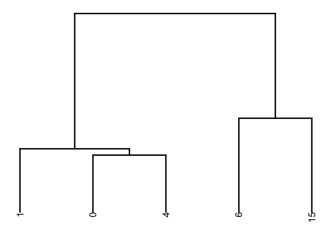<!-- -->

``` r
#Heatmap
heatmap<- DoHeatmap(subset(exp.a.heatmap, downsample = 200), features = c(cluster1.markers[1:5], cluster0.markers[1:5], cluster4.markers[1:5], cluster6.markers[1:5],cluster15.markers[1:5]), size = 3)
heatmap
```

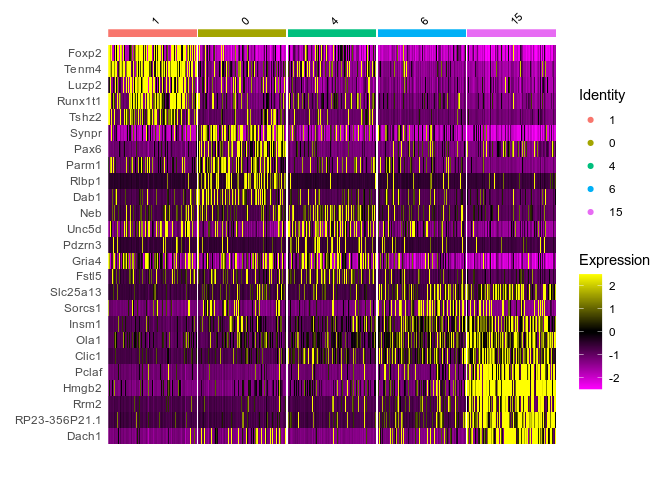<!-- -->

## Feature plots for regional markers

``` r
FeaturePlot(exp.a, features = "Slit2", order = T, pt.size = 0.7) + 
  scale_color_viridis(alpha = 1, option = "A") + 
  coord_fixed() +
  xlim(-4.5, 3.5) + 
  ylim(-14, -2) +
  simple
```

    ## Scale for 'colour' is already present. Adding another scale for 'colour',
    ## which will replace the existing scale.

    ## Scale for 'x' is already present. Adding another scale for 'x', which will
    ## replace the existing scale.

    ## Scale for 'y' is already present. Adding another scale for 'y', which will
    ## replace the existing scale.

    ## Warning: Removed 22 rows containing missing values (geom_point).

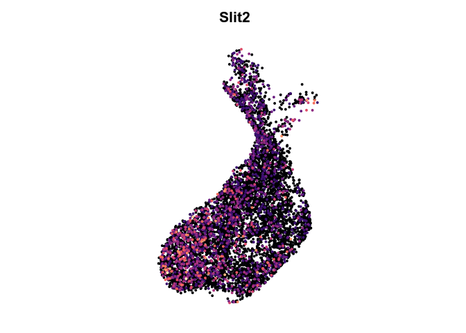<!-- -->

``` r
FeaturePlot(exp.a, features = "Vax1", order = T, pt.size = 0.7) + 
  scale_color_viridis(alpha = 1, option = "A") + 
  coord_fixed() +
  xlim(-4.5, 3.5) + 
  ylim(-14, -2) +
  simple
```

    ## Scale for 'colour' is already present. Adding another scale for 'colour',
    ## which will replace the existing scale.

    ## Scale for 'x' is already present. Adding another scale for 'x', which will
    ## replace the existing scale.

    ## Scale for 'y' is already present. Adding another scale for 'y', which will
    ## replace the existing scale.

    ## Warning: Removed 22 rows containing missing values (geom_point).

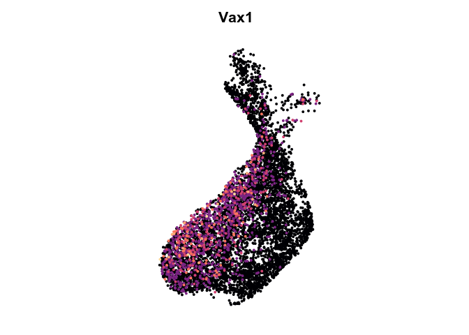<!-- -->

``` r
FeaturePlot(exp.a, features = "Pax6", order = T, pt.size = 0.7) + 
  scale_color_viridis(alpha = 1, option = "A") + 
  coord_fixed() +
  xlim(-4.5, 3.5) + 
  ylim(-14, -2) +
  simple
```

    ## Scale for 'colour' is already present. Adding another scale for 'colour',
    ## which will replace the existing scale.

    ## Scale for 'x' is already present. Adding another scale for 'x', which will
    ## replace the existing scale.

    ## Scale for 'y' is already present. Adding another scale for 'y', which will
    ## replace the existing scale.

    ## Warning: Removed 22 rows containing missing values (geom_point).

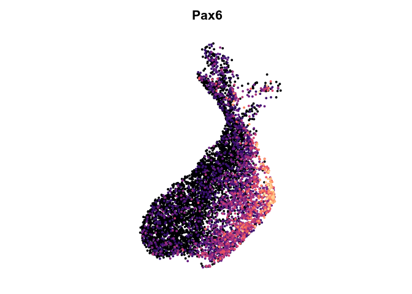<!-- -->

``` r
FeaturePlot(exp.a, features = "Rlbp1", order = T, pt.size = 0.7) + 
  scale_color_viridis(alpha = 1, option = "A") + 
  coord_fixed() +
  xlim(-4.5, 3.5) + 
  ylim(-14, -2) +
  NoAxes()
```

    ## Scale for 'colour' is already present. Adding another scale for 'colour',
    ## which will replace the existing scale.

    ## Scale for 'x' is already present. Adding another scale for 'x', which will
    ## replace the existing scale.

    ## Scale for 'y' is already present. Adding another scale for 'y', which will
    ## replace the existing scale.

    ## Warning: Removed 22 rows containing missing values (geom_point).

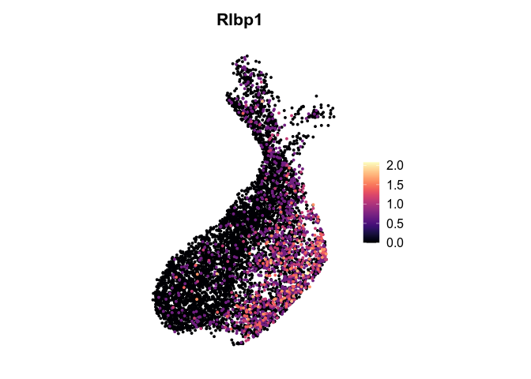<!-- -->

## Looking for DE genes (dataset-wide) in A cell clusters:

### Plotting DE genes in A cell clusters

### GO analysis
