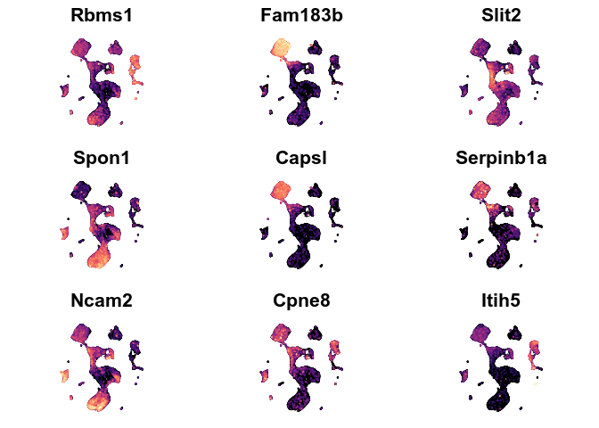

Neurogenic Lineages
================

**Cebrian-Silla, Nascimento, Redmond, Mansky et al. 2021**

## Setup

``` r
knitr::opts_chunk$set(warning = FALSE, message = FALSE)
library(knitr)
library(ggplot2) 
library(reticulate) 
library(Seurat)
library(R.utils)
```

    ## Loading required package: R.oo

    ## Loading required package: R.methodsS3

    ## R.methodsS3 v1.8.1 (2020-08-26 16:20:06 UTC) successfully loaded. See ?R.methodsS3 for help.

    ## R.oo v1.24.0 (2020-08-26 16:11:58 UTC) successfully loaded. See ?R.oo for help.

    ## 
    ## Attaching package: 'R.oo'

    ## The following object is masked from 'package:R.methodsS3':
    ## 
    ##     throw

    ## The following objects are masked from 'package:methods':
    ## 
    ##     getClasses, getMethods

    ## The following objects are masked from 'package:base':
    ## 
    ##     attach, detach, load, save

    ## R.utils v2.10.1 (2020-08-26 22:50:31 UTC) successfully loaded. See ?R.utils for help.

    ## 
    ## Attaching package: 'R.utils'

    ## The following object is masked from 'package:utils':
    ## 
    ##     timestamp

    ## The following objects are masked from 'package:base':
    ## 
    ##     cat, commandArgs, getOption, inherits, isOpen, nullfile, parse,
    ##     warnings

``` r
library(dplyr)
```

    ## 
    ## Attaching package: 'dplyr'

    ## The following objects are masked from 'package:stats':
    ## 
    ##     filter, lag

    ## The following objects are masked from 'package:base':
    ## 
    ##     intersect, setdiff, setequal, union

``` r
library(tibble)
library(viridis)
```

    ## Loading required package: viridisLite

``` r
library(patchwork)
library(tidyr)
```

    ## 
    ## Attaching package: 'tidyr'

    ## The following object is masked from 'package:R.utils':
    ## 
    ##     extract

``` r
library(readr)
library(AUCell)
library(GSEABase)
```

    ## Loading required package: BiocGenerics

    ## Loading required package: parallel

    ## 
    ## Attaching package: 'BiocGenerics'

    ## The following objects are masked from 'package:parallel':
    ## 
    ##     clusterApply, clusterApplyLB, clusterCall, clusterEvalQ,
    ##     clusterExport, clusterMap, parApply, parCapply, parLapply,
    ##     parLapplyLB, parRapply, parSapply, parSapplyLB

    ## The following objects are masked from 'package:dplyr':
    ## 
    ##     combine, intersect, setdiff, union

    ## The following objects are masked from 'package:stats':
    ## 
    ##     IQR, mad, sd, var, xtabs

    ## The following objects are masked from 'package:base':
    ## 
    ##     anyDuplicated, append, as.data.frame, basename, cbind, colnames,
    ##     dirname, do.call, duplicated, eval, evalq, Filter, Find, get, grep,
    ##     grepl, intersect, is.unsorted, lapply, Map, mapply, match, mget,
    ##     order, paste, pmax, pmax.int, pmin, pmin.int, Position, rank,
    ##     rbind, Reduce, rownames, sapply, setdiff, sort, table, tapply,
    ##     union, unique, unsplit, which, which.max, which.min

    ## Loading required package: Biobase

    ## Welcome to Bioconductor
    ## 
    ##     Vignettes contain introductory material; view with
    ##     'browseVignettes()'. To cite Bioconductor, see
    ##     'citation("Biobase")', and for packages 'citation("pkgname")'.

    ## Loading required package: annotate

    ## Loading required package: AnnotationDbi

    ## Loading required package: stats4

    ## Loading required package: IRanges

    ## Loading required package: S4Vectors

    ## 
    ## Attaching package: 'S4Vectors'

    ## The following object is masked from 'package:tidyr':
    ## 
    ##     expand

    ## The following objects are masked from 'package:dplyr':
    ## 
    ##     first, rename

    ## The following object is masked from 'package:base':
    ## 
    ##     expand.grid

    ## 
    ## Attaching package: 'IRanges'

    ## The following objects are masked from 'package:dplyr':
    ## 
    ##     collapse, desc, slice

    ## The following object is masked from 'package:R.oo':
    ## 
    ##     trim

    ## 
    ## Attaching package: 'AnnotationDbi'

    ## The following object is masked from 'package:dplyr':
    ## 
    ##     select

    ## Loading required package: XML

    ## Loading required package: graph

    ## 
    ## Attaching package: 'graph'

    ## The following object is masked from 'package:XML':
    ## 
    ##     addNode

``` r
library(scales)
```

    ## 
    ## Attaching package: 'scales'

    ## The following object is masked from 'package:readr':
    ## 
    ##     col_factor

    ## The following object is masked from 'package:viridis':
    ## 
    ##     viridis_pal

``` r
setwd(dirname(rstudioapi::getActiveDocumentContext()$path))
```

\#Loading the annotated Seurat Object

``` r
exp <- readRDS("../Files/seurat/GSM5039270_scSeq.rds")
exp.b <- subset(exp, idents = c(14, 5, 22))
exp.lin <- subset(exp, idents = c(14, 5, 22, 13, 12, 10, 16, 17, 8, 15, 1, 6, 4, 0))

Idents(exp) <- "integrated_snn_res.1.5"
simple <- NoAxes() + NoLegend()


a <- DimPlot(exp, label = T) + coord_fixed() + simple
b <- DimPlot(exp, group.by = "Phase") + coord_fixed() + simple

a+b
```

<!-- -->

``` r
allmarkers <- FindAllMarkers(exp, only.pos = T)
allmarkers
```

# Overview DimPlot and gene expression

``` r
#Overview
DimPlot(exp, label = T) + simple + coord_fixed()
```

<!-- -->

``` r
#Setting the main genes we believe to be region-related
spatialgenes <- c("Crym", "Urah", "Nkx6-2", "Gsx2", "Rlbp1")

Idents(exp) <- "integrated_snn_res.1.5"
a<-DimPlot(exp, label = T) + coord_fixed()+ NoLegend()
aa<- FeaturePlot(exp, spatialgenes, order = T, combine = FALSE)
fix.sc <- scale_color_viridis(alpha = 1, option = "A")
simple <- NoAxes() + NoLegend()
aaa <- lapply(aa, function (x) x + fix.sc + simple + coord_fixed())
b <- CombinePlots(aaa)
a+b
```

<!-- -->

# Exploring potential sources of variability

## Sex

``` r
#Checking potential differences between males and females
a <- DimPlot(exp, reduction = "umap", label = T) + 
  labs(title = "Cluster ID") +
  coord_fixed(ratio = 1) + 
  simple

b <- DimPlot(exp, group.by = "Sex", reduction = "umap", label = F, shuffle = T) + 
  labs(title = "Sex") +
  coord_fixed(ratio = 1) +
  simple

c<-DimPlot(exp, split.by = "Sex", reduction = "umap", label = F) + 
  labs(title = "Sex") +
  simple
  
#sex.summary
sex.summary<- exp@meta.data %>% group_by(integrated_snn_res.1.5, Sex) %>% summarise(counts = n()) %>% mutate(ratio = counts/sum(counts))
d<-ggplot(sex.summary, aes(integrated_snn_res.1.5, ratio, fill = Sex)) + geom_bar(stat = "identity") + theme_minimal() + labs(title = "Ratio of cells coming from male and female mice")

cluster.summary <- exp@meta.data %>% group_by(Sex, integrated_snn_res.1.5) %>% summarise(counts = n()) %>% mutate(ratio = counts/sum(counts))
e <- ggplot(cluster.summary, aes(Sex, ratio, fill = integrated_snn_res.1.5)) + geom_bar(color = "black", stat = "identity") + theme_minimal()

a+c+b+d+plot_layout(ncol = 2, nrow = 2, widths = c(1, 2))
```

<!-- -->

``` r
d+e+plot_layout(nrow = 2)
```

<!-- -->

## Barcodes (Samples)

``` r
a <- DimPlot(exp, reduction = "umap", label = T) + 
  labs(title = "Cluster ID") +
  coord_fixed() + 
  simple

b <- DimPlot(exp, group.by = "MULTI_Seq", reduction = "umap", label = F) + 
  labs(title = "Barcodes") +
  coord_fixed() +
  NoAxes()

c<-DimPlot(exp, split.by = "MULTI_Seq", reduction = "umap", label = F) + 
  labs(title = "Barcodes") +
  coord_fixed() +
  simple
  

#barcode.summary
bc.summary<- exp@meta.data %>% group_by(integrated_snn_res.1.5, MULTI_Seq) %>% summarise(counts = n()) %>% mutate(ratio = counts/sum(counts))
bc.summary$integrated_snn_res.1.5 <- factor(bc.summary$integrated_snn_res.1.5, levels = c(0:35))

d<-ggplot(bc.summary, aes(integrated_snn_res.1.5, ratio, fill = MULTI_Seq)) + 
  geom_bar(stat = "identity") + 
  scale_fill_manual(name = "Barcodes", values = c("#e8b768", "#ebcb65", "#83b774",  "#26928C", "grey")) + 
  theme_minimal() + labs(title = "Ratio of cells coming from different samples", x= "Cluster") +
  theme(panel.grid.major.x = element_blank())


sample.summary<- exp@meta.data %>% group_by(MULTI_Seq, integrated_snn_res.1.5) %>% summarise(counts = n()) %>% mutate(ratio = counts/sum(counts))
e<-ggplot(sample.summary, aes(MULTI_Seq, ratio, fill = integrated_snn_res.1.5)) + 
  geom_bar(col = "black", stat = "identity") + 
  theme_minimal() + 
  labs(title = "Distribution of cell IDs from different samples")

a+c+b+d+plot_layout(ncol = 2, nrow = 2, widths = c(1, 5))
```

<!-- -->

``` r
d+e+plot_layout(nrow = 2)
```

<!-- -->

## Wells

``` r
Idents(exp) <- "integrated_snn_res.1.5"
a <- DimPlot(exp, label = T ) + 
  NoLegend() + 
  coord_fixed(ratio = 1)
b<- DimPlot(exp, reduction = "umap", label =F, group.by = "Lane", shuffle = T) + 
  coord_fixed(ratio = 1)
a+b
```

<!-- -->

``` r
summary<- exp@meta.data %>% group_by(integrated_snn_res.1.5, Lane) %>% summarise(counts = n()) %>% mutate(ratio = counts/sum(counts))

                         
c<-ggplot(summary, aes(integrated_snn_res.1.5, ratio, fill = Lane)) + geom_bar(stat = "identity") + theme_minimal()

a+b+c
```

<!-- -->

# Overview

``` r
p1<- DimPlot(exp, reduction = "umap", label = TRUE) + NoLegend()
p2<- FeaturePlot(exp, features = spatialgenes, order = T, col = inferno(100))
p1 + p2
```

<!-- -->

``` r
p4 <- DimPlot(exp.b, reduction = "umap", label = TRUE) +
  xlim(-5, 3) + ylim(0, 7) +
  NoLegend() + 
  coord_fixed()

p5 <- FeaturePlot(exp.b, features = spatialgenes, order = T, combine = FALSE)
fix.sc <- scale_color_viridis(alpha = 1, option = "A")
fix.x <- xlim(-5, 3)
fix.y <- ylim(0, 7)

a <- lapply(p5, function (x) x + fix.sc + fix.x + fix.y + simple + coord_fixed())
p6 <- CombinePlots(a)
  
p4 + p6
```

<!-- -->

# Differentially expressed genes

## B Cells

### Cluster 14 vs. 5+22

``` r
#Cluster 5+22 seem to correspond to the wedge. Cluster 14 is ventral lateral wall?
###logfc threshold = 0.25------
  markers.14_22.5 <- FindMarkers(exp, ident.1 = "14", ident.2 = c("5",  "22"))
  markers.14_22.5 <- markers.14_22.5 %>% mutate(gene = rownames(markers.14_22.5))
  markers.14_22.5 <- markers.14_22.5 %>% mutate(pct.ratio = pct.1/pct.2)
  
  wedge.genes <- markers.14_22.5 %>% filter(pct.ratio < 1 & pct.1 < 0.3) %>% arrange(pct.ratio) %>% pull(gene)
  
  nonwedge.genes <- markers.14_22.5 %>% filter(pct.ratio > 1 & pct.2 < 0.3) %>% arrange(desc(pct.ratio)) %>% pull(gene)  
```

#### Plots

``` r
#Wedge
p1 <- FeaturePlot(exp, wedge.genes[1:9], order = T, col = inferno(100), combine = F) 
p1 <- lapply(p1, function (x) x + fix.sc + simple + coord_fixed())
wedge.genes.plot1 <- CombinePlots(p1)

p2 <- FeaturePlot(exp, wedge.genes[10:18], order = T, col = inferno(100), combine = F) 
p2 <- lapply(p2, function (x) x + fix.sc + simple + coord_fixed())
wedge.genes.plot2 <- CombinePlots(p2)

p3 <- FeaturePlot(exp, wedge.genes[19:27], order = T, col = inferno(100), combine = F) 
p3 <- lapply(p3, function (x) x + fix.sc + simple + coord_fixed())
wedge.genes.plot3 <- CombinePlots(p3)

wedge.genes.plot1
```

<!-- -->

``` r
wedge.genes.plot2
```

<!-- -->

``` r
wedge.genes.plot3
```

<!-- -->

``` r
wedge.selected.genes <- c("Hopx", "Egln3", "Urah", "Dio2", "Kcnip4", "Pcdh15")

p1 <- FeaturePlot(exp, wedge.selected.genes, order = T, col = inferno(100), combine = F) 
p1 <- lapply(p1, function (x) x + fix.sc + simple + coord_fixed())
wedge.selected.genes <- CombinePlots(p1)


#Non-Wedge
p1 <- FeaturePlot(exp, nonwedge.genes[1:9], order = T, col = inferno(100), combine = F) 
p1 <- lapply(p1, function (x) x + fix.sc + simple + coord_fixed())
nonwedge.genes.plot1 <- CombinePlots(p1)

p2 <- FeaturePlot(exp, nonwedge.genes[10:18], order = T, col = inferno(100), combine = F) 
p2 <- lapply(p2, function (x) x + fix.sc + simple + coord_fixed())
nonwedge.genes.plot2 <- CombinePlots(p2)

p3 <- FeaturePlot(exp, nonwedge.genes[19:27], order = T, col = inferno(100), combine = F) 
p3 <- lapply(p3, function (x) x + fix.sc + simple + coord_fixed())
nonwedge.genes.plot3 <- CombinePlots(p3)

p4 <- FeaturePlot(exp, nonwedge.genes[28:36], order = T, col = inferno(100), combine = F) 
p4 <- lapply(p4, function (x) x + fix.sc + simple + coord_fixed())
nonwedge.genes.plot4 <- CombinePlots(p4)

p5 <- FeaturePlot(exp, nonwedge.genes[37], order = T, col = inferno(100), combine = F) 
p5 <- lapply(p5, function (x) x + fix.sc + simple + coord_fixed())
nonwedge.genes.plot5 <- CombinePlots(p5)

nonwedge.genes.plot1
```

<!-- -->

``` r
nonwedge.genes.plot2
```

<!-- -->

``` r
nonwedge.genes.plot3
```

<!-- -->

``` r
nonwedge.genes.plot4
```

<!-- -->

``` r
nonwedge.genes.plot5
```

<!-- -->

``` r
nonwedge.selected.genes <- c("Crym", "Dpyd", "Lmo1", "Nkx6-2", "C1ql3", "Tmem176a", "Car8", "Necab2")
p1 <- FeaturePlot(exp, nonwedge.selected.genes, order = T, col = inferno(100), combine = F) 
p1 <- lapply(p1, function (x) x + fix.sc + simple + coord_fixed())
nonwedge.selected.genes <- wrap_plots(p1, nrow = 2)
```

### FindAllMarkers: 5 x 22 x 14

``` r
b.markers <- FindAllMarkers(exp.b, only.pos = T, logfc.threshold = 0.1)
b.markers <- b.markers %>% mutate(pct.ratio = pct.1/pct.2)
cluster5.genes <- b.markers %>% filter(cluster == 5 & pct.1 > 0.3 & pct.2 < 0.2) %>% arrange(desc(avg_logFC)) %>% pull(gene)
cluster22.genes <- b.markers %>% filter(cluster == 22 & pct.1 > 0.3 & pct.2 < 0.2) %>% arrange(desc(avg_logFC)) %>% pull(gene)
cluster14.genes <- b.markers %>% filter(cluster == 14 & pct.1 > 0.3 & pct.2 < 0.2) %>% arrange(desc(avg_logFC)) %>% pull(gene)
```

#### Plots

``` r
#cluster 5
p1 <- FeaturePlot(exp, cluster5.genes[1:15], order = T, col = inferno(100), combine = F) 
p1 <- lapply(p1, function (x) x + fix.sc + simple + coord_fixed())
wrap_plots(p1, nrow = 3)
```

<!-- -->

``` r
#cluster 22
p1 <- FeaturePlot(exp, cluster22.genes[1:15], order = T, col = inferno(100), combine = F) 
p1 <- lapply(p1, function (x) x + fix.sc + simple + coord_fixed())
wrap_plots(p1, ncol = 5)
```

<!-- -->

``` r
#cluster 14
p1 <- FeaturePlot(exp, cluster14.genes[1:15], order = T, col = inferno(100), combine = F) 
p1 <- lapply(p1, function (x) x + fix.sc + simple + coord_fixed())
wrap_plots(p1, ncol = 5)
```

<!-- -->

## A Cells (Cluster 1 vs. 0)

``` r
#Non-regressed data------
###logfc threshold = 0.25------
  markers.1_0 <- FindMarkers(exp, ident.1 = "1", ident.2 = "0", logfa.threshold = 0.25)
  markers.1_0 <- markers.1_0 %>% mutate(gene = rownames(markers.1_0))
  markers.1_0 <- markers.1_0 %>% mutate(pct.ratio = pct.1/pct.2)

  a.markers.v <-rownames(FindMarkers(exp, ident.1 = 1, ident.2 = 0, only.pos = T))
  a.markers.d <-rownames(FindMarkers(exp, ident.1 = 0, ident.2 = 1, only.pos = T))
```

### Plots

``` r
##Ventral
p1 <- FeaturePlot(exp, features = a.markers.v[1:15], combine = FALSE, pt.size = 1, order = T)
p2 <- lapply(p1, function (x) x + fix.sc + simple + coord_fixed())

Plot1 <- CombinePlots(p2)
Plot1 + plot_annotation(
  title = "Putative Ventral markers",
  subtitle = "Identified by detecting DE genes between Clusters 1 and 0 (A cells)",
  caption = "Code available on neurogenic.lineage.analysis.Rmd")
```

<!-- -->

``` r
##Dorsal
p3 <- FeaturePlot(exp, features = a.markers.d[1:15], combine = FALSE, pt.size = 1, order = T)
p4 <- lapply(p3, function (x) x + fix.sc + simple + coord_fixed())

Plot2 <- CombinePlots(p4)
Plot2 + plot_annotation(
  title = "Putative Dorsal markers",
  subtitle = "Identified by detecting DE genes between Clusters 1 and 0 (A cells)",
  caption = "Code available on neurogenic.lineage.analysis.Rmd")
```

<!-- -->

# Lineage Analysis

## Grouping B and A cells by putative regions

``` r
Idents(exp.lin) <- "integrated_snn_res.1.5"
v.bcells <- WhichCells(exp.lin, idents = 14)
d.bcells <- WhichCells(exp.lin, idents = c(22,5))

v.acells <- WhichCells(exp.lin, idents = 1)
d.acells <- WhichCells(exp.lin, idents = 0)

exp.lin@meta.data[v.bcells,  "region"] <- "B ventral"
exp.lin@meta.data[v.acells,  "region"] <- "A ventral"
exp.lin@meta.data[d.bcells,  "region"] <- "B dorsal"
exp.lin@meta.data[d.acells,  "region"] <- "A dorsal"

Idents(exp.lin) <- "region"
Idents(exp.lin) <- factor(Idents(exp.lin),levels = c("B ventral", "A ventral", "B dorsal", "A dorsal"))

lin.palette = c("#7b3294","#DC11D8",  "#008837", "#00B277")
lin.palette2 = c("#7700c2", "#8e2ccd", "#43c690", "#3d9398")

DimPlot(exp.lin, cols = lin.palette, shuffle = T, na.value = "grey85") + coord_fixed() + xlim(-6, 7) + ylim(-15, 8) + NoAxes()
```

<!-- -->

## Markers

``` r
Idents(exp.lin) <- "region"
b.region.markers <- FindMarkers(exp.lin, ident.1 = "B ventral", ident.2 = "B dorsal", logfc.threshold = 0.1)
a.region.markers <- FindMarkers(exp.lin, ident.1 = "A ventral", ident.2 = "A dorsal", logfc.threshold = 0.1)


#Cluster markers using the default threshold for avg_logFC
b.ventral.markers <- rownames(b.region.markers %>% filter(avg_logFC >0.25 & pct.2 < 0.5) %>% arrange(avg_logFC))
b.dorsal.markers <- rownames(b.region.markers %>% filter(avg_logFC < -0.25 & pct.1 < 0.5) %>% arrange(avg_logFC))
a.ventral.markers <- rownames(a.region.markers %>% filter(avg_logFC >0.25 & pct.2 < 0.5) %>% arrange(avg_logFC))
a.dorsal.markers <- rownames(a.region.markers %>% filter(avg_logFC < -0.25 & pct.1< 0.5) %>% arrange(avg_logFC))

#Cluster markers using a lower avg_logFC threshold, i.e.: more genes
b.ventral.markers.plus <- rownames(b.region.markers %>% filter(avg_logFC >0.10))
b.dorsal.markers.plus <- rownames(b.region.markers %>% filter(avg_logFC < -0.10))
a.ventral.markers.plus <- rownames(a.region.markers %>% filter(avg_logFC >0.10))
a.dorsal.markers.plus <- rownames(a.region.markers %>% filter(avg_logFC < -0.10))


#lineage markers are identified by looking at the genes that are present both in B and A cells for a given lineage
##Ventral
v.lineage.markers <- intersect(b.ventral.markers, a.ventral.markers)
v.lineage.markers.ctrl <- intersect(b.ventral.markers, a.dorsal.markers)
v.lineage.markers.plus <- intersect(b.ventral.markers.plus, a.ventral.markers.plus)
##Dorsal
d.lineage.markers <- intersect(b.dorsal.markers, a.dorsal.markers)
d.lineage.markers.ctrl <- intersect(b.dorsal.markers, a.ventral.markers)
d.lineage.markers.plus <- intersect(b.dorsal.markers.plus, a.dorsal.markers.plus)
```

## Plots

``` r
##Ventral
p1 <- FeaturePlot(exp.lin, features = v.lineage.markers, combine = FALSE, pt.size = 0.2, order = T)
fix.sc <- scale_color_viridis(alpha = 1, option = "A") 
simple <- NoAxes() + NoLegend() 
Plot1 <- lapply(p1, function (x) x + coord_fixed() + fix.sc + xlim(-6, 7) + ylim(-15, 8) + simple)

wrap_plots(Plot1, nrow = 1) + plot_annotation(
  title = "Putative Ventral Lineage Markers",
  subtitle = "Identified by grouping putative ventral B and A cells",
  caption = "Code available on neurogenic.lineage.analysis.Rmd")
```

<!-- -->

``` r
##Dorsal
p2 <- FeaturePlot(exp.lin, features = d.lineage.markers, combine = FALSE, pt.size = 0.2, order = T)
fix.sc <- scale_color_viridis(alpha = 1, option = "A") 
simple <- NoAxes() + NoLegend() 
Plot2 <- lapply(p2, function (x) x + coord_fixed() +  fix.sc + xlim(-6, 7) + ylim(-15, 8) + simple)

wrap_plots(Plot2, nrow = 1) + 
  plot_annotation(
    title = "Putative Dorsal Lineage Markers",
    subtitle = "Identified by grouping putative dorsal B and A cells",
    caption = "Code available on neurogenic.lineage.analysis.Rmd")
```

<!-- -->
\#\#\# Control plots

``` r
#Plotting the intesection between ventral B and dorsal a cells:
p1 <- FeaturePlot(exp.lin, features = v.lineage.markers.ctrl, combine = FALSE, pt.size = 0.4, order = T)
fix.sc <- scale_color_viridis(alpha = 1, option = "A") 
simple <- NoAxes() + NoLegend() 
Plot1 <- lapply(p1, function (x) x + coord_fixed() + fix.sc + xlim(-6, 7) + ylim(-15, 8) + simple)

wrap_plots(Plot1, nrow = 1) + plot_annotation(
  title = "Control plot",
  subtitle = "Markers Ventral B and Dorsal A cells have in common",
  caption = "Code available on neurogenic.lineage.analysis.Rmd")
```

<!-- -->

``` r
#Plotting the intesection between dorsal B and ventral a cells:
p1 <- FeaturePlot(exp.lin, features = d.lineage.markers.ctrl, combine = FALSE, pt.size = 0.4, order = T)
fix.sc <- scale_color_viridis(alpha = 1, option = "A") 
simple <- NoAxes() + NoLegend() 
Plot1 <- lapply(p1, function (x) x + coord_fixed() + fix.sc + xlim(-6, 7) + ylim(-15, 8) + simple)

wrap_plots(Plot1, nrow = 1) + plot_annotation(
  title = "Control plot",
  subtitle = "Markers Dorsal B and Ventral A cells have in common",
  caption = "Code available on neurogenic.lineage.analysis.Rmd")
```

<!-- -->

### Violin plot

``` r
## remove the x-axis text and tick
## plot.margin to adjust the white space between each plot.
## ... pass any arguments to VlnPlot in Seurat
modify_vlnplot<- function(obj, 
                          feature, 
                          pt.size = 0, 
                          plot.margin = unit(c(-0.75, 0, -0.75, 0), "cm"),
                          ...) {
  p<- VlnPlot(obj, features = feature, pt.size = pt.size, ... )  + 
    xlab("") + ylab(feature) + ggtitle("") + 
    theme(legend.position = "none", 
          plot.title= element_blank(),
          axis.title.x = element_blank(),
          axis.text.x = element_blank(), 
          axis.ticks.x = element_blank(), 
          axis.title.y = element_text(size = rel(1), angle = 0), 
          axis.text.y = element_text(size = rel(1)), 
          plot.margin = plot.margin ) 
  return(p)
}
## extract the max value of the y axis
extract_max<- function(p){
  ymax<- max(ggplot_build(p)$layout$panel_scales_y[[1]]$range$range)
  return(ceiling(ymax))
}
## main function
StackedVlnPlot<- function(obj, features,
                          pt.size = 0, 
                          plot.margin = unit(c(-0.75, 0, -0.75, 0), "cm"),
                          ...) {
  plot_list<- purrr::map(features, function(x) modify_vlnplot(obj = obj,feature = x, ...))
  # Add back x-axis title to bottom plot. patchwork is going to support this?
  plot_list[[length(plot_list)]]<- plot_list[[length(plot_list)]] +
    theme(axis.text.x=element_text(), axis.ticks.x = element_line())
  # change the y-axis tick to only max value 
  ymaxs<- purrr::map_dbl(plot_list, extract_max)
  plot_list<- purrr::map2(plot_list, ymaxs, function(x,y) x + 
                            scale_y_continuous(breaks = c(y)) + 
                            expand_limits(y = y))
  p<- patchwork::wrap_plots(plotlist = plot_list, ncol = 1)
  return(p)
}

StackedVlnPlot(obj = exp.lin, features = v.lineage.markers) + 
  plot_annotation(title = "Ventral Lineage Markers", 
                  caption = "Code available on neurogenic.lineage.analysis.Rmd")
```

<!-- -->

``` r
StackedVlnPlot(obj = exp.lin, features = d.lineage.markers) + 
  plot_annotation(title = "Dorsal Lineage Markers", 
                  caption = "Code available on neurogenic.lineage.analysis.Rmd")
```

<!-- -->

``` r
VlnPlot(exp.lin,  features ="Urah", pt.size = 0)
```

<!-- -->
\# GO Analysis

## Finding DE genes between High Score dorsal and ventral cells

### B Cells

``` r
Idents(exp)  <- "integrated_snn_res.1.5"
exp.b<- subset(exp, idents = c(14, 5, 22))


Idents(exp.b)  <- "Lineage"
exp.b.markers <- FindMarkers(exp.b, ident.1 = "dorsal", ident.2 = "ventral")
b.dorsal.markers <- rownames(exp.b.markers %>% filter(avg_logFC > 0 & p_val_adj < 0.05))
b.ventral.markers <- rownames(exp.b.markers %>% filter(avg_logFC < 0 & p_val_adj < 0.05))

FeaturePlot(exp, features = b.dorsal.markers[1:15], order = T) + coord_fixed() + NoLegend() + NoAxes()
```

<!-- -->

``` r
p1 <- FeaturePlot(exp, features = b.dorsal.markers[1:15], combine = FALSE, pt.size = 0.6, order = T)
fix.sc <- scale_color_viridis(alpha = 1, option = "A") 
simple <- NoAxes() + NoLegend() 
Plot1 <- lapply(p1, function (x) x + coord_fixed() +  fix.sc + simple)
wrap_plots(Plot1)
```

<!-- -->

### A Cells

``` r
Idents(exp)  <- "integrated_snn_res.1.5"
exp.a<- subset(exp, idents = c(0, 1))

Idents(exp.a)  <- "Lineage"
exp.a.markers <- FindMarkers(exp.a, ident.1 = "dorsal", ident.2 = "ventral")
a.dorsal.markers <- rownames(exp.a.markers %>% filter(avg_logFC > 0 & p_val_adj < 0.05))
a.ventral.markers <- rownames(exp.a.markers %>% filter(avg_logFC < 0 & p_val_adj < 0.05))

p1 <- FeaturePlot(exp, features = a.dorsal.markers[1:15], combine = FALSE, pt.size = 0.6, order = T)
fix.sc <- scale_color_viridis(alpha = 1, option = "A") 
simple <- NoAxes() + NoLegend() 
Plot1 <- lapply(p1, function (x) x + coord_fixed() +  fix.sc + simple)
wrap_plots(Plot1)
```

<!-- -->

### Lineages

``` r
Idents(exp.lin) <- "Lineage"
lin.markers <- FindMarkers(exp.lin, ident.1 = "dorsal", ident.2= "ventral", logfc.threshold = 0.1 )

lin.markers.0.1.dorsal <- rownames(lin.markers %>% filter(avg_logFC > 0.1 & p_val_adj < 0.05))
lin.markers.0.1.ventral <- rownames(lin.markers %>% filter(avg_logFC < -0.1 & p_val_adj < 0.05))

lin.markers.0.25.dorsal <- rownames(lin.markers %>% filter(avg_logFC > 0.25 & p_val_adj < 0.05)) 
lin.markers.0.25.ventral <- rownames(lin.markers %>% filter(avg_logFC < -0.25 & p_val_adj < 0.05)) 
```

## Loading data from Panther

### Comparing whole dorsal and ventral clusters

``` r
#importing the data exported from panther. I exported each condition (dorsal A and B cells, ventral A and B cells and Dorsal and Ventral lineages.) as a different .txt file and I will load each file as a distinct table on R 

#Comparing whole Clusters----
b.dorsal.go <- read_delim("b.dorsal.go.txt", 
    "\t", escape_double = FALSE, col_names = c("go", "ref", "obs", "expected", "pos.neg", "fold.enrich", "raw.p.value", "fdr"), 
    trim_ws = TRUE, skip = 12)

b.ventral.go <- read_delim("b.ventral.go.txt", 
    "\t", escape_double = FALSE, col_names = c("go", "ref", "obs", "expected", "pos.neg", "fold.enrich", "raw.p.value", "fdr"), 
    trim_ws = TRUE, skip = 12)

a.dorsal.go <- read_delim("a.dorsal.go.txt", 
    "\t", escape_double = FALSE, col_names = c("go", "ref", "obs", "expected", "pos.neg", "fold.enrich", "raw.p.value", "fdr"), 
    trim_ws = TRUE, skip = 12)

a.ventral.go <- read_delim("a.ventral.go.txt", 
    "\t", escape_double = FALSE, col_names = c("go", "ref", "obs", "expected", "pos.neg", "fold.enrich", "raw.p.value", "fdr"), 
    trim_ws = TRUE, skip = 12)

#Comparing the whole lineage
dorsal.go <- read_delim("dorsal.go.txt", 
    "\t", escape_double = FALSE, col_names = c("go", "ref", "obs", "expected", "pos.neg", "fold.enrich", "raw.p.value", "fdr"), 
    trim_ws = TRUE, skip = 12)

ventral.go <- read_delim("ventral.go.txt", 
    "\t", escape_double = FALSE, col_names = c("go", "ref", "obs", "expected", "pos.neg", "fold.enrich", "raw.p.value", "fdr"), 
    trim_ws = TRUE, skip = 12)
```

#### Writing the GO termstable

``` r
#Merging all tables into a single mega table with all the data. Instead of creating a column called "identity" on line 238, you can name it to whatever you are comparing (Could be "identity" as you will be comparing NSC and parenchymal astrocytes)
go.cat.n <- nrow(b.dorsal.go)
go.data <- do.call("rbind", list(b.dorsal.go, b.ventral.go, a.dorsal.go, a.ventral.go, dorsal.go, ventral.go))
go.data %>% mutate(fold.enrich = go.data$obs/go.data$expected)
```

    ## # A tibble: 94,694 x 8
    ##    go                   ref   obs expected pos.neg fold.enrich raw.p.value   fdr
    ##    <chr>              <dbl> <dbl>    <dbl> <chr>         <dbl>       <dbl> <dbl>
    ##  1 posterior midgut …     1     1     0.01 +               100      0.0101 0.402
    ##  2 coronal suture mo…     1     1     0.01 +               100      0.0101 0.401
    ##  3 regulation of ade…     1     1     0.01 +               100      0.0101 0.4  
    ##  4 midbrain-hindbrai…     1     1     0.01 +               100      0.0101 0.399
    ##  5 prechordal plate …     1     1     0.01 +               100      0.0101 0.398
    ##  6 positive regulati…     1     1     0.01 +               100      0.0101 0.397
    ##  7 vestibular recept…     1     1     0.01 +               100      0.0101 0.396
    ##  8 FasL biosynthetic…     1     1     0.01 +               100      0.0101 0.395
    ##  9 positive regulati…     1     1     0.01 +               100      0.0101 0.394
    ## 10 positive regulati…     1     1     0.01 +               100      0.0101 0.393
    ## # … with 94,684 more rows

``` r
go.data[1:go.cat.n,"identity"] <- "B Dorsal"
go.data[(1+go.cat.n):(2*go.cat.n),"identity"] <- "B Ventral"
go.data[(1+(2*go.cat.n)):(3*go.cat.n),"identity"] <- "A Dorsal"
go.data[(1+(3*go.cat.n)):(4*go.cat.n),"identity"] <- "A Ventral"
go.data[(1+(4*go.cat.n)):(5*go.cat.n),"identity"] <- "Dorsal Lineage"
go.data[(1+(5*go.cat.n)):(6*go.cat.n),"identity"] <- "Ventral Lineage"

order <- c("B Dorsal", "A Dorsal", "Dorsal Lineage", "B Ventral", "A Ventral", "Ventral Lineage") #order of the groups you are comparing

go.data$identity <- factor(go.data$identity, levels = order)

#There are many ways of determining which categories to display. Here I will first filter out categories with very little or too many genes, that's what the "filter(ref >5 & ref <50"does. I am also filtering for categories with a raw p value < 0.01 and adjusted p value of <0.05. And then I pick the top 10 of each lineage.
go.cats <- rev(unique(go.data %>% filter(ref > 5 & ref < 50 & fdr < 0.05) %>% group_by(identity) %>% slice_max(n = 30, order_by = fold.enrich, with_ties = F) %>% pull(go)))


#You may still find several redundant or somewhat irrelevant categories. I used the list of categories generated on line 242 as a starting point and ended up making my own set of categories manually: 
go.cats <- rev(c(
  "glial cell fate commitment (GO:0021781)",
  "positive regulation of vascular associated smooth muscle cell migration (GO:1904754)",
  "central nervous system projection neuron axonogenesis (GO:0021952)",
  "regulation of vascular associated smooth muscle cell migration (GO:1904752)",
  "central nervous system neuron axonogenesis (GO:0021955)",
  "presynapse assembly (GO:0099054)",
  "postsynapse assembly (GO:0099068)",
  "positive regulation of excitatory postsynaptic potential (GO:2000463)",
  "NMDA glutamate receptor clustering (GO:0097114)",
  "cerebral cortex regionalization (GO:0021796)",
  "detoxification of copper ion (GO:0010273)",
  "olfactory bulb interneuron differentiation (GO:0021889)",
  "telencephalon regionalization (GO:0021978)",
  "adrenal gland development (GO:0030325)",
  "negative regulation of glial cell differentiation (GO:0045686)",
  "positive regulation of extrinsic apoptotic signaling pathway via death domain receptors (GO:1902043)",
  "response to growth hormone (GO:0060416)",
  "regulation of amyloid precursor protein biosynthetic process (GO:0042984)",
  "retinal ganglion cell axon guidance (GO:0031290)",
  "glomerulus development (GO:0032835)",
  "mechanosensory behavior (GO:0007638)",
  "regulation of axon extension involved in axon guidance (GO:0048841)",
  "negative regulation of axon extension (GO:0030517)",
  "negative regulation of neural precursor cell proliferation (GO:2000178)",
  "negative chemotaxis (GO:0050919)",
  "G protein-coupled glutamate receptor signaling pathway (GO:0007216)",
  "cellular response to fluid shear stress (GO:0071498)",
  "synaptic transmission, glutamatergic (GO:0035249)",
  "regulation of sprouting angiogenesis (GO:1903670)",
  "tangential migration from the subventricular zone to the olfactory bulb (GO:0022028)"
  ))
```

#### Plotting

``` r
#Now you will create another table with the information you want to plot, in the order you want them to appear in the plot:
order <- c("B Dorsal", "A Dorsal", "Dorsal Lineage", "B Ventral", "A Ventral", "Ventral Lineage") #order of the groups you are comparing

df.all<- go.data %>% filter(go %in% go.cats)
#df.all$fold.enrich <- as.numeric(df.all$fold.enrich)
#df.all <- df.all %>% mutate(fold.enrich = replace_na(fold.enrich, 0))
#df.all$fold.enrich <- as.numeric(df.all$fold.enrich)
df.all <- df.all %>% mutate(fold.enrich = obs/expected)
df.all <- df.all %>% mutate(sig = ifelse(fdr < 0.05, T, F))
df.all$identity <- factor(df.all$identity, levels = order)
df.all$go <- factor(df.all$go, levels = go.cats)
df.all <- df.all %>% mutate(fdr2 = ifelse(sig == T, fdr, NA))


#Making the plot
ggplot(df.all, aes(identity, go)) + 
  geom_point(aes(col = fdr2, size = fold.enrich)) + 
  scale_color_gradient(name = "Adjusted p-value", low = "#de2d26", high = "#fee0d2", na.value = "grey75")  + 
  #scale_color_manual(name = NULL, labels = c("FDR p > 0.05", "FDR p < 0.05"), values = go.palette) + 
  scale_size(name = "Fold enrichment") +
  #scale_x_discrete(labels=c("Cluster 1" = "1", "Cluster 0" = "0", "Cluster 4" = "4", "Cluster 6" = "6", "Cluster 15" = "15")) +
  theme_minimal() + 
  theme(panel.grid.major = element_blank(), axis.title = element_blank(), axis.text.x.bottom = element_text(hjust = 1, angle =45), legend.position = "bottom", legend.direction = "vertical")
```

<!-- -->
\#\#\# Comparing the top 25% of ventral and dorsal lineage scores.

``` r
#Lineages
dorsal.lin.go <- read_delim("lin.dorsal.0.25.GO.binomial.txt", 
    "\t", escape_double = FALSE, col_names = c("go", "ref", "obs", "expected", "pos.neg", "fold.enrich", "raw.p.value", "fdr"), 
    trim_ws = TRUE, skip = 12)

ventral.lin.go <- read_delim("lin.ventral.0.25.GO.binomial.txt", 
    "\t", escape_double = FALSE, col_names = c("go", "ref", "obs", "expected", "pos.neg", "fold.enrich", "raw.p.value", "fdr"), 
    trim_ws = TRUE, skip = 12)

#B Cells
dorsal.b.go <- read_delim("bcell.dorsal.GO.binomial.txt", 
    "\t", escape_double = FALSE, col_names = c("go", "ref", "obs", "expected", "pos.neg", "fold.enrich", "raw.p.value", "fdr"), 
    trim_ws = TRUE, skip = 12)
ventral.b.go <- read_delim("bcell.ventral.GO.binomial.txt", 
    "\t", escape_double = FALSE, col_names = c("go", "ref", "obs", "expected", "pos.neg", "fold.enrich", "raw.p.value", "fdr"), 
    trim_ws = TRUE, skip = 12)

#A Cells
dorsal.a.go <- read_delim("acell.dorsal.GO.binomial.txt", 
    "\t", escape_double = FALSE, col_names = c("go", "ref", "obs", "expected", "pos.neg", "fold.enrich", "raw.p.value", "fdr"), 
    trim_ws = TRUE, skip = 12)
ventral.a.go <- read_delim("acell.ventral.GO.binomial.txt", 
    "\t", escape_double = FALSE, col_names = c("go", "ref", "obs", "expected", "pos.neg", "fold.enrich", "raw.p.value", "fdr"), 
    trim_ws = TRUE, skip = 12)

dorsal.b.go[,"identity"] <- "B Dorsal"
ventral.b.go[,"identity"] <- "B Ventral"
dorsal.a.go[,"identity"] <- "A Dorsal"
ventral.a.go[,"identity"] <- "A Ventral"
dorsal.lin.go[,"identity"] <- "Dorsal Lineage"
ventral.lin.go[,"identity"] <- "Ventral Lineage"


go.data <- rbind(dorsal.b.go, ventral.b.go, dorsal.a.go, ventral.a.go, dorsal.lin.go, ventral.lin.go)
go.data <- go.data %>% mutate(fold.enrich = obs/expected)

order <- c("B Dorsal", "B Ventral", "A Dorsal", "A Ventral", "Dorsal Lineage", "Ventral Lineage") #order of the groups you are comparing
go.data$identity <- factor(go.data$identity, levels = order)

go.data <- go.data %>% filter(identity != "Dorsal Lineage" & identity != "Ventral Lineage") #comment out this line to include the whole lineage in the plot.


#There are many ways of determining which categories to display. Here I will first filter out categories with very little or too many genes. I am also filtering for categories with an adjusted p-value < 0.05. An agnostic approach picks the top 10 of each identity: 
go.cats.agn <- rev(unique(go.data %>% filter(ref >5 & ref <50 & fdr <0.05) %>% group_by(identity) %>% slice_max(n = 10, order_by = fold.enrich, with_ties = F) %>% pull(go)))

#However it may not contain the most relevant categories. Another approach is to manually curate a list of relevant categories:

go.cats.cur <- c(
                 "calcium ion import into cytosol (GO:1902656)", 
                 "calcium ion import across plasma membrane (GO:0098703)", 
                 "retinal ganglion cell axon guidance (GO:0031290)", 
                 "dorsal/ventral axon guidance (GO:0033563)",
                 "regulation of negative chemotaxis (GO:0050923)",
                 "semaphorin-plexin signaling pathway (GO:0071526)",
                 "positive regulation of axon extension involved in axon guidance (GO:0048842)", 
                 "presynaptic membrane assembly (GO:0097105)",
                 "cerebral cortex regionalization (GO:0021796)",
                 "NMDA glutamate receptor clustering (GO:0097114)",
                 "dorsal/ventral pattern formation (GO:0009953)",
                 "insulin receptor signaling pathway (GO:0008286)",
                 "cellular response to epidermal growth factor stimulus (GO:0071364)",
                 "platelet-derived growth factor receptor signaling pathway (GO:0048008)",
                 "cerebrospinal fluid circulation (GO:0090660)", 
                 "response to growth hormone (GO:0060416)", 
                 "adherens junction assembly (GO:0034333)", 
                 "histone H4 deacetylation (GO:0070933)",
                 "response to laminar fluid shear stress (GO:0034616)",
                 "positive regulation of TRAIL-activated apoptotic signaling pathway (GO:1903984)",
                 "positive regulation of Notch signaling pathway (GO:0045747)",
                 "rostrocaudal neural tube patterning (GO:0021903)", 
                 "substrate-independent telencephalic tangential interneuron migration (GO:0021843)", 
                 "interneuron migration from the subpallium to the cortex (GO:0021830)",
                 "thyroid-stimulating hormone secretion (GO:0070460)")
```

#### Creating colorscale

``` r
#Reference for this scale: https://observablehq.com/@d3/color-schemes?collection=@d3/d3-scale-chromatic

reds <- scale_color_gradientn(name = "False Discovery Rate", 
                              limits = c(0, 0.05), 
                              breaks = c(0, 0.025, 0.05), 
                              colors = rev(c("#fff5f0","#fff4ef","#fff4ee","#fff3ed","#fff2ec","#fff2eb","#fff1ea","#fff0e9","#fff0e8","#ffefe7","#ffeee6","#ffeee6","#ffede5","#ffece4","#ffece3","#ffebe2","#feeae1","#fee9e0","#fee9de","#fee8dd","#fee7dc","#fee6db","#fee6da","#fee5d9","#fee4d8","#fee3d7","#fee2d6","#fee2d5","#fee1d4","#fee0d2","#fedfd1","#feded0","#feddcf","#fedccd","#fedbcc","#fedacb","#fed9ca","#fed8c8","#fed7c7","#fdd6c6","#fdd5c4","#fdd4c3","#fdd3c1","#fdd2c0","#fdd1bf","#fdd0bd","#fdcfbc","#fdceba","#fdcdb9","#fdccb7","#fdcbb6","#fdc9b4","#fdc8b3","#fdc7b2","#fdc6b0","#fdc5af","#fdc4ad","#fdc2ac","#fdc1aa","#fdc0a8","#fcbfa7","#fcbea5","#fcbca4","#fcbba2","#fcbaa1","#fcb99f","#fcb89e","#fcb69c","#fcb59b","#fcb499","#fcb398","#fcb196","#fcb095","#fcaf94","#fcae92","#fcac91","#fcab8f","#fcaa8e","#fca98c","#fca78b","#fca689","#fca588","#fca486","#fca285","#fca183","#fca082","#fc9e81","#fc9d7f","#fc9c7e","#fc9b7c","#fc997b","#fc987a","#fc9778","#fc9677","#fc9475","#fc9374","#fc9273","#fc9071","#fc8f70","#fc8e6f","#fc8d6d","#fc8b6c","#fc8a6b","#fc8969","#fc8868","#fc8667","#fc8565","#fc8464","#fb8263","#fb8162","#fb8060","#fb7f5f","#fb7d5e","#fb7c5d","#fb7b5b","#fb795a","#fb7859","#fb7758","#fb7657","#fb7455","#fa7354","#fa7253","#fa7052","#fa6f51","#fa6e50","#fa6c4e","#f96b4d","#f96a4c","#f9684b","#f9674a","#f96549","#f86448","#f86347","#f86146","#f86045","#f75e44","#f75d43","#f75c42","#f65a41","#f65940","#f6573f","#f5563e","#f5553d","#f4533c","#f4523b","#f4503a","#f34f39","#f34e38","#f24c37","#f24b37","#f14936","#f14835","#f04734","#ef4533","#ef4433","#ee4332","#ed4131","#ed4030","#ec3f2f","#eb3d2f","#eb3c2e","#ea3b2d","#e93a2d","#e8382c","#e7372b","#e6362b","#e6352a","#e5342a","#e43229","#e33128","#e23028","#e12f27","#e02e27","#df2d26","#de2c26","#dd2b25","#dc2a25","#db2924","#da2824","#d92723","#d72623","#d62522","#d52422","#d42321","#d32221","#d22121","#d12020","#d01f20","#ce1f1f","#cd1e1f","#cc1d1f","#cb1d1e","#ca1c1e","#c91b1e","#c71b1d","#c61a1d","#c5191d","#c4191c","#c3181c","#c2181c","#c0171b","#bf171b","#be161b","#bd161a","#bb151a","#ba151a","#b91419","#b81419","#b61419","#b51319","#b41318","#b21218","#b11218","#b01218","#ae1117","#ad1117","#ac1117","#aa1017","#a91016","#a71016","#a60f16","#a40f16","#a30e15","#a10e15","#a00e15","#9e0d15","#9c0d14","#9b0c14","#990c14","#970c14","#960b13","#940b13","#920a13","#900a13","#8f0a12","#8d0912","#8b0912","#890812","#870811","#860711","#840711","#820711","#800610","#7e0610","#7c0510","#7a0510","#78040f","#76040f","#75030f","#73030f","#71020e","#6f020e","#6d010e","#6b010e","#69000d","#67000d")), na.value = "grey75")
```

#### Plotting

``` r
#Select a list of categories to plot:
#go.cats <- go.cats.agn #agnostic approach
go.cats <- go.cats.cur #manually curated list of categories

df.all<- go.data %>% filter(go %in% go.cats)
df.all$fold.enrich <- as.numeric(df.all$fold.enrich)
df.all <- df.all %>% mutate(sig = ifelse(fdr < 0.05, T, F))
df.all$go <- factor(df.all$go, levels = go.cats)
df.all <- df.all %>% mutate(fdr2 = ifelse(sig == T, fdr, NA))

#Making the plot
ggplot(df.all, aes(identity, go)) + 
  geom_point(aes(col = fdr2, size = fold.enrich)) + 
  reds+
  scale_size(name = "Fold enrichment",
             #breaks = c(0,30,60)
             ) +
  theme_minimal() + 
  theme(panel.grid.major = element_blank(), axis.title = element_blank(), axis.text.x.bottom = element_text(hjust = 1, angle =45), legend.position = "bottom", legend.direction = "vertical")
```

<!-- -->

# Pseudotime

``` r
FeaturePlot(exp.lin, "velocity_pseudotime") + scale_color_viridis(option = "B") +  xlim(-6, 7) + ylim(-15, 8) + coord_fixed() + NoAxes()
```

<!-- -->

``` r
ggplot(exp.lin@meta.data, aes(velocity_pseudotime, Dorsal_Lineage_AUC)) + geom_point(size= 0.5, alpha = 0.05) + geom_smooth(alpha = .5, col = "#31a354") + theme_minimal()
```

<!-- -->

``` r
ggplot(exp.lin@meta.data, aes(velocity_pseudotime, Ventral_Lineage_AUC)) + geom_point(size= 0.5, alpha = 0.05) + geom_smooth(alpha = .5, col = "#756bb1") + theme_minimal()
```

<!-- -->

``` r
exp.lin2 <- SCTransform(exp.lin, variable.features.n = 50000, new.assay.name = "SCT2", vars.to.regress = "percent.mt")
```

    ##   |                                                                              |                                                                      |   0%  |                                                                              |==================                                                    |  25%  |                                                                              |===================================                                   |  50%  |                                                                              |====================================================                  |  75%  |                                                                              |======================================================================| 100%
    ##   |                                                                              |                                                                      |   0%  |                                                                              |=                                                                     |   2%  |                                                                              |===                                                                   |   4%  |                                                                              |====                                                                  |   6%  |                                                                              |======                                                                |   8%  |                                                                              |=======                                                               |  10%  |                                                                              |=========                                                             |  12%  |                                                                              |==========                                                            |  14%  |                                                                              |===========                                                           |  16%  |                                                                              |=============                                                         |  18%  |                                                                              |==============                                                        |  20%  |                                                                              |================                                                      |  22%  |                                                                              |=================                                                     |  24%  |                                                                              |===================                                                   |  27%  |                                                                              |====================                                                  |  29%  |                                                                              |=====================                                                 |  31%  |                                                                              |=======================                                               |  33%  |                                                                              |========================                                              |  35%  |                                                                              |==========================                                            |  37%  |                                                                              |===========================                                           |  39%  |                                                                              |=============================                                         |  41%  |                                                                              |==============================                                        |  43%  |                                                                              |===============================                                       |  45%  |                                                                              |=================================                                     |  47%  |                                                                              |==================================                                    |  49%  |                                                                              |====================================                                  |  51%  |                                                                              |=====================================                                 |  53%  |                                                                              |=======================================                               |  55%  |                                                                              |========================================                              |  57%  |                                                                              |=========================================                             |  59%  |                                                                              |===========================================                           |  61%  |                                                                              |============================================                          |  63%  |                                                                              |==============================================                        |  65%  |                                                                              |===============================================                       |  67%  |                                                                              |=================================================                     |  69%  |                                                                              |==================================================                    |  71%  |                                                                              |===================================================                   |  73%  |                                                                              |=====================================================                 |  76%  |                                                                              |======================================================                |  78%  |                                                                              |========================================================              |  80%  |                                                                              |=========================================================             |  82%  |                                                                              |===========================================================           |  84%  |                                                                              |============================================================          |  86%  |                                                                              |=============================================================         |  88%  |                                                                              |===============================================================       |  90%  |                                                                              |================================================================      |  92%  |                                                                              |==================================================================    |  94%  |                                                                              |===================================================================   |  96%  |                                                                              |===================================================================== |  98%  |                                                                              |======================================================================| 100%
    ##   |                                                                              |                                                                      |   0%  |                                                                              |=                                                                     |   2%  |                                                                              |===                                                                   |   4%  |                                                                              |====                                                                  |   6%  |                                                                              |======                                                                |   8%  |                                                                              |=======                                                               |  10%  |                                                                              |=========                                                             |  12%  |                                                                              |==========                                                            |  14%  |                                                                              |===========                                                           |  16%  |                                                                              |=============                                                         |  18%  |                                                                              |==============                                                        |  20%  |                                                                              |================                                                      |  22%  |                                                                              |=================                                                     |  24%  |                                                                              |===================                                                   |  27%  |                                                                              |====================                                                  |  29%  |                                                                              |=====================                                                 |  31%  |                                                                              |=======================                                               |  33%  |                                                                              |========================                                              |  35%  |                                                                              |==========================                                            |  37%  |                                                                              |===========================                                           |  39%  |                                                                              |=============================                                         |  41%  |                                                                              |==============================                                        |  43%  |                                                                              |===============================                                       |  45%  |                                                                              |=================================                                     |  47%  |                                                                              |==================================                                    |  49%  |                                                                              |====================================                                  |  51%  |                                                                              |=====================================                                 |  53%  |                                                                              |=======================================                               |  55%  |                                                                              |========================================                              |  57%  |                                                                              |=========================================                             |  59%  |                                                                              |===========================================                           |  61%  |                                                                              |============================================                          |  63%  |                                                                              |==============================================                        |  65%  |                                                                              |===============================================                       |  67%  |                                                                              |=================================================                     |  69%  |                                                                              |==================================================                    |  71%  |                                                                              |===================================================                   |  73%  |                                                                              |=====================================================                 |  76%  |                                                                              |======================================================                |  78%  |                                                                              |========================================================              |  80%  |                                                                              |=========================================================             |  82%  |                                                                              |===========================================================           |  84%  |                                                                              |============================================================          |  86%  |                                                                              |=============================================================         |  88%  |                                                                              |===============================================================       |  90%  |                                                                              |================================================================      |  92%  |                                                                              |==================================================================    |  94%  |                                                                              |===================================================================   |  96%  |                                                                              |===================================================================== |  98%  |                                                                              |======================================================================| 100%

``` r
scaled.exp <- t(exp.lin2@assays[["SCT2"]]@scale.data)

genes.pseudotime <- merge(scaled.exp, exp.lin@meta.data, by = 0)
```

``` r
ggplot(genes.pseudotime, aes(velocity_pseudotime, Gfap)) + geom_point(size= 0.5, alpha = 0.05) + geom_smooth(alpha = .5, col = "#31a354") + theme_minimal()
```

<!-- -->

``` r
ggplot(genes.pseudotime, aes(velocity_pseudotime, Dcx)) + geom_point(size= 0.5, alpha = 0.05) + geom_smooth(alpha = .5, col = "#31a354") + theme_minimal()
```

<!-- -->

``` r
ggplot(genes.pseudotime, aes(velocity_pseudotime, Egfr)) + geom_point(size= 0.5, alpha = 0.05) + geom_smooth(alpha = .5, col = "#31a354") + theme_minimal()
```

<!-- -->

``` r
ggplot(genes.pseudotime, aes(velocity_pseudotime, Pax6)) + geom_point(size= 0.5, alpha = 0.05) + geom_smooth(alpha = .5, col = "#31a354") + theme_minimal()
```

<!-- -->

``` r
ggplot(genes.pseudotime, aes(velocity_pseudotime, Rlbp1)) + geom_point(size= 0.5, alpha = 0.05) + geom_smooth(alpha = .5, col = "#31a354") + theme_minimal()
```

<!-- -->

``` r
ggplot(genes.pseudotime, aes(velocity_pseudotime, Crym)) + geom_point(size= 0.5, alpha = 0.05) + geom_smooth(alpha = .5, col = "#31a354") + theme_minimal()
```

<!-- -->

``` r
lineage.auc.pseudotime <- ggplot(exp.lin@meta.data, aes(x = velocity_pseudotime)) + 
                          geom_smooth(aes(y = Ventral_Lineage_AUC), alpha = 0, col = "#756bb1") +
                          geom_smooth(aes(y = Dorsal_Lineage_AUC), alpha = 0, col = "#31a354") +
                          ylim(0,1) + 
                          labs(x = "Pseudotime", y = "AUCell Score") + 
                          scale_x_continuous(breaks = c(0, 0.5, 1)) +
                      theme_minimal() + 
                      theme(panel.grid.minor = element_blank(), panel.grid.major.x = element_blank())


genes.pseudotime.plot <- ggplot(genes.pseudotime, aes(velocity_pseudotime)) + 
                      geom_smooth(aes(y=Gfap), alpha = 0, col = "#4E94D0") + 
                      geom_smooth(aes(y=Egfr), alpha = 0, col = "#43CF81") +
                      geom_smooth(aes(y=Dcx), alpha = 0, col = "#E96060") +
                      ylim(-3, 30) +
                      labs(x = "Pseudotime", y = "Scaled gene expression") + 
                      scale_x_continuous(breaks = c(0, 0.5, 1)) +
                      theme_minimal() + 
                      theme(panel.grid.minor = element_blank(), panel.grid.major.x = element_blank())

dorsal.genes.pseudotime.plot <- ggplot(genes.pseudotime, aes(velocity_pseudotime)) + 
                      geom_smooth(aes(y=Rlbp1), alpha = 0, col = "#4E94D0") + 
                      geom_smooth(aes(y=Pax6), alpha = 0, col = "#43CF81") +
                      geom_smooth(aes(y=Dcc), alpha = 0, col = "#E96060") +
                      geom_smooth(aes(y=Gm29260), alpha = 0, col = "black") +
                      ylim(-3, 20) +
                      labs(x = "Pseudotime", y = "Scaled gene expression") + 
                      theme_minimal() + 
                      theme(panel.grid.minor = element_blank())
  

genes.pseudotime.plot + lineage.auc.pseudotime
```

<!-- -->

# oRG signature

## FeaturePlots

``` r
org.go <- c("Moxd1", "Hopx", "Dio2", "Tnc", "Ptprz1")

p1 <- FeaturePlot(exp.lin, features = org.go, combine = F, order = T)
fix.sc <- scale_color_viridis(alpha = 1, option = "A") 
simple <- NoAxes() + NoLegend() 
Plot1 <- lapply(p1, function (x) x + coord_fixed() + fix.sc + xlim(-6, 7) + ylim(-15, 8) + simple)

wrap_plots(Plot1, nrow = 1) + plot_annotation(
  title = "oRG Genes",
  subtitle = "oRG genes identified in Pollen et al. 2016",
  caption = "Code available on neurogenic.lineage.analysis.Rmd")
```

<!-- -->

## AUCell Scoring

``` r
org.cells <- GSEABase::GeneSet(org.go, setName= "org.auc")

CellTypes <- GeneSetCollection(org.cells)

## loading in the expression matrix from seurat (replace 'experiment' with whatever seurat object you're using)
exprMatrix <- as.matrix(GetAssayData(exp.lin, slot = "data"))

## check how many genes from each signature appear in the dataset
CellTypes <- subsetGeneSets(CellTypes, rownames(exprMatrix)) 
cbind(nGenes(CellTypes))
```

    ##         [,1]
    ## org.auc    5

``` r
## calculating the ranking of genes for each cell in the dataset
cells_rankings <- AUCell_buildRankings(exprMatrix, nCores=16, plotStats=TRUE)
```

<!-- -->

    ##  min   1%   5%  10%  50% 100% 
    ## 1762 2051 2323 2491 3534 5516

``` r
cells_rankings
```

    ## Ranking for 25803 genes (rows) and 14660 cells (columns).
    ## 
    ## Top-left corner of the ranking:
    ##                cells
    ## genes           AAACCCAAGTCTGGTT AAACCCATCGTTCCCA AAACGAAGTACGCTTA
    ##   0610005C13Rik            10992            12582            13584
    ##   0610006L08Rik            25343            22832            15694
    ##   0610007P14Rik            23304             3010             2374
    ##   0610009B22Rik             3042             1101             3247
    ##   0610009E02Rik             7676             9950             9595
    ##   0610009L18Rik            13470             3092            23309
    ##                cells
    ## genes           AAACGAAGTCACAGAG AAACGAAGTGTTACAC
    ##   0610005C13Rik            13490             7762
    ##   0610006L08Rik            22614            23018
    ##   0610007P14Rik            11511            16332
    ##   0610009B22Rik             5520            23688
    ##   0610009E02Rik             6985            11315
    ##   0610009L18Rik            18542             3961
    ## 
    ## Quantiles for the number of genes detected by cell:
    ##  min   1%   5%  10%  50% 100% 
    ## 1762 2051 2323 2491 3534 5516

``` r
## calculate the area under the curve (AUC) to see if the gene set is enriched at the top of the gene ranking per cell
cells_AUC <- AUCell_calcAUC(geneSets = CellTypes, cells_rankings)
cells_AUC
```

    ## AUC for 1 gene sets (rows) and 14660 cells (columns).
    ## 
    ## Top-left corner of the AUC matrix:
    ##          cells
    ## gene sets AAACCCAAGTCTGGTT AAACCCATCGTTCCCA AAACGAAGTACGCTTA AAACGAAGTCACAGAG
    ##   org.auc        0.1698758        0.1858696        0.1285714        0.1903727
    ##          cells
    ## gene sets AAACGAAGTGTTACAC
    ##   org.auc                0

``` r
## see distribution of enrichment in all your cells and see where a cutoff is drawn
set.seed(123)
par(mfrow=c(2,2)) 
cells_assignment <- AUCell_exploreThresholds(cells_AUC, plotHist=TRUE, assign=TRUE) 

## extract the scores
AUCScores <- getAUC(cells_AUC)
AUCScores <- data.frame(t(AUCScores))

## add to the object 
exp.lin <- AddMetaData(exp.lin, AUCScores)

## plotting

purples <- brewer_pal(9, "Purples")
greens <- brewer_pal(9, "Greens")

FeaturePlot(exp.lin, "org.auc", cols = viridis(100), order = T) +
            coord_fixed() + 
            xlim(-6, 7) + 
            ylim(-15, 8) + 
            NoAxes() +
            labs(title = "oRG gene signature score")
```

<!-- -->
